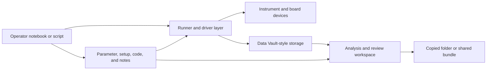

# As-Is Architecture

## Status

Initial architecture reading of the current brownfield environment.

## Purpose

Describe the current system as an integration and migration environment for
Scopecat. This document is an architecture frame over the current-state
evidence, not a raw inventory, target architecture, implementation plan, or
complete legacy-system specification.

The detailed brownfield evidence owner remains
[`../brownfield/current-state-assessment.md`](../brownfield/current-state-assessment.md).

## Current Architecture Shape

The existing system is an operator-managed lab workflow around notebooks,
scripts, service-backed measurement storage, local helper code, parameter and
setup files, generated runtime companions, instrument drivers, and analysis
artifacts.

Its practical architecture is not a clean application boundary. The system of
record is spread across:

- operator decisions and notebook cells;
- local scripts and imported helper modules;
- parameter, registry, setup, and generated companion files;
- instrument and runner service state;
- Data Vault-style recorded measurements;
- copied folders, selected IDs, plots, arrays, reports, and notes.

## Current Runtime Spine

## Architectural Pressures

| Pressure | Meaning For Scopecat |
| --- | --- |
| Runtime coupling | Scopecat should not start by owning hardware control, scan execution, service lifecycle, or emergency recovery. |
| Artifact ambiguity | Scopecat needs explicit artifact roles instead of treating every nearby file as equivalent evidence. |
| Context drift | Parameter, setup, code, and environment facts need point-in-time records or references before they can support review. |
| Partial lifecycle | Running, interrupted, partial, complete, reviewed, selected, and imported states need separate handling. |
| Handoff fragility | Portable output needs package-relative references, missing-context reporting, and import review. |
| Legacy parser risk | Legacy files should enter through explicit adapters or observations, not by becoming the product model. |
| Operator authority | User review and acknowledgement should remain visible before Scopecat mutates storage or claims readiness. |

## Brownfield Entrypoints

Use these entrypoints as the first architecture lens. A discovery slice that
does not support one of these entrypoints should be treated as concept evidence
until a new entrypoint is named.

| Entrypoint | Current Anchor | First Scopecat Role |
| --- | --- | --- |
| Share a selected measurement | Existing selected IDs, copied folders, reports, and primary data. | Review, package, open, and import one selected record. |
| Record an externally produced run | Legacy files, sidecars, adapter outputs, and user-declared source facts. | Record source posture, primary data, and references without replacing the runner. |
| Review context before a manual run | Parameter files, setup notes, code folders, environment state, and notebooks. | Compose review evidence and acknowledgement without run-start authority. |
| Inspect a running or partial measurement | Live plotting, partial rows, progress habits, and interrupted runs. | Observe lifecycle/progress/partial-data evidence without scan control. |
| Continue calibration work | Failed fits, notebooks, proposed writes, and downstream blocking. | Record review state, user actions, and accepted handoff to parameter review. |
| Compare or rerun from a reference | Last-working runs, selected references, copied code, and remembered setup. | Compare declared context and prepare review evidence without claiming reproducibility. |

## Non-Claims

This as-is architecture does not define:

- a complete legacy inventory;
- final storage schema;
- public API or SDK;
- hardware-control architecture;
- automatic legacy parsing;
- scientific-validity model;
- universal context graph.
