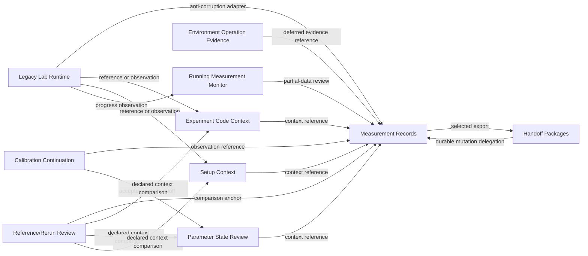

# Context Map

## Status

Initial bounded-context map.

## Purpose

Separate current legacy ownership from Scopecat-owned or candidate contexts.
Use this map to decide where adapters, anti-corruption layers, review
boundaries, and deferred contracts belong.

## Contexts

| Context | Owner Posture | Primary Responsibility | Explicit Non-Ownership |
| --- | --- | --- | --- |
| Legacy Lab Runtime | External current system | Notebooks, scripts, hardware drivers, LabRAD/Data Vault-style services, local experiment execution. | Scopecat should not assume control of run start, hardware apply, timing, recovery, or raw legacy semantics by default. |
| Measurement Records | Scopecat accepted boundary | Local measurement identity, primary-data import/write, source posture, references, manifests, operation results, durable audit records, and read/review projections. | Does not own all legacy parsing, scientific validity, hardware execution, or universal context graph. |
| Handoff Packages | Scopecat accepted boundary | Package selected measurement data for review, open package read-only, plan/import after acceptance. | Does not own sender trust, authenticity, batch durable import, linked-context durable import, code/environment restore, offline execution migration, shared lab storage semantics, or final public package contract by default. |
| Parameter State Review | Scopecat candidate context | Review parameter-state facts when a real entrypoint earns the boundary. | No active implementation owner; does not own hardware apply, live write-back, current instrument truth, setup truth, prepared-run context, or storage schema. |
| Environment Operation Evidence | Scopecat candidate context | Review bounded manager-operation facts when a real entrypoint earns the boundary. | No active implementation owner; does not own verified package state, runtime readiness, code execution, generic process execution, other environment managers, or hardware/service probes. |
| Experiment Code Context | Scopecat candidate context | Record, compare, materialize, or observe selected code/workspace facts. | Does not own Git semantics, importability, dependency closure, environment restoration, or execution. |
| Setup Context | Scopecat candidate context | Represent setup-binding, station-registry, wiring, generated companion, and physical-context facts. | Does not own parameter state, hardware state, or universal setup truth. |
| Running Measurement Monitor | Scopecat candidate context | Observe lifecycle, progress, and partial-data facts from active measurements. | Does not own scan control, scheduling, automatic retune, or execution changes. |
| Calibration Continuation | Scopecat candidate context | Review fit evidence, proposed writes, user actions, and continuation state. | Does not own fitting execution, automatic retry, parameter write-back, scheduler, or hardware control. |
| Reference/Rerun Review | Scopecat candidate context | Compare declared context against selected references and prepare manual rerun review evidence. | Does not own reproducibility, cause attribution, setup truth, or automatic restore. |

## Relationship Types

| Relationship | Meaning |
| --- | --- |
| Anti-corruption adapter | Translate legacy or external facts into a Scopecat boundary while declaring copied, converted, omitted, or unproven facts. |
| Reference link | Preserve relation to a context or source without importing payload or claiming authority. |
| Review composition | Combine facts from multiple contexts into a local review surface without creating a shared schema. |
| Durable mutation delegation | A context delegates storage mutation to the owning context instead of writing its storage directly. |
| Deferred contract | Relationship pressure exists, but stable schema, lifecycle, or ownership is not accepted yet. |

## Current Context Relationships

## Context Rules

- Legacy integration uses adapters or observations, not direct model reuse.
- Context links do not create shared ownership.
- A review surface may compose facts without owning their lifecycle.
- A context that needs durable mutation should delegate to the owning storage
  boundary.
- Candidate contexts should remain candidate until a named brownfield
  entrypoint proves repeated user value.
