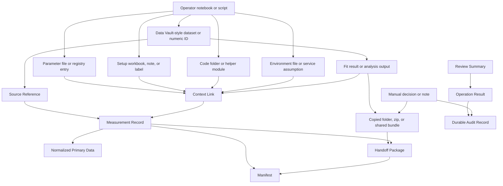

# Domain Model

## Status

Initial layered domain model.

## Purpose

Provide a shared analysis language for architecture, discovery cleanup, and
next-slice design while keeping brownfield concepts separate from Scopecat
transition concepts.

This is not a final public schema, storage schema, SDK contract, fixture
schema, shared implementation module, or claim that current lab users already
use Scopecat's product vocabulary.

## Layers

| Layer | Meaning | Use For |
| --- | --- | --- |
| Brownfield vocabulary | Concepts already visible in the current lab workflow or legacy artifacts. | Ground architecture in current user work and prevent slice-shaped abstractions from leading the model. |
| Transition model | Scopecat concepts introduced to bridge, record, review, package, compare, or import around the brownfield workflow. | Design narrow boundaries and classify discovery slices. |
| Product candidates | Concepts that may become stable Scopecat capabilities after repeated entrypoints prove them. | Track future architecture without promoting a final shared model. |

## Brownfield Vocabulary

These are the starting concepts. They should appear in as-is analysis before
Scopecat transition terms are introduced.

| Concept | Brownfield Meaning | Architecture Pressure |
| --- | --- | --- |
| Operator notebook or script | The user-facing work surface that prepares, runs, inspects, analyzes, or reopens experiment work. | Notebooks can be both review surfaces and hardware-active entrypoints; Scopecat should not treat them as passive documents by default. |
| Experiment runner or driver | Local code and services that configure devices, execute sweeps, append rows, and clean up. | Existing runtime authority stays outside Scopecat until explicitly moved. |
| Data Vault-style dataset or numeric ID | Legacy recorded measurement identity and row storage used for reopen, plotting, and selected-run work. | Scopecat needs to preserve source identity without inheriting all legacy storage semantics. |
| Primary table or row data | Recorded measurement rows, chunks, or converted tables expected to support inspection. | Preview and import need explicit shape and source posture. |
| Partial or interrupted run | A run with useful rows or progress but incomplete lifecycle evidence. | Partial state can be normal, not automatically invalid. |
| Parameter file or registry entry | Active or copied JSON/registry facts used to configure experiments and interpret results. | Point-in-time parameter facts can drift from generated companions and later writes. |
| Setup workbook, note, or label | Human-maintained setup context such as wiring, cooldown, sample, channel, station, or selected-ID notes. | Important facts may be semi-structured or manual, not clean machine contracts. |
| Generated setup companion | Derived chip, line, pulse, readout, or runtime-facing file produced from setup or parameter inputs. | Generated files may be useful evidence without being authoritative source truth. |
| Code folder or helper module | Editable experiment code, copied folders, private helper imports, backups, checkpoints, or local variants. | Code identity and runnable readiness are separate concerns. |
| Environment file or local service assumption | `pyproject`, lockfiles, local paths, driver packages, LabRAD services, and machine-specific runtime state. | Runtime readiness cannot be inferred from file presence alone. |
| Live plot or inspection surface | Existing live graphing, plotting, or notebook view used while a measurement runs. | Running review can start by observing, not controlling, execution. |
| Fit result or analysis output | Arrays, plots, reports, notebooks, fitted values, and workbooks produced after acquisition. | Derived artifacts need lineage and role clarity before handoff or reuse. |
| Copied folder, zip, or shared bundle | Ad hoc transfer unit used to move selected data and context between computers or collaborators. | Portable output needs explicit contents, missing-context reporting, and safe paths. |
| Manual decision or note | Human choice to accept, stop, retry, refit, continue, copy, or share work. | Scopecat should record decisions without turning them into automatic authority. |

## Transition Model

These terms are introduced by Scopecat. They are useful architecture tools but
should not be mistaken for native brownfield concepts.

| Concept | Status | Introduced To | Boundary Notes |
| --- | --- | --- | --- |
| Measurement Record | Accepted transition boundary | Give legacy or external measurement work a local Scopecat identity, source posture, primary data, references, and review visibility. | Not a claim that the legacy system already has this object; does not own execution or scientific validity. |
| Normalized Primary Data | Core transition concept | Make selected measurement rows inspectable, importable, packageable, and testable without parsing arbitrary legacy files. | Separate from raw legacy datasets and derived artifacts. |
| Source Reference | Core transition concept | Preserve where a fact, file, run, or package member came from without importing or interpreting it automatically. | Reference-only by default. Observation or import requires a narrower boundary. |
| Context Link | Core transition concept | Attach parameter, setup, code, environment, artifact, or note evidence to a measurement, package, calibration step, or review. | Linkage does not imply payload ownership, recursive traversal, or shared context schema. |
| Review Summary | Core transition concept | Present local findings, readiness, missing context, or blocked state for a human decision. | Review text or JSON is not durable authority unless a boundary says so. |
| Operation Result | Core transition concept | Report the outcome of one command, observation, write, import, package, or review operation. | May be transient or durable. A result is not automatically a domain object. |
| Durable Audit Record | Core transition concept | Persist a narrow fact that an accepted operation, observation, import, write, or user decision occurred. | Historical `receipt` slice outputs should be classified here only when durable audit value is real. |
| Manifest | Core transition concept | Describe identity, members, structure, or declared facts for a storage record, package, or artifact set. | Should not be called a receipt; it describes an artifact rather than proving an operation happened. |
| Handoff Package | Accepted transition boundary | Replace ad hoc copied folders with explicit package contents and open-before-import review. | A Scopecat artifact, not the as-is transfer concept; trust, authenticity, and scientific validity remain separate. |
| Import Plan | Core transition concept | Let a receiver preview what could be imported before storage mutation. | Non-mutating by default; durable import needs explicit acceptance and delegated storage rules. |
| Operator Acknowledgement | Supporting transition concept | Capture user acceptance, deferral, note, or continuation choice without claiming run permission. | Should not become an approval bureaucracy or hardware-safety gate by default. |
| Parameter State Record | Accepted transition boundary | Preserve reviewed point-in-time parameter facts independent of active legacy files. | Does not apply hardware state or own final parameter schema. |
| Environment Operation Evidence | Accepted transition boundary | Record bounded local manager-operation intent/result facts for later review. | This is a Scopecat evidence object; it does not prove runnable readiness. |
| Calibration Continuation State | Supporting transition concept | Preserve fit review, proposed writes, blocked downstream work, and continuation decisions. | Should remain grounded in failed-fit and manual-continuation entrypoints, not an invented scheduler. |
| Reference Comparison Finding | Supporting transition concept | Compare declared facts against a selected reference without explaining causes. | Does not claim setup truth, reproducibility, or user judgment. |

## Product Candidates

These are visible pressures but should remain candidates until repeated
brownfield entrypoints prove stable ownership.

| Candidate | Why It Exists | Do Not Promote Until |
| --- | --- | --- |
| Experiment Code Context | Users need to know which code folder, entrypoint, or helper version shaped a run. | A concrete record/compare/materialize/rerun entrypoint needs stable behavior. |
| Setup Context | Users rely on wiring, station registry, generated companions, sample labels, and notes. | A prepared-run, comparison, or recording entrypoint needs a stable setup boundary. |
| Running Measurement Monitor | Users inspect partial data and progress before completion. | Explicit lifecycle/progress events are available without scan control. |
| Calibration Continuation | Users recover from failed fits and proposed writes across steps. | A repeated workflow needs stable action recording and review state beyond one scenario. |
| Reference/Rerun Preparation | Users compare against last-working or notable references. | Objective comparison findings and manual rerun preparation become a named workflow. |

## Relationship Sketch

## Modeling Rules

- Name the brownfield object first, then the Scopecat transition concept.
- Treat `Measurement Record`, `Handoff Package`, `Import Plan`, `Context Link`,
  `Operation Result`, `Durable Audit Record`, and `Manifest` as
  Scopecat-introduced terms.
- Do not promote a fixture field into domain vocabulary unless it maps to a
  brownfield object or a named transition boundary.
- Reclassify historical `receipt` outputs before using them architecturally:
  many are operation results, durable audit records, review summaries, or
  slice-to-slice glue rather than domain concepts.
- Keep source, storage, package, and external references distinct.
- Treat review, acceptance, import, and mutation as separate concepts.
- Keep context families separate until two or more accepted boundaries need
  the same behavior with the same failure semantics.

## Deferred Shared Models

The following are intentionally not accepted by this initial model:

- universal experiment context;
- shared relation graph;
- final measurement storage schema;
- public package schema;
- public SDK object model;
- automatic data-shape inference;
- analysis provenance DAG;
- hardware/run execution model;
- scheduler, retry, or rollback model;
- trust/authenticity/scientific-validity model.
