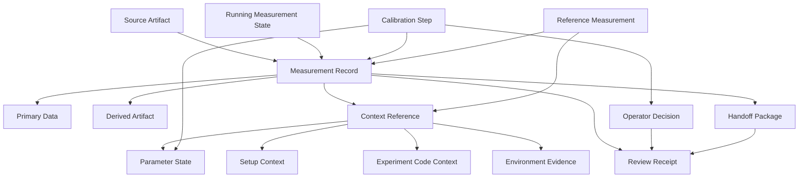

# Domain Model

## Status

Initial candidate domain model.

## Purpose

Provide a shared analysis language for architecture, discovery cleanup, and
next-slice design. This is not a final public schema, storage schema, SDK
contract, fixture schema, or shared implementation module.

Concept maturity is explicit so the model can guide work without prematurely
turning fixture vocabulary into product contracts.

## Maturity Labels

| Label | Meaning |
| --- | --- |
| Core candidate | Stable enough to guide architecture and slice classification. |
| Accepted boundary | Already has live prototype or decision-backed ownership in a narrow context. |
| Supporting candidate | Useful context concept, but not yet an independent product boundary. |
| Deferred contract | Real pressure, but not ready for shared schema or public contract. |
| Historical evidence | Useful for learning, not a current architecture driver. |

## Core Concepts

| Concept | Maturity | Meaning | Boundary Notes |
| --- | --- | --- | --- |
| Measurement Record | Accepted boundary | Local record of a measurement or externally produced run with identity, source posture, primary data, references, receipts, and review projections. | Does not own legacy execution, scientific validity, hardware state, or all post-run review UX. |
| Primary Data | Core candidate | Scopecat-readable or adapter-normalized measurement data users can inspect, store, package, or import. | Separate from raw legacy source files and derived artifacts. |
| Source Artifact | Core candidate | External or legacy artifact that explains where evidence came from. | May be reference-only, observed, imported, or packaged depending on boundary. |
| Derived Artifact | Supporting candidate | Plot, array, report, notebook output, workbook, or analysis product derived from measurement work. | Not primary data unless a boundary explicitly promotes it. |
| Context Reference | Core candidate | Link from a measurement, run, package, calibration step, or review to family-owned context evidence. | Reference does not imply payload import, recursive traversal, or context authority. |
| Parameter State | Accepted boundary | Reviewed point-in-time parameter facts, provenance, storage, read view, and manual pre-run review input. | Does not imply hardware apply, live write-back, current instrument truth, or final parameter schema. |
| Setup Context | Supporting candidate | Snapshot or reference describing wiring, station registry, generated line/readout state, and setup binding. | Should remain separate from parameter state until repeated slices earn a shared contract. |
| Experiment Code Context | Supporting candidate | Recorded or selected code/workspace facts around a run, step, comparison, or rerun. | Does not imply Git semantics, importability, execution readiness, or environment restoration. |
| Environment Evidence | Accepted boundary | Approved environment-operation intent/result/review facts such as bounded `uv sync` evidence. | Does not verify installed package state, runnable readiness, or hardware/service availability. |
| Review Receipt | Core candidate | Durable or local evidence that a user, adapter, or route reviewed, accepted, blocked, deferred, or summarized a state. | Receipt shape is boundary-specific; not every review summary is durable authority. |
| Handoff Package | Accepted boundary | Portable package carrying selected measurement data and declared package-relative context for open-before-import review. | Does not claim sender trust, authenticity, scientific validity, or archive bytes as authority by default. |
| Operator Decision | Core candidate | User-authored acknowledgement, acceptance, deferral, note, action, or continuation choice. | Should be recorded without implying automated execution or run permission. |
| Running Measurement State | Supporting candidate | Lifecycle, progress, freshness, completeness, and partial-data facts observed while a measurement is still active or incomplete. | Does not imply scan control, scheduling, automatic retune, or execution authority. |
| Calibration Step | Supporting candidate | A step in calibration work with planned intent, observations, fit evidence, proposed writes, and continuation state. | Not an executor, scheduler, or automatic retry model. |
| Reference Measurement | Supporting candidate | User-selected comparison anchor such as last-working, notable, or relevant measurement. | Label does not imply cause attribution, goodness, reproducibility, or setup truth. |

## Relationships

## Modeling Rules

- Start from a brownfield entrypoint before adding a concept.
- Keep source, storage, package, and external references distinct.
- Treat review, acceptance, import, and mutation as separate concepts.
- Keep context families separate until two or more accepted boundaries need
  the same behavior with the same failure semantics.
- Use `Deferred contract` for recurring pressure that is real but not ready
  for shared schema.
- Promote a concept only through a decision record or accepted prototype
  boundary.

## Deferred Shared Models

The following are intentionally not accepted by this initial model:

- universal experiment context;
- shared relation graph;
- final measurement storage schema;
- public package schema;
- public SDK object model;
- automatic data-shape inference;
- analysis provenance DAG;
- hardware/run execution model;
- scheduler, retry, or rollback model;
- trust/authenticity/scientific-validity model.
