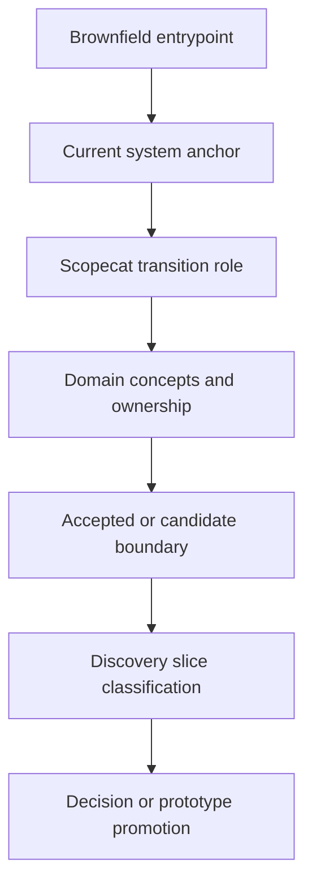

# Transition Architecture

## Status

Initial brownfield entrypoint-driven transition architecture.

## Purpose

Define how Scopecat should move from current lab-system entrypoints to useful
owned boundaries. This document is also the first classification frame for
deciding which discovery slices should remain active, be summarized, or be
removed from current docs.

This document complements
[`../brownfield/transition-architecture.md`](../brownfield/transition-architecture.md).
The brownfield document owns target-journey transition posture. This document
owns the architecture entrypoint and domain-model lens.

## Transition Principles

- Start from existing user entrypoints, not from invented object families.
- Improve review, record, package, bridge, and compare workflows before owning
  execution.
- Keep legacy authority explicit until a named boundary moves.
- Prefer adapters and anti-corruption layers over legacy model reuse.
- Promote one narrow durable boundary at a time.
- Treat old discovery slices as evidence unless they support a current
  entrypoint or accepted boundary.

## Entrypoint Transition Map

| Brownfield Entrypoint | Current System Anchor | Scopecat Transition Role | Core Domain Objects | Slice Classification Signal |
| --- | --- | --- | --- | --- |
| Share a selected measurement | Selected IDs, Data Vault-style rows, copied folders, derived review artifacts. | Select one complete-enough record, export package, open package, review, import after acceptance. | Measurement Record, Primary Data, Handoff Package, Review Receipt, Operator Decision. | Keep slices that prove package, open-before-import, import planning, durable import, artifact boundary, and redaction behavior. Archive pure GUI/view-model experiments unless they guide current UX. |
| Record an externally produced run | Legacy files, sidecars, adapter outputs, run notes, external source references. | Record source posture, reviewed primary data, references, and receipts without replacing the runner. | Measurement Record, Source Artifact, Primary Data, Context Reference, Review Receipt. | Keep slices proving source posture, normalized primary data, no-overwrite storage, and reference-only boundaries. Archive repeated sidecar projections once summarized. |
| Review context before a manual run | Parameter files, setup notes, code folders, environment files, operator notebooks. | Compose selected context evidence and acknowledgement without run-start or hardware-control authority. | Parameter State, Setup Context, Experiment Code Context, Environment Evidence, Operator Decision, Review Receipt. | Keep slices tied to manual-prep user review. Archive concept-only context bundles that do not change the entrypoint or boundary. |
| Inspect running or partial measurements | Live plotters, partial rows, progress habits, interrupted scans. | Observe lifecycle/progress/partial data and surface review state without scan control. | Measurement Record, Primary Data, Running State, Review Receipt. | Keep slices that prove lifecycle/progress observation and partial-data review. Archive static projections that do not connect to emitted events or user decisions. |
| Continue calibration work | Failed fits, notebooks, manual recovery, proposed writes, blocked downstream steps. | Record fit review, user action, continuation state, and accepted handoff into parameter-state review. | Calibration Step, Measurement Record, Parameter State, Operator Decision, Review Receipt. | Keep slices that prove accepted write handoff, action recording, and continuity. Archive over-fragmented review-state projections after extracting the model. |
| Compare or rerun from a reference | Last-working runs, notable references, copied code, remembered setup, selected artifacts. | Compare declared context and prepare manual rerun evidence without claiming reproducibility. | Reference Measurement, Measurement Record, Context Reference, Experiment Code Context, Parameter State, Setup Context. | Keep slices that prove objective comparison findings. Archive slices that imply restore, cause attribution, or shared relation graph before acceptance. |

## Architecture Flow

## Slice Classification

Use this classification before deleting or retaining historical discovery
material.

| Classification | Keep Full Body? | Criteria |
| --- | --- | --- |
| Current architecture evidence | Yes | Supports an active brownfield entrypoint and changes the domain model, context map, or transition boundary. |
| Accepted boundary evidence | Yes or summarized in owner doc | Proves behavior now owned by a module, prototype boundary, or decision record. |
| Risk evidence | Usually summarize | Captures an important non-claim, safety boundary, redaction rule, or migration risk. |
| Historical validation | No | Proved a candidate fixture or projection that is now superseded or no longer drives decisions. |
| Concept-only experiment | No | Introduced vocabulary without tying it to a brownfield entrypoint or accepted boundary. |
| Misleading direction | No | Encourages shared schema, final architecture, GUI/API contract, execution authority, or legacy parser ownership that is not accepted. |

## Cleanup Rule

Before deleting a slice, record one index row with:

- former path;
- classification;
- supported entrypoint if any;
- extracted concept or risk if any;
- current owner or replacement if any.

The full historical body does not need to remain in-tree when Git preserves it.

## Promotion Rule

A slice can influence current architecture only when it answers at least one
of these questions:

- Which brownfield entrypoint does this improve?
- Which context owns this behavior?
- Which artifact boundary changes?
- Which authority moves from legacy to Scopecat?
- Which existing risk is reduced?
- Which accepted boundary or decision should be updated?

If none apply, the slice is historical evidence, not architecture input.
