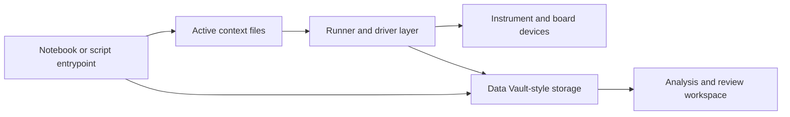
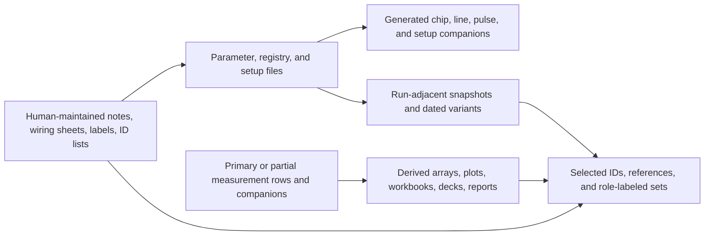
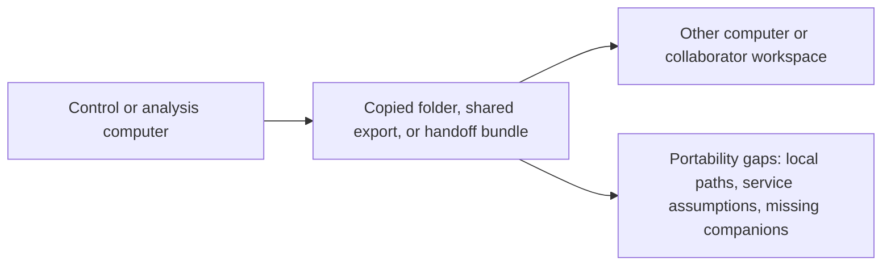
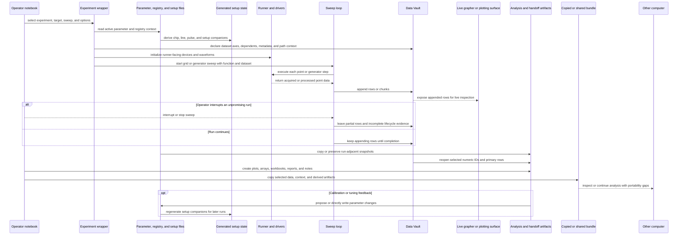

# Brownfield Current-State Assessment

## Status

Current as-is assessment for Scopecat's brownfield adoption context.

## Purpose

Describe the existing lab workflow and artifact reality that Scopecat must
adopt around.

This document intentionally records patterns, not private local file listings.
The local sample corpus is used as a current-state reference, but stable docs
should avoid carrying private paths, hostnames, lab identifiers, or full raw
file inventories.

Use [`pain-points.md`](pain-points.md) for detailed workflow friction, user
impact, current workarounds, and Scopecat opportunities.

## Current-State Architecture

The current environment is a LabRAD/Data Vault-era experiment-code workspace,
not a clean product integration surface. Its architecture is notebook-led,
service-coupled, and file-context-heavy: experiment code, hardware runners,
parameter files, generated setup state, measurement rows, and analysis
artifacts all participate in the practical system of record.

Runtime spine:

Context and artifact surfaces:

Transfer shape:

### Existing Services And Modules

Observed service and module families include:

- operator notebooks for calibration, setup inspection, plotting, analysis,
  selected-ID reopen, and practical run orchestration;
- experiment scripts and wrappers that initialize runner-facing state, prepare
  datasets, execute grid or generator sweeps, and perform cleanup;
- utility modules for dataset creation, sweep execution, unit handling,
  parameter loading, generated setup construction, plotting, and data reopen;
- active parameter and registry JSON files, generated chip/line/pulse
  companions, and wiring/setup workbooks used together as setup context;
- human-maintained setup and workflow context, including notes, labels,
  workbooks, selected-ID lists, and folder naming conventions;
- instrument-driver and runner modules that coordinate device state, waveform
  updates, local services, and hardware-facing calls;
- Data Vault-style storage services and files for dataset metadata, numeric
  IDs, row append, and later reopen;
- analysis and reporting artifacts such as arrays, notebooks, plots,
  workbooks, presentations, reports, archives, backups, and copied folders.

This is a coupled workspace architecture. The practical module boundary is
often "whatever the notebook imported and the operator remembered," not a
declared package API or deployable service boundary.

### Data Flows

The main current-state flows are:

- run preparation: notebook/script selection -> config imports -> parameter,
  registry, and setup reads -> generated setup companions -> runner/device
  setup;
- measurement recording: wrapper prepares Data Vault metadata -> sweep loop
  runs points -> rows or chunks are appended -> partial data may exist after
  abort or interruption;
- live inspection and early stop: appended rows can be inspected through live
  graphing or plotting surfaces, and operators may interrupt unpromising runs
  before the intended scan completes;
- shaped data review: users often infer scan shape, axis roles, completeness,
  and richer payload meaning from rows, sidecars, plotting helpers, notebooks,
  or reshape code rather than from one durable primary-data contract;
- parameter context preservation: active JSON may be copied near a run, saved
  as a dated variant, diffed through helper code, or overwritten by calibration
  paths;
- analysis and handoff: selected numeric IDs and session/path context are used
  to reopen data, then notebooks and helpers produce derived arrays, plots,
  reports, workbooks, and sharing material;
- computer-to-computer transfer: useful results may be copied as folders,
  shared exports, or ad hoc bundles, where local paths, service assumptions,
  missing companions, and unclear source identity become receiver-side
  inspection problems;
- calibration or tuning feedback: review and analysis can become proposed or
  direct parameter changes, which then affect generated setup companions and
  later runs.

### Integrations

Current integrations are mostly implicit and local:

- LabRAD/Data Vault provides live dataset creation, row append, metadata, and
  selected-run reopen behavior;
- instrument services and drivers provide board control, LO/DC
  source control, ADC/DAC channel behavior, waveform upload, trigger handling,
  and cleanup;
- LabRAD unit/value semantics appear in sweep and experiment code;
- local Python/Jupyter imports, private helper packages, and local path
  assumptions connect notebooks to scripts, data directories, and generated
  files;
- workbook and registry generators connect physical wiring/setup information
  to generated runtime-facing mappings;
- manually maintained notes, workbook tabs, folder names, selected-ID lists,
  and labels act as context sources but are not stable machine-readable
  contracts;
- optional local persistence helpers, lock-like files, and backup folders act
  as informal versioning or edit-state evidence.

### Deployment And Runtime Shape

The existing system appears to run as an operator-managed workstation workflow:

- an operator starts local services, opens a Jupyter environment, and runs
  notebooks or scripts from an editable workspace;
- the code assumes service availability, local data directories, local helper
  imports, and hardware-driver access rather than a sealed application
  deployment;
- notebooks and scripts can be both review surfaces and hardware-active
  entrypoints;
- state lives across active JSON, generated temp companions, Data Vault files,
  notebooks, output artifacts, service state, and hardware state;
- selected work can move to another computer through copied folders, shared
  storage, or manually assembled bundles rather than a declared portable
  package;
- experiment and tool code can move separately through copied folders, shared
  storage, manual Git operations, or zipped workspaces before another
  measurement computer uses it;
- copied workspaces, nested repositories, backups, caches, checkpoints, and
  dated variants make deployment identity and selected-code identity ambiguous.

### Known Limitations And Technical Debt

- Artifact and authority ambiguity: tables, Data Vault-style metadata, NumPy
  arrays, JSON records, notebooks, workbooks, reports, generated companions,
  sidecars, backups, lock-like files, and dated variants can all appear useful
  without declaring which source is authoritative.
- Runtime coupling: measurement recording and later data access depend on
  LabRAD/Data Vault semantics, local services, session/path conventions,
  numeric IDs, runner code, driver timing, device state, abort behavior,
  cleanup, and recovery habits.
- Active-code risk: existing scripts and notebooks can be hardware-active,
  parameter-mutating, or environment-dependent, so treating them as passive
  artifacts can be unsafe or misleading.
- Parameter and setup drift: active parameter JSON, generated companions,
  human-maintained workbooks, notes, labels, selected-ID lists, and folder
  conventions can drift from each other while still shaping run interpretation.
- Lifecycle ambiguity: lazy dataset creation, row buffering workarounds,
  controlled aborts, partial data, suppressed artifacts, and stale generated
  files blur complete versus partial versus invalid state.
- Primary-data shape ambiguity: row/table storage, CSV-like persisted files,
  metadata sidecars, arrays, notebooks, and plotting helpers can require users
  to infer intended scan shape, axis roles, expected counts, and completeness.
- Handoff and portability fragility: selected IDs, derived arrays, figures,
  reports, notebooks, local paths, service names, host details, instrument
  addresses, helper imports, and missing companions can all become receiver-side
  gaps when work moves between computers or collaborators.

## Current User Work Patterns

### Recording Runs

Runs are recorded by experiment scripts into Data Vault-style storage and
nearby run-adjacent files, with notebooks and local folders often adding output
or context around the recorded data. Numeric IDs are generated as part of that
recording/storage process.

Current-state pressure summary: run identity, primary data, transformed data,
and context references are often inferred from nearby files and naming
conventions. Detailed pain is tracked in
[`BR-PAIN-001`](pain-points.md#br-pain-001); primary-data shape pressure is
tracked in [`BR-PAIN-011`](pain-points.md#br-pain-011).

### Recording And Reviewing Shaped Measurement Data

Users record or review grid scans, partial scans, traces, multi-response
tables, and sidecar-backed results through row-oriented storage, CSV-like
files, arrays, metadata sidecars, notebooks, and plotting helpers.

Current-state pressure summary: intended scan shape, axis roles, expected
counts, observed completeness, and richer payload meaning are often inferred
from code or review context rather than recorded as a durable primary-data
fact. Detailed pain is tracked in
[`BR-PAIN-011`](pain-points.md#br-pain-011).

### Selecting Measurements For Sharing

Users often need to identify a useful run or result from a mixture of data
files, notebooks, sidecar notes, reports, and folder structure.

Current-state pressure summary: selected measurement identity, primary data,
derived outputs, and missing context are easy to lose when work moves through
manual folders. Detailed pain is tracked in
[`BR-PAIN-002`](pain-points.md#br-pain-002).

### Checking Context Before A Run

Users inspect parameter files, setup notes, wiring spreadsheets, code folders,
and environment state before running.

Current-state pressure summary: selected pre-run context is scattered across
files, notebooks, code, setup notes, and environment checks while existing
systems remain authoritative for run start. Detailed pain is tracked in
[`BR-PAIN-003`](pain-points.md#br-pain-003).

### Maintaining Parameter And Setup Files

Users maintain parameter, registry, wiring, and setup snapshots as practical
working artifacts across run preparation, calibration, and later analysis.

Current-state pressure summary: parameter, registry, setup, and wiring variants
coexist without a stable review boundary or live hardware truth claim.
Detailed pain is tracked in [`BR-PAIN-004`](pain-points.md#br-pain-004).

### Moving Or Synchronizing Experiment Code

Users move experiment scripts, notebooks, helper modules, generated
companions, and local tool code between measurement computers through copied
folders, shared storage, manual Git operations, or zipped workspaces.

Current-state pressure summary: the intended code/tool version for another
measurement computer can diverge from the local workstation across editable
folders, helper imports, generated companions, service assumptions, and
environment state. Detailed pain is tracked in
[`BR-PAIN-010`](pain-points.md#br-pain-010).

### Checking Instrument And Service Readiness

Users often check whether instruments, services, drivers, environments, or
helper processes are ready enough before they trust a run.

Current-state pressure summary: readiness checks and recovery knowledge are
local, bounded, and scattered across scripts, notebooks, GUIs, logs, and
operator habits. Detailed pain is tracked in
[`BR-PAIN-003`](pain-points.md#br-pain-003).

### Continuing Calibration Work

Calibration work often depends on interrupted notebook state, fit previews,
manual actions, proposed writes, and downstream blocking decisions.

Current-state pressure summary: continuation state, fit review, proposed
writes, accepted writes, and downstream blocking remain notebook-local or
implicit after interruption. Detailed pain is tracked in
[`BR-PAIN-007`](pain-points.md#br-pain-007).

### Inspecting Running Measurements

Long-running measurements may expose partial data or progress through scripts,
temporary files, plots, or notebook output.

Current-state pressure summary: partial-but-useful data can exist before full
completion, but completeness and readiness are not explicit while execution
and scan control remain outside Scopecat. Detailed pain is tracked in
[`BR-PAIN-006`](pain-points.md#br-pain-006); primary-data shape pressure is
tracked in [`BR-PAIN-011`](pain-points.md#br-pain-011).

### Reviewing Completed Results

After a run, users often reopen stored rows or selected numeric IDs, browse
manually managed folders, analyze data, plot selected series, summarize, and
report selected results before deciding whether the data is worth preserving,
comparing, or handing off.

Current-state pressure summary: completed-result review depends on folder
names, notebooks, sidecars, reports, plots, helper code, local services, and
memory rather than a records browser. Detailed pain is tracked in
[`BR-PAIN-008`](pain-points.md#br-pain-008); primary-data shape pressure is
tracked in [`BR-PAIN-011`](pain-points.md#br-pain-011).

### Reconstructing A Reference Or Rerun

Users reconstruct a prior or known-good run by combining reference selection,
code context, parameter/setup context, and local environment evidence.

Current-state pressure summary: reconstructing a reference or rerun requires
declared boundaries around code context, parameters, setup, generated
artifacts, environment evidence, and user/domain judgment. Detailed pain is
tracked in [`BR-PAIN-009`](pain-points.md#br-pain-009) and
[`BR-PAIN-005`](pain-points.md#br-pain-005). Cross-computer code alignment
pressure is tracked in [`BR-PAIN-010`](pain-points.md#br-pain-010).

## Update Rule

Update this assessment when a new current-state pattern changes Scopecat's
brownfield assumptions.

Do not use this document to track target journeys, adoption paths, pain-point
detail, validation maturity, implementation entrypoints, tests, or raw local
file inventories.
