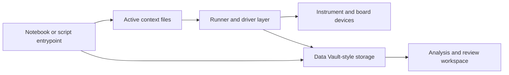
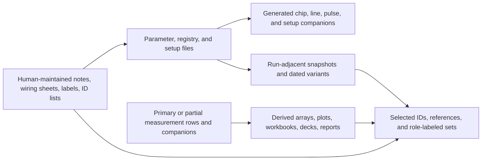
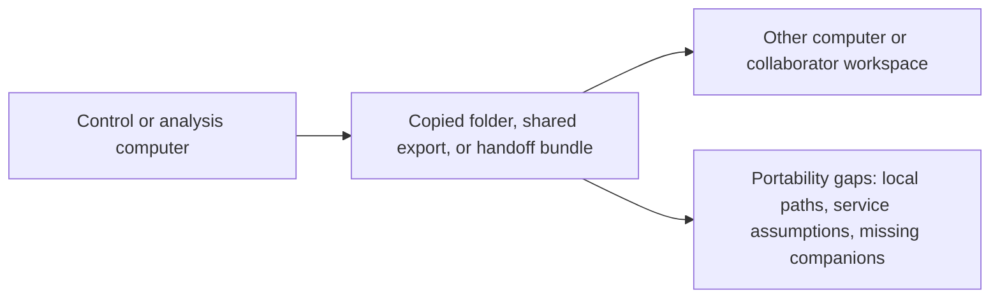
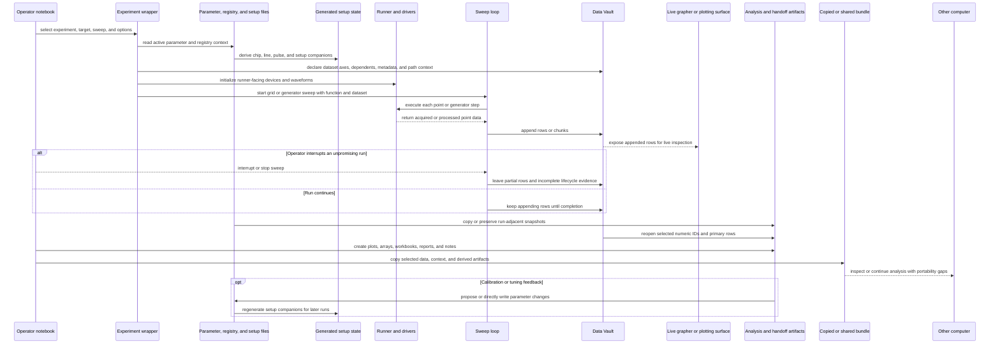

# Brownfield Current-State Assessment

## Status

Current as-is assessment for Scopecat's brownfield adoption context.

## Purpose

Describe the existing lab workflow and artifact reality that Scopecat must
adopt around. This is an as-is assessment, not a target journey map, transition
architecture, migration plan, implementation register, or evidence archive.

This document intentionally records patterns, not private local file listings.
The local sample corpus is used as a current-state reference, but stable docs
should avoid carrying private paths, hostnames, lab identifiers, or full raw
file inventories.

## Current-State Architecture

The current environment is a LabRAD/Data Vault-era experiment-code workspace,
not a clean product integration surface. Its architecture is notebook-led,
service-coupled, and file-context-heavy: experiment code, hardware runners,
parameter files, generated setup state, measurement rows, and analysis
artifacts all participate in the practical system of record.

Runtime spine:

Context and artifact surfaces:

Transfer shape:

### Existing Services And Modules

Observed service and module families include:

- operator notebooks for calibration, setup inspection, plotting, analysis,
  selected-ID reopen, and practical run orchestration;
- experiment scripts and wrappers that initialize runner-facing state, prepare
  datasets, execute grid or generator sweeps, and perform cleanup;
- utility modules for dataset creation, sweep execution, unit handling,
  parameter loading, generated setup construction, plotting, and data reopen;
- active parameter and registry JSON files, generated chip/line/pulse
  companions, and wiring/setup workbooks used together as setup context;
- human-maintained setup and workflow context, including notes, labels,
  workbooks, selected-ID lists, and folder naming conventions;
- instrument-driver and runner modules that coordinate device state, waveform
  updates, local services, and hardware-facing calls;
- Data Vault-style storage services and files for dataset metadata, numeric
  IDs, row append, and later reopen;
- analysis and reporting artifacts such as arrays, notebooks, plots,
  workbooks, presentations, reports, archives, backups, and copied folders.

This is a coupled workspace architecture. The practical module boundary is
often "whatever the notebook imported and the operator remembered," not a
declared package API or deployable service boundary.

### Data Flows

The main current-state flows are:

- run preparation: notebook/script selection -> config imports -> parameter,
  registry, and setup reads -> generated setup companions -> runner/device
  setup;
- measurement recording: wrapper prepares Data Vault metadata -> sweep loop
  runs points -> rows or chunks are appended -> partial data may exist after
  abort or interruption;
- live inspection and early stop: appended rows can be inspected through live
  graphing or plotting surfaces, and operators may interrupt unpromising runs
  before the intended scan completes;
- parameter context preservation: active JSON may be copied near a run, saved
  as a dated variant, diffed through helper code, or overwritten by calibration
  paths;
- analysis and handoff: selected numeric IDs and session/path context are used
  to reopen data, then notebooks and helpers produce derived arrays, plots,
  reports, workbooks, and sharing material;
- computer-to-computer transfer: useful results may be copied as folders,
  shared exports, or ad hoc bundles, where local paths, service assumptions,
  missing companions, and unclear source identity become receiver-side
  inspection problems;
- calibration or tuning feedback: review and analysis can become proposed or
  direct parameter changes, which then affect generated setup companions and
  later runs.

### Integrations

Current integrations are mostly implicit and local:

- LabRAD/Data Vault provides live dataset creation, row append, metadata, and
  selected-run reopen behavior;
- instrument services and drivers provide board control, LO/DC
  source control, ADC/DAC channel behavior, waveform upload, trigger handling,
  and cleanup;
- LabRAD unit/value semantics appear in sweep and experiment code;
- local Python/Jupyter imports, private helper packages, and local path
  assumptions connect notebooks to scripts, data directories, and generated
  files;
- workbook and registry generators connect physical wiring/setup information
  to generated runtime-facing mappings;
- manually maintained notes, workbook tabs, folder names, selected-ID lists,
  and labels act as context sources but are not stable machine-readable
  contracts;
- optional local persistence helpers, lock-like files, and backup folders act
  as informal versioning or edit-state evidence.

### Deployment And Runtime Shape

The existing system appears to run as an operator-managed workstation workflow:

- an operator starts local services, opens a Jupyter environment, and runs
  notebooks or scripts from an editable workspace;
- the code assumes service availability, local data directories, local helper
  imports, and hardware-driver access rather than a sealed application
  deployment;
- notebooks and scripts can be both review surfaces and hardware-active
  entrypoints;
- state lives across active JSON, generated temp companions, Data Vault files,
  notebooks, output artifacts, service state, and hardware state;
- selected work can move to another computer through copied folders, shared
  storage, or manually assembled bundles rather than a declared portable
  package;
- copied workspaces, nested repositories, backups, caches, checkpoints, and
  dated variants make deployment identity and selected-code identity ambiguous.

### Known Constraints And Technical Debt

- Service coupling: measurement recording and reopen depend on LabRAD/Data
  Vault semantics, local service availability, session/path conventions, and
  numeric IDs.
- Hardware-control coupling: replacing the runtime path would cross runner,
  driver, timing, device-state, abort, cleanup, and recovery responsibilities.
- Hidden authority: active parameter JSON, run-adjacent snapshots, generated
  companions, backups, lock-like files, and optional history stores can all look
  authoritative without a declared review boundary.
- Mutation risk: calibration or helper paths can write active parameter JSON
  directly, while proposed, accepted, rejected, and skipped changes may remain
  notebook-local.
- Lifecycle ambiguity: lazy dataset creation, row buffering workarounds,
  controlled aborts, partial data, suppressed artifacts, and stale generated
  files blur complete versus partial versus invalid state.
- Code selection ambiguity: notebooks, copied roots, backups, nested repository
  state, caches, and checkpoints make it difficult to say which code mattered
  for a run.
- Handoff fragility: selected IDs, derived arrays, figures, reports, and
  notebooks often need session/path, parameter, setup, code, and missing-context
  evidence to be useful elsewhere.
- Manual context drift: human-maintained workbooks, notes, labels, selected-ID
  lists, and folder conventions can be essential evidence but can also drift
  from active code, parameters, generated setup state, and copied handoff
  material.
- Computer-transfer fragility: moving work between control and analysis
  computers can preserve files while losing service assumptions, local paths,
  helper imports, source identity, and openability of linked companions.
- Redaction pressure: portable/export artifacts need managed-reference
  validation because local paths, service names, host details, and lab-specific
  labels can leak through ordinary artifacts.

### Assessment

The assessment does capture the existing system state at the right level if it
is read as architecture pressure rather than a full source inventory. The
important refinement is that the current state is not only a mixed research
folder: it is a service-coupled experiment runtime where Data Vault, runner
code, parameter JSON, generated setup state, notebooks, and analysis artifacts
together form the effective system.

Scopecat should therefore first record, link, review, compare, and hand off
evidence around existing code boundaries. It should not begin by claiming
hardware-control ownership, broad legacy parsing, scientific validity, or a
clean replacement runtime.

Observed patterns include:

- notebooks, Python scripts, helper packages, instrument-driver code, generated
  data, logs, workbooks, presentations, archives, backups, and copied folders
  living near each other;
- multiple similar project trees that appear to represent related hardware,
  cooldown, board, or experiment variants;
- repeated backup folders, notebook checkpoints, copied package folders, and
  dated file variants used as informal versioning;
- measurement data stored in different shapes, including CSV-like tables,
  NumPy arrays, JSON-like records, reports, and notebook outputs;
- parameter, registry, setup, wiring, and analysis context spread across JSON
  files, lock files, workbooks, scripts, notebooks, folders, and human naming
  conventions;
- experiment-code context stored as editable folders rather than a single
  trusted versioned artifact;
- driver/service code, experiment scripts, plotting utilities, and analysis
  helpers sharing the same broad workspace;
- presentation, plotting, and processing artifacts co-located with primary data
  and experiment code, suggesting review and reporting are part of the same
  practical work surface;
- output artifacts that are useful to humans but do not declare a stable
  machine-readable boundary for selection, handoff, review, or import.

## Current User Work Patterns

### Recording And Reopening Runs

Runs are recorded and later reopened through the existing experiment scripts,
Data Vault-style storage, notebooks, selected numeric IDs, local folders, and
nearby companion artifacts.

Current pressure:

- source identity, operator intent, primary data, transformed data, and context
  references are often inferred from nearby files and naming conventions;
- a useful run can be represented by a Data Vault-style dataset, a numeric ID,
  a folder, notebook output, a dated table, or a manually selected artifact;
- run meaning depends on nearby parameter snapshots, setup references, generated
  companions, analysis outputs, and notebook-local choices;
- later reopening can require the original session/path context, helper code,
  local services, and operator memory, not only the stored rows.

### Selecting Measurements For Sharing

Users often need to identify a useful run or result from a mixture of data
files, notebooks, sidecar notes, reports, and folder structure.

Current pressure:

- useful measurement identity is inferred from filenames, folders, notebook
  cells, IDs, or human memory;
- transformed data and primary data can be hard to distinguish later;
- moving a result to another computer or collaborator risks losing context;
- the receiver may need to trust folder residue before they can inspect the
  data.

### Checking Context Before A Run

Users inspect parameter files, setup notes, wiring spreadsheets, code folders,
and environment state before running.

Current pressure:

- selected pre-run context is not gathered into one stable, reviewable place;
- existing systems remain authoritative for hardware apply and run start;
- evidence about readiness is scattered;
- notebooks and local scripts can hide which context was actually used.

### Maintaining Parameter And Setup Files

Users maintain parameter, registry, wiring, and setup snapshots as practical
working artifacts across run preparation, calibration, and later analysis.

Current pressure:

- multiple dated or variant parameter and registry files can coexist;
- lock files or sidecar files may indicate local editing or runtime state, but
  they do not by themselves prove current hardware state;
- setup and wiring context often lives in workbooks or notes outside the
  scripts that consume parameters;
- users may need to inspect history, compare variants, or plot parameter changes
  before they can decide which files matter for a run or analysis step.

### Checking Instrument And Service Readiness

Users often check whether instruments, services, drivers, environments, or
helper processes are ready enough before they trust a run.

Current pressure:

- readiness checks may live in scripts, notebooks, GUIs, logs, or operator
  habits rather than a stable review surface;
- failure recovery can require local knowledge about drivers, services,
  hardware state, or lab-specific restart order;
- readiness evidence is bounded and local; it does not by itself prove hardware
  safety or define recovery authority.

### Continuing Calibration Work

Calibration work often depends on interrupted notebook state, fit previews,
manual actions, proposed writes, and downstream blocking decisions.

Current pressure:

- continuation state is difficult to inspect after interruption;
- proposed writes and accepted writes can be separated from later measurement
  context;
- fit review and retry decisions often remain notebook-local or implicit;
- execution, write-back, and hardware-control concerns are entangled in the
  existing notebooks, scripts, drivers, and operator habits.

### Inspecting Running Measurements

Long-running measurements may expose partial data or progress through scripts,
temporary files, plots, or notebook output.

Current pressure:

- partial-but-useful data can be available before full completion;
- readiness and completeness are not always explicit;
- monitoring needs are real, but execution and scan control remain owned by the
  measurement code.

### Reviewing Completed Results

After a run, users often browse manually managed folders, analyze data, plot
selected series, summarize, and report selected results before deciding whether
the data is worth preserving, comparing, or handing off.

Current pressure:

- finding the relevant result can depend on folder names, notebook residue,
  sidecars, reports, plots, and memory rather than a records browser;
- analysis artifacts can be mixed with primary data, transformed data,
  notebooks, figures, reports, and presentation material;
- selected "useful" results may be identified after several exploratory plots
  or notebook edits;
- later handoff or comparison depends on knowing which data is primary, which
  artifacts are derived, which review notes matter, and which context is
  missing;
- static reports or presentations can be useful review evidence, but they can
  hide which source data, transformations, and operator decisions produced the
  final result.

### Reconstructing A Reference Or Rerun

Users reconstruct a prior or known-good run by combining reference selection,
code context, parameter/setup context, and local environment evidence.

Current pressure:

- the code that mattered for a run may not be a clean Git commit;
- notebooks, helper modules, and generated environment files may all be
  relevant;
- a folder can be useful evidence without being a trustworthy execution
  environment;
- changed, missing, unverified, and not-compared facts are easy to collapse
  into vague gap language;
- reference goodness is user/domain judgment, not something Scopecat should
  claim by default;
- objective comparison needs declared context boundaries;
- reconstructing a rerun requires deciding which records, files, code folders,
  parameters, setup references, and generated artifacts still apply.

## Current-State Constraints

- Scopecat should not assume it can parse every legacy artifact shape.
- Scopecat should not infer hardware truth, setup truth, or scientific validity
  from local filenames or folder structure.
- Scopecat should not execute current-state scripts during static analysis or
  discovery.
- Scopecat should treat local evidence as a guide for product pressure, not as
  the target product model.
- Portable/export artifacts need stronger managed-reference validation and
  redaction than local internal review surfaces.

## Update Rule

Update this assessment when a new current-state pattern changes Scopecat's
brownfield assumptions.

Do not use this document to track target journeys, adoption paths, validation
maturity, implementation entrypoints, tests, or raw local file inventories.
