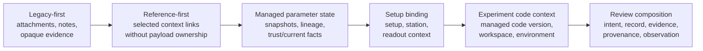
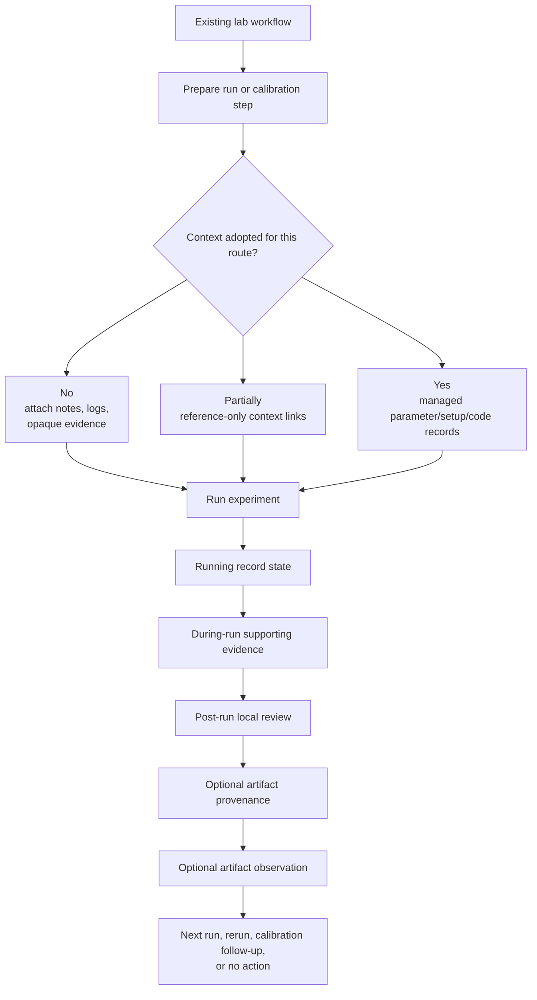
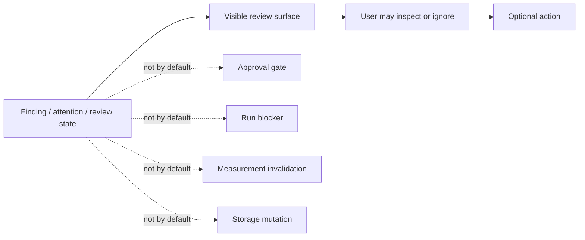

# Measurement Context Workflow Review Strategy

## Status

Discovery synthesis, not an ADR.

This note explains how to review the accumulated measurement-context discovery
slices. It is a product/workflow review aid, not an accepted storage model,
GUI contract, execution framework, or universal context schema.

## Review Question

Review these slices first for workflow fidelity:

Do they model how a lab user can gradually move an existing experiment workflow
into Scopecat without making context adoption, review findings, or artifact
management mandatory?

Implementation details matter after that question is answered. Most slices are
validation candidates over fixtures, so the largest risk is an incorrect
workflow model rather than Python mechanics.

## Migration Ladder

Scopecat should support partial adoption. A user should be able to start with
opaque supporting evidence around legacy scripts, then adopt managed context
only where it removes real ambiguity.

Early users may only use Scopecat as a structured review notebook. A copied
parameter JSON, XLSX table, runtime config, or other opaque legacy snapshot is
supporting evidence by default. It should not become managed parameter state
merely because it looks parameter-shaped; managed parameter state should keep
its own structured lineage, readiness, trust, and review semantics. Later users
may choose managed parameter state, setup binding, code context, or richer
artifact provenance. Measurement-record validity should not depend on adopting
all of these routes.

## Experiment Flow

The validated slices should be read as optional layers around an experiment:

Context, supporting evidence, artifact provenance, and artifact observation are
separate layers. A workflow may use any subset.

## Passive Review By Default

Most review slices are display/state projections. They should make system
state legible in a GUI, CLI, or notebook, not interrupt an experiment by
default.

Reserve `approval` and `gate` for slices backed by an explicit local
policy/template that provides interruption semantics. Passive GUI/review state
should use `review`, `attention`, `finding`, `status`, or `incomplete`.
`required` and `blocked` should be scoped to the local review surface, such as
`blocked_for_context_review`; they do not mean that hardware execution or
measurement validity has been decided.

## Boundary Rules

- Measurement context is optional for primary measurement-record validity
  unless a narrower workflow explicitly earns stronger semantics.
- Measurement intent may carry moving selectors; measurement records carry the
  resolved snapshot links actually used.
- Supporting evidence is not canonical context by default. Opaque legacy
  parameter files, spreadsheets, runtime configs, logs, screenshots, and debug
  objects stay supporting evidence unless a later accepted import/adapter slice
  maps them into a family-owned context record.
- Attachments and debug logs are opaque supporting evidence unless a later
  accepted slice promotes a specific artifact family into context.
- Artifact provenance is optional and declared; it is useful when an artifact's
  producer or source matters for review, comparison, or handoff, but it is not
  a default requirement for every attachment and it does not prove complete
  analysis lineage.
- Artifact observation is optional and file-level only; it is useful when
  availability or integrity matters, but it does not parse payloads, generate
  previews, or decide artifact correctness.
- Context readiness is local review state; it is not runnable readiness,
  hardware safety, setup truth, or run blocking.
- Calibration review slices should be checked against real notebook workflows
  before treating their child-summary chain as required product shape.
- Calibration external apply and parameter-state handoff are separate adoption
  paths. External apply records that a user intends to update an outside system
  or parameter file; it does not create managed parameter context. Parameter-
  state handoff is the path that intentionally creates or updates a managed
  Scopecat parameter-state snapshot.
- Setup binding can be reviewed as its own context family. Review surfaces may
  show selected parameter state and station registry alongside it, but setup
  binding should not be forced into the parameter-state model.

## Review Checklist

Use this order for branch review:

1. Confirm the migration ladder matches real lab adoption behavior.
2. Confirm review states are passive visibility by default.
3. Confirm optional context stays optional for measurement-record validity.
4. Confirm intent/record boundaries preserve moving selectors versus resolved
   snapshots.
5. Confirm supporting evidence, artifact provenance, and artifact observation
   remain separate from canonical context and storage.
6. Confirm calibration slices do not over-require a complete linear workflow
   when real users may have partial notebook outputs.
7. Only then review implementation mechanics, fixture coverage, and schema
   strictness.

## Workflow Questions To Resolve

- Which local policies or templates, if any, turn review findings into
  mandatory gates?
- Which opaque legacy files, if any, deserve an explicit import/adapter path
  into managed parameter state instead of remaining supporting evidence?
- Which artifact types actually need provenance and file-level observation in
  normal review, rather than staying plain supporting evidence?
- Which workflows use calibration external apply, which use parameter-state
  handoff, and where do users need to see both decisions side by side?
- Should post-run artifact observation coverage ever be required, or only
  surfaced when provided?
