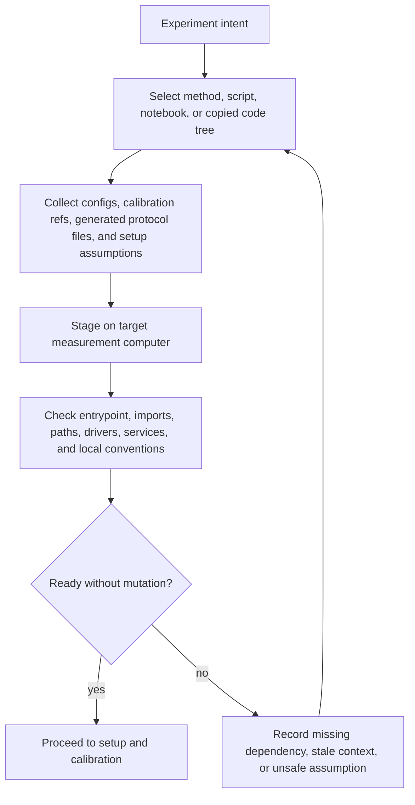
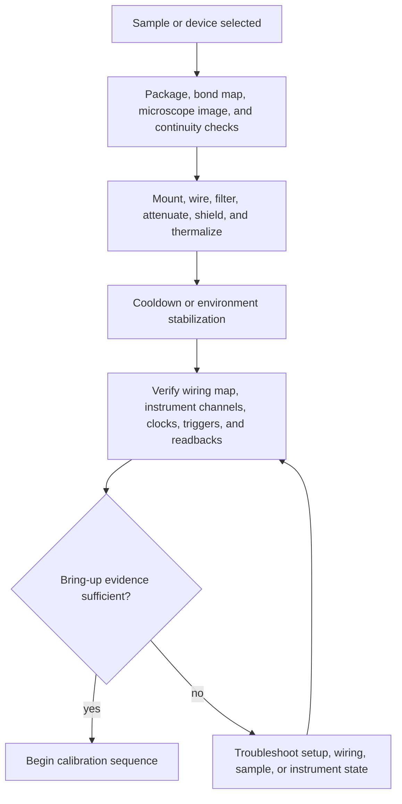
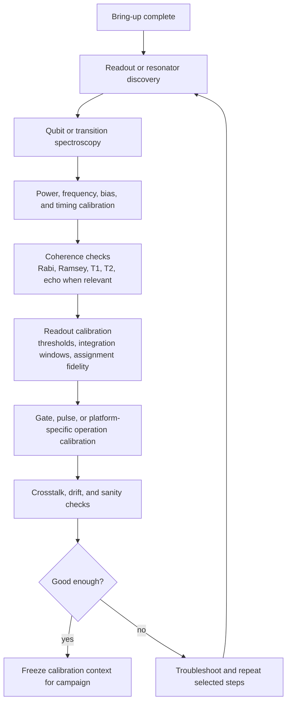
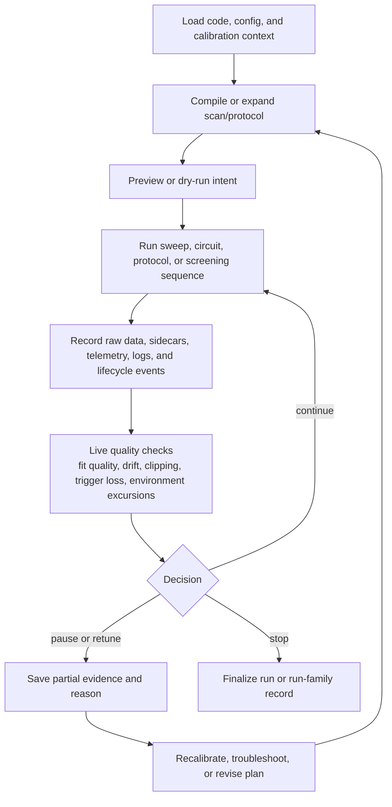
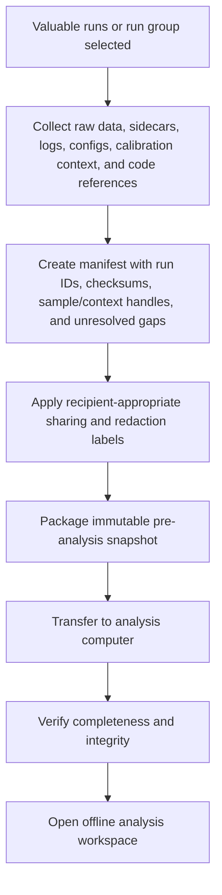
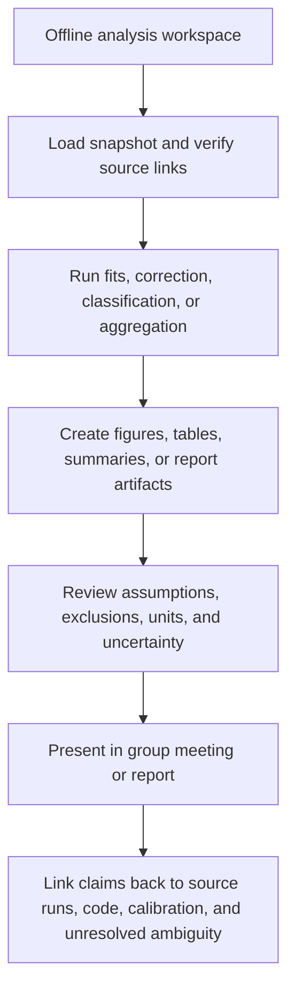

# Experimental Lab Workflow Reference

## Status

Quarantined.

Use this note for gap discovery; do not promote it directly into product scope.

## Source

- User refinement on 2026-05-15: preserve realistic experimental-lab workflow
  detail so future product work can compare candidate journeys against the
  whole lab context.
- Role-synthesis discussion from internal expert-style reasoning across
  experimental-physicist, lab-manager, and data/control-engineer perspectives.
  Treat these as domain hypotheses unless supported by existing evidence.
- Existing extracted research:
  - [`research-acceptance-readiness-triage.md`](research-acceptance-readiness-triage.md)
- Internal fixture source maps prepared from local sample trees. Use these only
  as full-fidelity internal evidence; promote public-safe intent and role
  patterns, not exact local artifact details.
- Promoted context in
  [`../../../strategy/experience-map.md`](../../../strategy/experience-map.md).

This note is public-safe and intentionally generic. It omits local paths,
hostnames, machine names, user names, sample identifiers, instrument addresses,
and lab-specific project labels.

## Summary

This note records realistic experimental-lab workflow detail that is too broad
for a product experience map but useful for future gap discovery. It is not a
product plan, accepted journey, architecture contract, subsystem spec, hardware
control model, scheduler model, ELN/LIMS scope, or public user documentation.

This workflow is a research scaffold for asking better questions, not an
accepted product journey:

```text
prepare intent
  -> stage code/config/context on a target measurement computer
  -> bring up and calibrate the sample/device
  -> run a measurement campaign in the existing local stack
  -> capture raw data, sidecars, logs, lifecycle events, and provenance
  -> package selected runs for analysis handoff
  -> transfer the snapshot to an analysis computer
  -> analyze, report, and link claims back to source evidence
  -> feed lessons into calibration, method, setup, or next-sample work
```

The important product-learning point is that code transfer and data transfer
sit on opposite sides of the measurement. Pre-run code/config staging is a
readiness and portability problem. Post-run data movement is an evidence,
integrity, and handoff problem.

## Current Use

Use this note as a gap-discovery reference when drafting or reviewing future
journeys, especially:

- dry-run package readiness;
- copied-code provenance;
- calibration review before write-back;
- hardware bring-up validation;
- passive measurement-time decision support;
- selected-run analysis handoff;
- scientific comparability review;
- analysis and report lineage.

Do not infer product acceptance directly from this note. Promote only narrow
claims into owner documents after fixture, interview, spike, or existing
evidence review.

Before promoting anything from this note, use the checklist at the end.

When using legacy sample evidence, focus on the user or lab intent behind the
artifact. Some concrete files, names, copies, sidecars, notebooks, or scripts
may exist because the old system lacked better primitives. They are evidence of
pressure, not product shapes to preserve by default.

## Remaining Value

This note remains useful while future product work is deciding whether candidate
journeys miss high-value lab gaps. Delete or archive it after the useful
workflow detail has moved into journey source maps, fixture plans,
capability-adoption hypotheses, or accepted decisions.

## How To Classify Claims Before Promotion

Use these classes when extracting from the workflows below:

| Class | Meaning | Handling |
| --- | --- | --- |
| Observed evidence | Directly supported by existing extracted research or current fixtures. | Can support evidence inventory or journey source maps. |
| Observed role/status evidence | Static artifacts show a likely role, status, or relation, but not authoritative runtime truth. | Preserve as source-map evidence with confidence and ambiguity labels. |
| Evidence-backed inference | Reasonable conclusion from observed artifacts, current docs, or multiple source families. | Candidate for promotion after owner review. |
| Domain hypothesis | Plausible lab workflow detail from role synthesis or domain reasoning. | Validate before promotion. |
| Boundary guardrail | Detail that protects scope, safety, or public redaction boundaries. | Keep visible when slicing journeys. |
| Rejected as current scope | Useful background that would over-broaden current product scope. | Keep out of journey acceptance unless new evidence and a decision reverse it. |

## Intent Lens For Legacy Artifacts

Local sample trees contain concrete artifacts such as copied code folders,
root config files, runtime setting bundles, generated sidecars, dated variants,
lock files, notebooks, summary arrays, rendered figures, spreadsheets, decks,
and hardware logs. Treat those artifacts as clues to intent. Do not assume the
product should reproduce the old artifact shape.

Read each row as: artifact seen -> likely intent -> product question -> scope
trap.

| Legacy artifact pattern | Likely user intent | Product gap to test | Avoid overfitting to |
| --- | --- | --- | --- |
| Copied code folders, backups, and dated script variants | Preserve a known-working method before changing setup, sample, or experiment assumptions. | Explain code provenance, known-good references, drift, and readiness. | Git hosting, package registries, automatic environment sync, or folder-management UX. |
| Root configs plus broader runtime-selected settings | Recover which context was actually selected, while preserving ambiguity when static evidence cannot prove it. | Selected-context explanation with confidence, conflicts, and observed-vs-inferred roles. | One universal config hierarchy or treating basename as authoritative truth. |
| Generated or copied sidecars | Keep derived context near the run because primary data alone is not enough to explain later results. | Companion-artifact roles, completeness checks, and run-bound snapshots. | Exact sidecar filenames, old serialization formats, or claims that every run emitted them. |
| Dated variants, backups, and lock/status clues | Avoid losing previous working states and warn about stale or concurrent edits. | Variant/status classification and rollback-pressure evidence. | Backup management, lock semantics, or automatic restoration as first scope. |
| Notebook analysis and local helper copies | Iterate quickly and keep tacit processing knowledge near the data. | Notebook/code evidence linking and analysis lineage. | Full notebook-state capture or treating outputs/execution counts as truth. |
| Summary arrays, generated figures, spreadsheets, and decks | Move from acquisition evidence to shareable analysis, meetings, and claims. | Analysis-impact lineage from outputs back to source runs and processing choices. | Report generation, presentation tooling, or publication workflow scope. |
| Hardware/service logs and setup scripts | Diagnose fragile local environments and equipment readiness. | Readiness and diagnostic evidence without mutation. | Hardware control, network mutation, setup apply, or environment management. |

The artifact classification vocabulary from fixture work is useful when
extracting intent:

- Artifact roles: anchor, selected-context candidate, code candidate, generated
  or derived artifact, setup evidence, environment evidence, backup, cache,
  checkpoint, and unknown.
- Evidence metadata: status, provenance relation, evidence handling, inclusion
  boundary, and sharing boundary.

These are source map concepts for analysis; they are not accepted user-facing
product objects.

## Workflow Reference

Each workflow gives context only. Promote only the intent, evidence to preserve,
and boundary that a narrower owner can validate.

### 1. Pre-Run Code And Context Staging

Before a measurement, experiment users often need to move or adapt runnable
measurement code, configuration files, calibration references, generated
protocol artifacts, and environment assumptions onto a target measurement
computer.



Extraction notes:

- Intent: preserve and recognize known-working method context before changing
  setup, sample, or computer.
- Evidence to preserve: code reference, selected configs, generated protocol
  context, dependency/readiness clues, and observed-vs-inferred status.
- Boundary: readiness checks should not become package deployment,
  environment ownership, managed execution, or hardware control.

### 2. Sample Or Device Bring-Up

The sample/device is not simply "ready." It passes through physical, setup, and
instrument readiness checks before scientific calibration begins.



Extraction notes:

- Intent: understand whether physical and setup context can support the next
  calibration or measurement.
- Evidence to preserve: sample/device identity handles, wiring/setup artifacts,
  readiness checks, and failure clues.
- Boundary: static setup artifacts are not authoritative setup truth; device
  communication, setup apply, and reconciliation remain out of scope unless
  explicitly decided.

### 3. Calibration Sequence

Calibration is a chain of measurements, fits, operator decisions, and sometimes
direct setting changes. Future products should preserve evidence and proposal
boundaries before accepting write-back.



Extraction notes:

- Intent: turn calibration measurements and fits into trusted context for later
  runs.
- Evidence to preserve: source measurement, fit output, operator judgment,
  selected calibration context, and correction/classifier choices.
- Boundary: reviewable proposals can be useful; automatic write-back or hidden
  parameter mutation needs a separate decision.

### 4. Measurement Campaign

A campaign may include repeated scans, sample-screening sequences, generated
protocols, partial runs, retunes, pauses, and stop/continue decisions.



Extraction notes:

- Intent: preserve enough context to understand the campaign, not just one
  completed dataset.
- Evidence to preserve: generated protocol context, sidecars, run-family
  relations, lifecycle state, and stop/pause/retune reasons.
- Boundary: passive, replayable decision support is different from a scheduler,
  workflow DAG, queue, or autonomous controller.

### 5. Analysis Handoff

After acquisition, a user may select valuable runs and move data plus context
from a measurement computer to a personal or shared analysis computer.



Extraction notes:

- Intent: move valuable data and context to analysis without losing source
  identity.
- Evidence to preserve: run IDs, manifest, checksums, selected context,
  source links, unresolved gaps, and recipient-appropriate sharing labels.
- Boundary: internal analysis handoff is not public export, full work-bundle
  import, report generation, or publication workflow.

### 6. Analysis, Reports, And Claims

Analysis work often continues outside the measurement environment and produces
fits, figures, notebooks, spreadsheets, reports, group-meeting slides, or paper
draft material.



Extraction notes:

- Intent: make later figures, reports, and claims traceable to source evidence.
- Evidence to preserve: processing code references, assumptions, exclusions,
  corrections, uncertainty, and links back to source runs.
- Boundary: preserve lineage before considering report generation,
  publication tooling, or full notebook-state capture.

### 7. Lab-Management Context

Operational work surrounds the experiment but should not dominate product
journey scope unless a narrow workflow earns validation.

| Activity | Why it matters | Product handling |
| --- | --- | --- |
| Equipment booking and cooldown planning | Scarce tools, cooldown windows, setup time, and backup users constrain experiments. | Context for readiness and scheduling pressure; not accepted scheduler scope. |
| Shift handoff | Operators need current state, active scripts, anomalies, next actions, stop conditions, and contacts. | Potential evidence for lifecycle and decision records. |
| Sample inventory | Chips, packages, mounted devices, fabrication batches, and status affect interpretation. | Minimal sample/context handles before full inventory scope. |
| Lab notebooks | Objectives, setup diagrams, parameter ranges, scripts, observations, and data links are operational evidence. | Link and summarize as evidence; avoid automatic notebook truth. |
| Group meetings and weekly reports | Figures, blockers, decisions, owners, and next actions shape what work continues. | Useful for analysis lineage and decision context; not full project-management scope. |
| Safety, training, and incidents | Cryogens, magnets, high voltage, lasers/RF, and faults constrain mutation and automation. | Guardrails for ADR-gated control/apply decisions. |

## Promotion Checklist

Promote from this note only when a narrower owner can answer:

Required before promotion:

- the user-visible outcome;
- the concrete fixture or interview source;
- the user intent behind any legacy artifact pattern;
- which computer owns the step: authoring, target measurement, shared
  instrument-control, or analysis;
- whether the workflow moves code/config before the run or data/evidence after
  the run;
- which source identity, calibration, setup, generated-protocol, correction, or
  lifecycle context affects trust;
- the boundary between evidence, proposal, diagnostic, and mutation;
- the minimum artifacts required;
- the redaction and sharing boundary;
- what remains explicitly out of scope.

Still out of scope unless separately decided:

- full ELN, LIMS, or lab-management platform;
- scheduler, queue, lease manager, or generic workflow DAG;
- automatic environment sync, package deployment, or code registry;
- hardware control, setup apply, rollback, or autonomous calibration;
- full publication, report generation, or collaboration workflow;
- universal sample, device, setup, or topology database.
