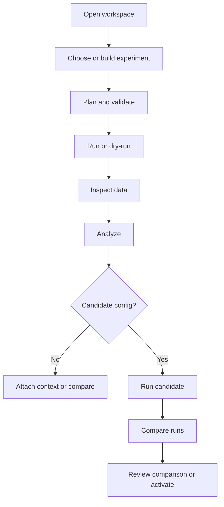

# Scopecat Experiment Workflow

Scopecat models experiment measurement as a local, repeatable workflow with
explicit inputs, validation, execution boundaries, artifacts, and audit
records.

The public path is Python-first:

```text
sc.open
  -> Workspace.experiment
  -> Workspace.run
  -> Run.data
  -> Run.analysis
  -> Analysis.candidate_config
  -> Workspace.run(..., config=candidate)
  -> Workspace.compare
```

Durable JSON models are useful for tests, debugging, storage, and adapter
boundaries. They should not become the main authoring surface for notebook or
script users.

## Main Flow



## Configuration

Configuration resolution assembles a validated `ConfigProfileSnapshot` without
connecting to hardware.

Parameter resolution loads a `ParameterCatalog`, accepted `ParameterState`,
and derivation rules, then freezes a `ParameterBuildSnapshot` with diagnostics,
hashes, and provenance.

Raw spreadsheets, registry trees, and private runner dictionaries must be
translated into typed Scopecat models before planning. Importers are one-way
anti-corruption tools, not compatibility layers.

## Experiment

An `ExperimentSpec` describes acquisition intent with four primary fields:

- `points`: relation expression that yields one row per acquired point.
- `params`: parameter patches evaluated against point rows.
- `state`: desired-state bindings evaluated from point columns and patched
  parameters.
- `acquire`: acquisition shape, shots, repetitions, dimensions, and record
  granularity.

Optional fields include `kind`, `id`, `assets`, and expected measurement
schema. Operator metadata belongs to the run request or manifest, not to the
experiment recipe.

The experiment subject is not a special `target` field. Fixed targets, swept
targets, and simultaneous multi-target control are represented as point
columns, variable-key joins, or repeated state bindings.

## Planning

Planning combines a config snapshot with an experiment spec:

- evaluate `points` into point rows and point ids;
- evaluate parameter patches into point-local patched views;
- evaluate desired-state bindings and state diffs;
- build an acquisition plan and expected result contract;
- persist a `PlanSnapshot` with hashes, diagnostics, provenance, and preview
  discovery.

Planning should not expose mutable registry/session objects, raw spreadsheets,
or private runner dictionaries. It consumes typed snapshots and emits typed
records.

Large point, patch, desired-state, or result-intent previews should be artifact
backed. Execution should depend on plan identity, point ids, acquisition shape,
and result contracts, not on local preview file layout.

## Validation

Blocking diagnostics prevent side effects before execution. Validation covers:

- catalog, state, derivation, and experiment schemas;
- point relation references and variable-key lookup cardinality;
- parameter patch keys, values, units, and safety bounds;
- desired-state resource and capability compatibility;
- acquisition dimensions, channels, shots, repetitions, and expected records;
- native instrument capability constraints.

Diagnostics should use stable codes and logical locations rather than local
file paths.

## Execution

Dry runs persist the plan and diagnostics without acquiring measurements.

Native runs resolve instruments through a provider, validate desired state,
compare desired state to readback state, apply state patches, acquire records
through a measurement sink, and persist events, artifacts, and diagnostics.

Runner adapters remain boundary code. They may translate a validated Scopecat
plan to external runner calls, but compatibility concerns must not shape core
models.

Hardware offload, lazy waveform generation, cross-instrument timing barriers,
active reset loops, sparse retries, crash recovery, resource scheduling, and
background monitor rows are execution or workflow boundary objects. They may
produce artifacts, events, point-status records, or scheduling records, but
they should not add hidden branches to the experiment kernel.

## Data And Analysis

`Run.data()` is the first post-run surface. It reads measurement datasets,
tables, arrays, text, JSON, binary artifacts, and typed artifact refs by
artifact id, kind, or metadata.

`Run.attach(...)` records run-owned attachments such as notebooks, notes,
screenshots, exported reports, and other operator context. Attachments are run
artifacts, not analysis records.

`Run.analysis(title, key=...)` records notebook interpretation: notes, tables,
arrays, figures, parameter changes, and saved analysis artifacts. Analysis
inputs are declared separately from outputs so raw measurements, run
attachments, and prior analysis artifacts can all participate in lineage
without becoming output rows. The analysis key defines the saved record
namespace; `Run.analyze(step)` defaults that key from `step.id` so multiple
steps can save without colliding. A reusable `AnalysisStep` should reproduce
the same output shape as manual notebook analysis; it is the promotion path for
repeated post-run logic.

Analysis notes are optional interpretation outputs, not required creation
metadata. Most repeated analysis should prefer structured tables, figures, and
parameter change reasons over free-form notes.

Derived analysis tables and arrays should keep coordinate, observable,
auxiliary, uncertainty, mask, and status roles in their schemas. When a derived
table keeps the original point coordinates, it should preserve source artifact
metadata so plotting and later analysis can use the same coordinate identity.

Online analysis is the incremental form of the same boundary. It may consume a
partial batch of validated result rows, run declared analysis steps, publish
analysis artifacts, and feed candidate finalization or adaptive continuation.
It must not mutate accepted parameters, rewrite `PlanSnapshot`, or hide
fitter/compiler decisions inside the experiment DSL.

Early-stop decisions consume validated rows, produce a stop/continue decision,
and record skipped planned points as run state. They must not compact,
renumber, or rewrite the planned point table.

## Candidate Configs

`Analysis.candidate_config()` turns analysis parameter changes into a lazy
`ParameterChangeSet`-backed candidate object. `Workspace.run(...,
config=candidate)` resolves that object at the run boundary, writing the
parameter change set and candidate config artifact. Resolution is a system
step, not human review. Candidate objects do not carry a separate reason; the
evidence lives on their parameter change sets.

Review is attached to a concrete decision point: fit assessment, parameter
change review, run comparison review, or config activation. Accepted parameter
changes happen only through explicit activation. Fit outputs, quality metrics,
covariance, classifier thresholds, and other calibration evidence remain
artifacts until a policy chooses parameter patches and activates a candidate
configuration. Free-form notes belong on those review and activation records
when the operator has something specific to record.

Rollback uses config registry activation history. Historical run data,
analysis artifacts, parameter changes, decisions, and activation records remain
immutable.

## Comparison And Overview

Run comparison is the review point after a candidate configuration has been
used for a follow-up run.

User-facing displays should render from durable records such as run manifests,
measurement datasets, analysis artifacts, candidate configs, reviews, and
comparison results. Scopecat does not automatically persist Markdown reports
or summaries as a second source of truth; user-authored Markdown remains a
normal attachment or analysis artifact. `RunOverview` is a rebuildable
structured view over the same records.

## Anti-Corruption Rules

- Never connect to hardware during configuration parsing.
- Never silently write accepted parameter state.
- Keep heavy legacy parsing dependencies and spreadsheet semantics out of core.
- Convert legacy JSON, CSV, XLSX, registry, or private runner inputs through
  explicit importers that produce typed artifacts and diagnostics.
- Preserve raw external outputs as artifacts when adapters need them.
- Standardize Scopecat-owned data around typed records, relation expressions,
  tables, arrays, events, and artifact refs.
- Remove transitional wrappers once tests cover the direct path.
