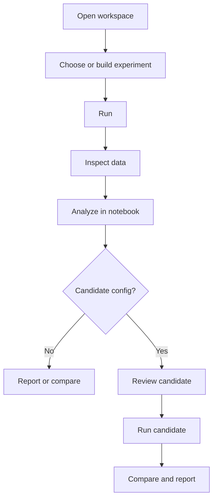

# Scopecat Experiment Workflow

Status: accepted workflow detail
Date: 2026-06-24

Scopecat models experiment measurement as a local, repeatable workflow with
explicit inputs, validation, execution boundaries, artifacts, and audit
records.

The canonical shape and vocabulary are defined in
[Scopecat Architecture](architecture.md). This note expands the workflow and
durable-record side of that accepted baseline.

The public path is Python-first. Notebooks and scripts start with
`sc.open -> Workspace.experiment -> Workspace.run -> Run.data -> Run.analysis`
and then optionally continue to `Analysis.candidate_config`,
`Workspace.review`, follow-up `Workspace.run`, `Workspace.compare`, and
`Workspace.report`.
Durable JSON models remain useful for tests, debugging, storage, and boundary
contracts, but they should not become the main authoring surface.

## Main Flow

## Resolve Configuration

Configuration resolution assembles a validated `ConfigProfileSnapshot` without
connecting to hardware.

Parameter resolution is part of configuration resolution:

1. load `ParameterCatalog`
2. load accepted `ParameterState`
3. validate schemas, units, keys, and safety bounds
4. evaluate relation-based parameter derivations
5. freeze `ParameterBuildSnapshot`

Raw spreadsheets, registry trees, and private runner dictionaries must be
translated into typed Scopecat artifacts before this point. Importers are
one-way anti-corruption tools, not compatibility layers.

## Build Experiment

An `ExperimentSpec` describes acquisition intent with four primary fields:

- `points`: relation expression that yields one row per acquired point
- `params`: parameter patches evaluated against point rows
- `state`: desired-state bindings evaluated from point columns and patched
  parameters
- `acquire`: acquisition shape, shots, repetitions, dimensions, and record
  granularity

Optional fields include `kind`, `id`, `assets`, and expected measurement
schema. Operator metadata belongs to the run request or manifest, not to the
experiment recipe.

The experiment subject is not a special `target` field. Fixed targets, swept
targets, and simultaneous multi-target control are represented as point
columns or repeated state bindings.

Do not encode workflow policy as pseudo experiment state. Resume policy,
campaign dependencies, resource leases, artifact eligibility, backend strategy,
and monitor insertion should be explicit boundary inputs around an ordinary
experiment plan. If the authoring surface needs pseudo-resources to express
them, the case belongs outside `ExperimentSpec`.

## Plan

Planning combines a config snapshot with an experiment spec:

- evaluate `points` into `PointPlan`
- evaluate parameter patches into `ParameterPatchPlan`
- build internal patched parameter views for affected point rows
- re-evaluate affected parameter derivations when needed
- evaluate desired-state bindings into `DesiredStatePlan`
- diff adjacent desired states into `StatePatchPlan`
- build `AcquisitionPlan`
- persist `PlanSnapshot` with hashes, diagnostics, and artifact refs

`PlanSnapshot` should persist point rows, parameter patch rows, desired state,
state patches, acquisition shape, diagnostics, and provenance. It should not
commit to embedding full per-point copies of all parameter tables. Detailed
parameter previews can be sampled or stored as artifacts.

Variable-key parameter references are planned as relation operations: project
keys from point or repeated-state rows, join against parameter tables, validate
cardinality, then project values.

## Validate

Validation checks:

- catalog, state, derivation, and experiment schema
- point relation references
- parameter patch keys, values, units, and safety bounds
- variable-key lookup cardinality
- desired-state resource and capability compatibility
- acquisition dimensions, channels, shots, and repetitions
- native instrument capability constraints

Blocking diagnostics prevent execution before side effects.

## Execute

Dry runs persist the plan and diagnostics without acquiring measurements.

Native runs resolve instruments through a provider, validate desired state,
compare desired state to readback state, apply state patches, acquire records
through a `MeasurementSink`, and persist events and diagnostics.

Heavy per-point artifacts such as compiled schedules and waveforms should be
available through lazy compiler/resource nodes. The `PlanSnapshot` records
intent and provenance; executors consume point or batch iterators so a large
sweep does not require every waveform to be generated before the first point
can run.

Some hardware can run selected sweep axes inside an uploaded sequence program.
Scopecat should still plan the logical sweep points, then let a hardware
program planner group those points into host invocations with an explicit
hardware-index to `point_id` map. Device results must decode back to normal
result rows before storage, processing, or evaluation.

Executors may also mix strategies in one logical plan. Points that satisfy a
hardware-offload policy can be grouped into hardware programs, while unsupported
points remain host-swept. Both paths must preserve the original `point_id`
space and converge at the same result contract.

Point-internal feedback programs, such as repeated syndrome readout with
decoder-driven frame updates, are also execution boundary objects. They may
contain dynamic branches inside the hardware or decoder loop, but Scopecat
should record their intent, decoder refs, syndrome summaries, and applied
frame updates as artifacts or point-level result rows.

Heralded preparation and active-reset loops follow the same rule. The
experiment still has one logical point; the domain boundary owns retry count,
readout labels, reset gates, and stop conditions, then emits a point-level
summary such as success, attempts, and final state.

Cross-instrument timing barriers are executor/resource-gate plans derived from
resource timing requests. A validated experiment may require multiple
resources to become ready at one logical barrier time, but the arm/settle order
belongs to the execution boundary rather than point-row authoring.

Sparse failed-point retries are also execution cleanup. Retry attempts should
be validated and summarized before storage so downstream processing receives
logical point rows plus retry diagnostics, not duplicated scan points.

Crash recovery is a workflow decision over persisted point status rows. A
resume planner should read the original `PlanSnapshot`, completed rows, failed
rows, and skipped rows, then emit concrete pending and retry point ids. It must
not compact, renumber, or rewrite the planned point table.

Resource contention belongs to the scheduler. Run requests should declare
shared or exclusive leases with durations and dependencies; the scheduler may
overlap compatible runs and serialize exclusive conflicts before native
execution receives a concrete start order.

Long-running workflows may interleave health-monitor or background calibration
rows around ordinary scan rows. This should happen by materializing concrete
rows with explicit roles and source indices before execution, not by adding
hidden branches to the experiment kernel.

Runner adapters remain boundary code. They may translate a validated
Scopecat plan to external runner calls, but compatibility concerns must not
shape core models.

## Inspect Data, Analyze, And Review Candidates

`Run.data()` is the first post-run surface. It reads measurement datasets,
tables, arrays, text, JSON, binary artifacts, and typed artifact refs by
artifact id, kind, or metadata.

`Run.analysis(...)` records notebook interpretation: notes, tables, arrays,
figures, guesses, and saved analysis artifacts. A reusable `AnalysisStep`
should reproduce the same output shape as manual notebook analysis; it is the
promotion path for repeated post-run logic.

`Analysis.candidate_config()` turns guesses into a public candidate object.
`Workspace.review(candidate)` and `Workspace.run(..., config=candidate)` lower
that object into internal `ParameterChangeSet` and candidate config artifacts.
The notebook path does not require users to handle proposal records directly,
but durable storage still records them for audit and GUI review.

Online analysis is the incremental form of the same boundary. It may consume a
partial batch of validated result rows, run declared analysis steps, publish
named analysis results, and feed candidate finalization or adaptive continuation
planning. It must not mutate accepted parameters, change the static
`PlanSnapshot`, or hide fitter/compiler decisions inside the experiment DSL.
Online decisions should be persisted as run events or analysis artifacts so
later offline replay can explain the same candidate.

Early-stop decisions are a special case of online analysis: they consume
validated rows, produce a stop/continue decision and completed point ids, and
record skipped planned points as run state. They must not rewrite the
`PlanSnapshot`.

Calibration acceptance policy is separate from fit execution. Fit artifacts may
carry value, uncertainty, covariance, and quality metrics; proposal finalization
uses explicit thresholds to decide which analysis-backed values survive review.

When accepted parameter changes are created, a dependency/invalidation boundary
should mark affected derived state, compiler inputs, cached waveforms, and
resource state previews dirty. This is separate from both experiment-time
patching and accepted-state mutation.

Shot-level classifier selection is acquisition or analysis boundary work. The
experiment may declare a readout intent and expected probability outputs, but
training shots, classifier quality, selected thresholds, and apply-from-shot
decisions should be stored as classifier artifacts or evaluation records.

Candidate review creates a candidate `ParameterState`, resolves and validates
a candidate config snapshot, and can later register or activate it through the
config registry when that policy is appropriate.

Multi-run calibration campaigns wrap ordinary experiments. They order readout,
Rabi, T1, candidate activation, and comparison runs by explicit dependencies
and produced artifacts; they do not require nested experiment syntax.

## Compare And Report

Reports are artifacts that link back to source runs, datasets, analysis
artifacts, candidate configs, and comparisons.

Run comparison is the review point after a candidate configuration has been
used for a follow-up run.

## Durable Records

Every run centers on a `RunManifest` with:

- run id, status, runner id, dry-run flag, and creation time
- workspace, experiment, config snapshot, plan refs, and content hashes
- runner versions
- event stream ref
- measurement dataset refs
- artifact refs
- analysis artifact refs
- lower-level job artifacts for implementation compatibility behind the public
  `Analysis` API
- parameter-change and candidate-review artifact ids
- finalization summary

Large data should be referenced through artifacts rather than embedded in the
manifest or record metadata.

Streaming arrays may be written as ordered artifact chunks. The run manifest or
dataset index should reference the chunk manifest and point-scoped artifact
refs, while storage validation checks completeness, duplicate chunks, and
missing chunks before derived processing consumes the array.

Partial artifact failure should not automatically invalidate a scalar point
row. Storage or processing eligibility checks should distinguish missing
required artifacts, missing optional artifacts, usable scalar measurements, and
diagnostics for each logical point.

## Boundary Summary

The full system split is maintained in
[Scopecat Architecture](architecture.md).
Workflow-specific boundaries in this document are:

| Boundary | Workflow Responsibility |
|---|---|
| `RunManifest` | Tie run inputs, plan refs, datasets, artifacts, events, analysis records, candidate configs, and reports under one run identity. |
| `NativeInstrument` | Validate, diff, apply, acquire, cleanup, and abort native state during execution. |
| `RunnerAdapter` | Translate validated Scopecat plans at the external boundary without shaping core models. |
| `MeasurementSink` | Persist and validate typed measurement records against result contracts. |
| `RunResumePlanner` | Convert persisted point status into pending and retry point ids without rewriting plans. |
| `ResourceScheduler` | Resolve shared/exclusive leases and run dependencies before execution. |
| `AnalysisStep` | Produce derived data, figures, notes, quality decisions, and candidate guesses from stored run data. |
| `OnlineAnalysis` | Incrementally connect validated result rows, analysis outputs, candidate finalization, and adaptive continuation. |
| `ConfigRegistry` | Register, activate, roll back, and compare accepted configuration candidates. |

## Anti-Corruption Rules

- Never connect to hardware during configuration parsing.
- Never silently write accepted parameter state.
- Keep heavy legacy parsing dependencies and spreadsheet semantics out of
  Scopecat core.
- Convert legacy JSON, CSV, XLSX, registry, or private runner inputs through
  explicit importers that produce typed artifacts and diagnostics.
- Preserve raw external outputs as artifacts when adapters need them.
- Standardize Scopecat-owned data around typed records, relation expressions,
  tables, arrays, events, and artifact refs.
- Remove compatibility wrappers once tests cover the accepted path.
