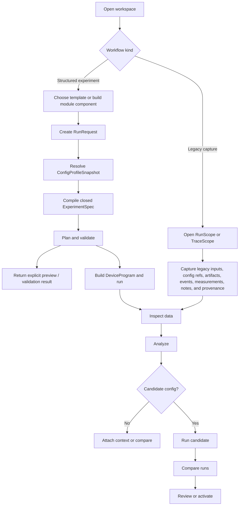

# Scopecat Experiment Workflow

Status: target design

Scopecat models experiment measurement as a local, auditable workflow with
explicit inputs, closed run-segment specs, validation, execution boundaries,
typed outputs, artifacts, analysis records, and reviewable configuration
changes.

## Public Flow

The structured Python-first path is:

```text
sc.open
  -> Workspace.template / Workspace.module
  -> RunRequest
  -> compile ExperimentSpec
  -> plan / validate
  -> run
  -> Run.data
  -> Run.analysis
  -> CandidateConfig
  -> follow-up RunRequest
  -> Workspace.compare
  -> review / activate
```

Legacy capture is a separate low-intrusion path for existing notebooks,
scripts, or runners that do not use Scopecat experiment definitions:

```text
sc.open
  -> RunScope / TraceScope
  -> capture inputs, config refs, artifacts, events, measurements, and notes
  -> Run.data / attachments
  -> Run.analysis
  -> optional CandidateConfig
  -> review / activate
```

Capture records may sit in the same run graph as structured records, but they
do not imply an `ExperimentModule`, `ExperimentTemplate`, `RunRequest`,
`ExperimentSpec`, `ExperimentPlan`, or `DeviceProgram`.

Durable JSON records are useful for tests, storage, debugging, reproducibility,
and adapter boundaries. They should not become the main authoring surface for
notebook or script users.

## Main Flow



## Configuration

Configuration resolution assembles an immutable `ConfigProfileSnapshot` without
hardware side effects. The snapshot includes accepted parameter state, topology,
routing, instrument registry metadata, and environment information. Run-level
source coordinates live on the run manifest instead of inside the snapshot.

Raw spreadsheets, registry trees, private dictionaries, and external config
formats are translated through importers or private adapters into typed
Scopecat records. They are not planning inputs directly.

Derived planning views can be materialized and hashed when useful, but the
accepted input remains `ConfigProfileSnapshot`.

## Authoring

`ExperimentModule` is the reusable library layer. It declares point variables,
column specs, defaults, helper functions, state fragments, record fragments,
program assets, dependencies, and pure code island boundaries.

`ExperimentTemplate` is the runnable entrypoint. It declares input schema,
defaults, labels, descriptions, categories, and calls one or more module
components. Templates should not compose other templates; composition happens
at the module/component layer.

Structured notebook and script users should be able to stay in ordinary Python
while the run boundary captures enough structure to compile a closed spec.
Legacy notebooks or scripts that do not provide this structure use
`RunScope` / `TraceScope` instead.

## RunRequest

`RunRequest` is the snapshot of this run or segment request. It includes:

- template ref and input values;
- config source or candidate config source;
- operator metadata;
- overrides and provenance;
- point axes, parameter sweeps, repeats, randomization inputs, and seeds;
- extra point columns when declared by a column spec or extension slot;
- extra records such as readbacks, derived coordinates, or instrument products;
- execution flags and policy;
- segment lineage for adaptive or follow-up runs.

Run requests should support ad-hoc sweeps without creating a new template for
each parameter combination. A parameter sweep compiles to a point column plus a
point-local config patch.

## Compilation

Compilation combines:

```text
ExperimentModule + ExperimentTemplate + RunRequest + ConfigProfileSnapshot
  -> ExperimentSpec
```

The output `ExperimentSpec` is a closed per-segment HIR. It contains or
references every input required to recompute the plan: module/template
fingerprints, run request hash, config snapshot hash, point source or point
table, point column specs, parameter patches, desired state declarations,
record declarations, assets, diagnostics, seeds, schema versions, and
provenance.

Spec compilation validates:

- unknown point columns and unbound expression references;
- parameter existence, units, safety bounds, and patch legality;
- entity refs and routing refs;
- override precedence and provenance;
- sweep composition semantics such as cross, zip, join, and concat;
- record source availability and basic shape policy;
- pure code island boundaries and fingerprints.

## Planning

Planning lowers a closed `ExperimentSpec` into an `ExperimentPlan`.

The plan materializes or references:

- point rows or point-source previews;
- `point_index`, `point_uid`, and logical identity columns;
- point-local parameter patches and derived config views when needed;
- desired logical state;
- record materialization and result contract;
- artifact refs and program refs;
- diagnostics and compiler identity.

Planning must not read mutable registries, notebook globals, raw spreadsheets,
or a second config source. It consumes the closed spec and deterministic
compiler inputs.

Large point, patch, state, or record previews should be artifact backed.
Execution depends on plan identity, point identity, result contract, program
refs, and device program records, not on local preview file layout.

## Execution

Preview and validation APIs return spec, plan, result contract, diagnostics,
and optional device-program validation without acquiring measurements or
creating a run manifest.

Structured runs build a `DeviceProgram` from the plan, program artifacts,
routing, instrument-group capabilities, and runtime policy. Runtime applies
state patches, uploads programs, coordinates arms/triggers/barriers, records
readbacks, acquires products, validates returned rows, handles retries or
early stop, and persists events and artifacts.

Legacy capture runs use `RunScope` or `TraceScope` directly. They do not start
from an `ExperimentTemplate`, `ExperimentModule`, `RunRequest`, compiled
`ExperimentSpec`, planned `ExperimentPlan`, or `DeviceProgram`. The legacy
script keeps execution control while Scopecat records run identity, inputs,
config refs, generated artifacts, events, measurements, notes, analysis, and
provenance level. Capture records are useful evidence, not proof that Scopecat
can replay the run.

Legacy batch runners can be wrapped behind instrument groups or
captured as run evidence when needed. They do not define the core model.

## Data And Analysis

`Run.data()` is the first post-run surface. It reads typed tables, arrays,
JSON, text, binary artifacts, record rows, artifact refs, and result-contract
metadata by artifact id, kind, or schema.

`Run.attach(...)` records run-owned operator context such as notebooks, notes,
screenshots, exported reports, or external files. Attachments are artifacts,
not analysis records.

`Run.analysis(...)` records interpretation: notes, tables, arrays, figures,
fit outputs, model outputs, parameter changes, and saved artifacts. Inputs and
outputs are declared separately so raw measurements, attachments, prior
analysis, and external artifacts can all participate in lineage.

Reusable `AnalysisStep`s reproduce the same output shapes as manual notebook
analysis. They are the promotion path for repeated post-run logic.

## Candidate Configs

Analysis may produce `ParameterChangeSet` or `ConfigPatch` records. A
candidate config resolves those patches against an accepted `ConfigProfileSnapshot`
and produces a candidate snapshot for follow-up runs.

Accepted configuration changes happen only through explicit activation.
Analysis, instruments, instrument providers, and online decisions must not silently
mutate accepted state.

Review is attached to concrete decision points such as fit assessment,
parameter-change review, run-comparison review, or config activation.
Rollback uses config activation history; historical run evidence remains
immutable.

## Adaptive And Online Workflows

Adaptive workflows do not mutate an existing closed spec.

Common adaptive runs use segment lineage:

```text
segment 1 -> run -> analysis/decision -> segment 2
```

Extreme online adaptive runs use a closed `PointSourceSpec` plus append-only
`PointDecisionRecord`s. The point source records how points may be generated;
the decision log records what was actually generated and why.

Online analysis may consume partial validated result rows and produce decisions
for early stop, adaptive continuation, or candidate finalization. It must not
rewrite the planned point table, compact point indices, or hide compiler
decisions inside analysis code.

## Validation

Blocking diagnostics prevent side effects before execution. Validation covers:

- config snapshot schema, refs, units, and safety bounds;
- module/template/run-request schemas;
- point sources, point columns, identity rules, and expression references;
- parameter patches and candidate patch expectations;
- desired state resources and capability compatibility;
- record declarations, result contract shape policy, and artifact strategy;
- program/code-island fingerprints and dependency provenance;
- routing, instrument-group capabilities, and device-program compatibility;
- storage refs, artifact eligibility, and returned-result validation.

Diagnostics should use stable codes and logical locations. Local paths and raw
exceptions may be debug details, not durable diagnostic identity.
