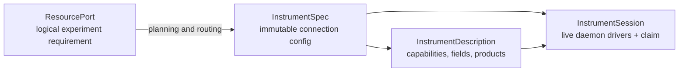

# Instrument Control

Scopecat treats direct instrument interaction as a first-class lab activity,
not as an experiment with one point. The GUI and notebook API open explicit
sessions owned by the lab daemon, while experiments and interactive sessions
compete for the same exclusive resource claims.

The design borrows Labber's useful separation between a background Instrument
Server, manual instrument controls, and measurement tooling. It does not adopt
a flat, vendor-shaped quantity tree as Scopecat's experiment model. Logical
resource ports and capabilities remain the experiment-facing contract.

## Four distinct layers



`InstrumentSpec` answers what physical device is configured and how a provider
can reach it. It contains a stable instance id, `driver_id`, and a typed
connection. It is versioned with the complete `ConfigProfileSnapshot`; editing
a connection publishes a new immutable config entry instead of mutating a live
run's inputs.

`InstrumentDescription` is the pure driver contract used without opening
hardware. It declares vendor-neutral capabilities, state fields, field access,
types, units, labels, descriptions, and collectable products. Both GUI controls
and experiment validation are derived from it.

`InstrumentSession` is an explicit daemon-owned connection. The daemon pins
the active config revision, claims all requested instruments, provisions the
drivers, and keeps them behind a session id until close or abort. There is no
client lease, TTL, or heartbeat: losing a GUI tab does not imply that hardware
state is uncertain. The session remains visible and can be disconnected by
another GUI or notebook client. Daemon shutdown aborts and closes live drivers;
on restart, idle sessions are released while a session interrupted during a
consequential operation remains in `attention_required`.

`ResourcePort` remains a logical experiment requirement such as RF output or
network sweep. Planning routes it to a physical instrument. Experiment
definitions therefore do not depend on addresses, vendors, or GUI concepts.

## Connection configuration

The core configuration schema distinguishes:

- `virtual`: an in-process simulated device selected by `driver_id`;
- `tcpip_socket`: host, port, and timeout for line-oriented SCPI.

Connections may carry driver-specific `options`. The first-party provider
supports virtual devices and configured TCP/IP endpoints.

Example:

```json
{
  "id": "readout-vna",
  "driver_id": "scopecat.keysight.e5080b",
  "connection": {
    "kind": "tcpip_socket",
    "host": "192.0.2.20",
    "port": 5025,
    "timeout_seconds": 10,
    "options": {}
  }
}
```

The GUI's connection editor follows the same immutable workflow as other
configuration: load the active complete snapshot, edit the selected
instrument's current TCP/IP endpoint or timeout, publish a new entry, and
activate it. The editor does not change `driver_id`, connection kind, or driver
options. Virtual connections have no endpoint to edit. Editing is disabled
while the instrument is owned.

## Instruments workspace

Instruments are a top-level workspace beside Runs and Configuration. The list
shows:

- friendly label, stable id, driver, and non-secret connection summary;
- availability: `available`, `active`, `quarantined`, or `unavailable`;
- current owner kind and actor or run id;
- provider or configuration problems.

Opening an instrument does not connect automatically. The operator explicitly
selects **Connect**, after which the detail view:

1. reads a fresh state snapshot;
2. renders capability groups and field controls from
   `InstrumentDescription`;
3. disables `read_only` fields and never tries to read `write_only` values;
4. stages edits locally, showing current and proposed values separately;
5. submits all staged fields in one **Apply** operation;
6. offers **Collect** only for declared products and previews returned values
   or arrays;
7. closes the session on explicit disconnect or workspace teardown.

If a browser teardown request does not reach the daemon, the next client can
disconnect the still-visible interactive session. This is ordinary ownership
recovery, not quarantine: only an unfinished consequential operation or failed
driver cleanup creates hardware uncertainty.

This is intentionally not a raw SCPI terminal. Driver capabilities preserve
units and validation, make changes auditable, and keep the same semantics in
GUI, notebooks, and experiments.

Output enable, source level, heater control, and similar consequential fields
must never be “apply on change”. Staging makes a multi-field transition
intentional and lets a driver order dependent device commands safely. The
initial Lake Shore driver is read-only because generic heater controls need
additional lab-specific safety policy.

## Notebook API

The normal project connection exposes the same daemon-owned path:

```python
import scopecat as sc

with sc.open_project(".").connect(operator="alice") as lab:
    for item in lab.instruments.list().items:
        print(item.spec.id, item.availability, item.owner_actor)

    with lab.instruments.open("readout-vna") as vna:
        print(vna.describe())
        print(vna.read_state())

        receipt = vna.apply(
            "network_sweep",
            start_frequency=sc.Quantity(4.8, "GHz"),
            stop_frequency=sc.Quantity(5.2, "GHz"),
            points=401,
        )
        trace = vna.collect(
            "network_sweep",
            "frequency",
            "s_parameter",
        )
```

Values with physical units may be passed as Scopecat `Quantity` values. Plain
numbers remain valid only where the declared field type accepts them. A
multi-instrument session is available when an operation must reserve a coherent
set:

```python
with lab.instruments.open("flux-source", "readout-vna") as session:
    session.apply(
        "dc_output",
        {
            "voltage_level": sc.Quantity(0.05, "V"),
            "output_enabled": True,
        },
        instrument_id="flux-source",
    )
    trace = session.collect(
        "network_sweep",
        "s_parameter",
        instrument_id="readout-vna",
    )
```

The handle is synchronous to match the existing notebook API. It generates a
new operation id for every apply or collect unless the caller supplies one,
and closes or aborts through the daemon when leaving the context. If an HTTP
response is lost, retry with the same `operation_id`: the daemon returns the
recorded receipt instead of touching the device again. The daemon client
automatically retries one transport failure with the same complete command;
callers can supply an id when they need to continue that retry explicitly.
Opening also has a retry identity. Close and abort are naturally idempotent
because the daemon records the session's terminal status.

An operator can recover a session left by another notebook kernel with
`lab.instruments.abort_session(session_id)`. This asks the daemon to run the
driver's safe abort path before releasing the resource claim.

## Concurrency and failure semantics

Runs and direct sessions claim the same resource key, so an instrument cannot
be manually adjusted while an experiment owns it. Multi-instrument acquisition
is all-or-nothing. The daemon acquires the durable claim before contacting
hardware. Only the external notebook executor needs a renewable lease and
fencing token; direct driver calls already execute inside the owning daemon.

Reads are observational: a failed read reports an error but does not by itself
claim the physical state changed. Apply and collect are consequential:

- `applied` or `collected` means the driver confirmed the outcome;
- `not_applied` or `not_collected` proves it did not happen;
- `unknown` means the command may have reached the instrument.

The last case aborts and closes the live drivers, retains quarantined resource
claims, and requires operator resolution. Automatic retry would be unsafe.
Operation ids provide session-local de-duplication, and durable started/finished
events provide an audit trail around consequential calls. A daemon restart
releases an idle session, but the durable active-operation marker lets it
quarantine a session interrupted between those two events.

The daemon is the sole live driver host for both interactive sessions and
experiment runs. A notebook plans and interprets the experiment program, but
after the daemon grants its fenced executor lease, the daemon provisions
drivers from the run's accepted configuration snapshot. The notebook submits
ordered hardware batches; the daemon owns current-state reconciliation,
driver calls, batch replay, and final cleanup or abort with terminal readback.
Experiments therefore do not expose per-device lifecycle RPCs. Planning may
call the provider's pure description contract; it never provisions a live
driver. Fine-grained read, apply, and collect remain available only through an
explicit interactive session.

Admission records the expected provider and an ordered instrument-contract
fingerprint. The daemon verifies both before connecting drivers, so a provider
or capability change cannot be accepted by client convention alone. Each
hardware batch has one content-derived retry identity and durable
started/finished evidence. Individual effects retain semantic ids for
diagnostics, not independent retry identities.

The daemon's reconciliation cache is an assumed state: it starts from observed
readback and advances only after confirmed writes, using driver-returned state
when available. It is not presented as fresh physical observation. Drivers for
devices whose fields drift independently can later require explicit readback
without changing the batch boundary.

## Initial superconducting-lab driver set

The first package deliberately implements narrow, documented subsets:

| Device | Capability | Initial boundary |
|---|---|---|
| Yokogawa GS200/GS210 | `dc_output` | source mode, range, level, protection, output, optional `/MON` reading |
| R&S SGS100A | `rf_output` | CW frequency, power, RF output, internal/external reference |
| Lake Shore 372 | `temperature_readout` | read-only scan channel, temperature, resistance, status, and sample-heater telemetry |
| Keysight E5080B | `network_sweep` | one linear two-port S-parameter sweep and complex trace |

These subsets follow the vendors' public programming documentation:

- [Yokogawa GS200/GS210 User's Manual](https://cdn.tmi.yokogawa.com/1/6218/files/IMGS210-01EN.pdf)
- [Rohde & Schwarz SGS100A User Manual](https://scdn.rohde-schwarz.com/ur/pws/dl_downloads/pdm/cl_manuals/user_manual/1173_9105_01/SGS100A_UserManual_en_13.pdf)
- [Lake Shore Model 372 User's Manual](https://www.lakeshore.com/docs/default-source/product-downloads/manuals/372_manual.pdf)
- [Keysight E5080B Programming Guide](https://helpfiles.keysight.com/csg/e5080b/Programming/Programming_Guide.htm)

## Virtual lab

Virtual instruments implement the same descriptions and receipts as real
drivers. They share one deterministic `VirtualLabWorld`: changing an enabled DC
source shifts the virtual resonance and adds heating; enabled RF power also
adds heating; the temperature monitor observes the resulting temperature; VNA
linewidth, depth, and trace noise respond to that world.

This coupling matters. Independent mocks can demonstrate buttons, but a shared
world lets a user learn the real workflow—connect, bias, observe temperature,
collect a trace, and see cause and effect—without hardware. A fixed seed keeps
tests reproducible while still producing realistic complex traces.
