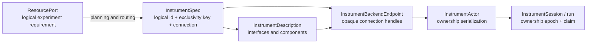

# Instrument Control

Scopecat treats direct instrument interaction as a first-class lab activity,
not as an experiment with one point. The GUI and notebook API open explicit
sessions owned by the lab daemon, while experiments and interactive sessions
compete for the same exclusive resource claims.

The design borrows Labber's useful separation between a background Instrument
Server, manual instrument controls, and measurement tooling. It does not adopt
a flat, vendor-shaped quantity tree as Scopecat's experiment model. Logical
resource ports and versioned interface requirements remain the
experiment-facing contract.

## Contract and lifecycle layers



`InstrumentSpec` answers what device is configured and how a provider can reach
it. Its `id` is the logical name used by commands, UI, and evidence;
`exclusivity_key` is the stable lab-defined physical access domain used only for
scheduling and daemon actors. It also contains `driver_id` and a typed
connection. The exclusivity key is neither inferred from an address nor exposed
to drivers. A config cannot assign one key to multiple instruments; a device
with several roles exposes multiple interfaces or components instead.
Ordinary activations may add physical domains but cannot remove or rekey one;
renaming a logical instrument keeps the same key. Retirement and rekeying
use a separate explicit inventory migration and only succeed after every
affected old and new physical domain is drained.
The complete spec is versioned with `ConfigProfileSnapshot`; editing it
publishes a new immutable entry instead of mutating a live run's inputs.

`InstrumentDescription` is the pure driver contract used without opening
hardware. It declares the versioned interfaces the device implements. An
interface or nested component may contain persistent properties, atomic
operations, and acquisitions with typed results. GUI controls and experiment
validation are derived from this description.

`InstrumentBackendEndpoint` owns providers and raw drivers, returning only
opaque connection handles. Before crossing that boundary, the daemon projects
the accepted config to provider bindings containing only device identity,
driver id, and connection settings. Topology, parameters, routing, and run-start
policy never enter the worker. Production uses one spawned, project-long worker;
the in-process implementation is a test seam behind the same API.
`InstrumentActor` remains in the daemon, is indexed by `exclusivity_key`, and
may retain a matching worker handle while the physical access domain is idle.
The owned view separately retains the logical instrument id. The actor accepts
only the driver backend ABI and never treats idle state as observed.
A handle is reusable only when its provider endpoint, canonical per-device
binding, and complete advertised description still match. Changing defaults,
run-start policy, routing, or unrelated configuration does not reconnect the
device; changing its driver, connection, options, or contract does. An idle
handle that is no longer selected remains process-local until a mismatched
owner replaces it or the daemon shuts down.

The normal instrument list is a separate safe projection: identity, driver id,
connection kind, and TCP/IP host/port. It excludes driver options, timeouts,
default state, run-start policy, exclusivity keys, and config hashes. The GUI
loads the complete active config only after a user explicitly opens
configuration editing.

`InstrumentSession` and an admitted run are ownership epochs, not connections.
The daemon pins the config revision, claims all requested instruments, and
acquires their actors until release or abort. Owner-scoped state and replay
evidence are cleared at the end of every epoch. Direct sessions carry a
renewable ownership lease; GUI and Notebook clients renew it explicitly at one
third of its duration. Renewal changes no hardware state and emits no durable
event. An expired idle session releases its actor without aborting, resetting,
or disconnecting a healthy cached connection. New run and session claims compare
the activation generation in the same SQLite writer transaction, so a concurrent
config activation cannot commit ownership derived from a stale physical
inventory.

A submitted run carries logical resource requirements only. Admission verifies
its complete instrument inventory against daemon-owned configuration, then
resolves separate canonical claims keyed by `exclusivity_key`; clients cannot
author physical claim ids. Registry and analysis-candidate sources are resolved
from their durable records, while a scratch submission must match the active
inventory. Domain plans retain the target kind and its complete instrument
footprint as one structured requirement. Ordinary run and instrument views
project claims back to logical ids. Scheduler keys remain confined to admission
storage, resource claims, and actor lookup.

A domain target may also own private connection endpoints that have no
standalone instrument contract. Such endpoints are configured as named target
members, remain invisible in the Instruments workspace, and are covered by the
target ownership claim. The target has its own stable `exclusivity_key`; its
logical id may change without changing the physical access domain, while
ordinary activation cannot silently replace that key. Admission compares the
complete submitted target binding, including member roles and private
connections, with daemon-owned active configuration before issuing the
canonical claim. Hardware that remains useful independently is instead
configured as an instrument member so direct sessions and other runs conflict
with the target through the same physical resource claim.

Executable Python remains in the client, so admission validates and authorizes
the declared plan rather than reconstructing it. Treating a hostile client as a
planner requires a future daemon-signed or daemon-built plan, not broader
implicit claims that serialize unrelated experiments.

Every new owner reads the device before its first write, including when it
reuses an idle connection. This accepts legitimate front-panel changes without
background polling or pretending the daemon observed idle hardware. A direct
session returns that synchronized snapshot in its open receipt; replaying the
same open operation returns the same evidence without touching hardware again.
If the initial refresh fails on a reused connection, the actor retires it and
retries once with a new connection. Normal release leaves a healthy connection
available; an unknown hardware outcome faults and disconnects it. Daemon
shutdown first fences new owners, then drains durable ownership, disconnects
actor handles, and shuts down the endpoint. If driver cleanup exceeds the
shutdown grace period, the daemon fences the whole worker generation; pending
consequential calls become unknown and the worker is terminated.

A state snapshot is complete public physical state for every advertised static
component. Logical entity and channel bindings remain command provenance; they
are resolved before a driver request and never become device-state identity.
Quantity readback uses the unit declared by its `PropertySpec`; canonical units
make daemon-side validation deterministic.

An explicit state refresh is read-only. If it fails, or the driver returns an
invalid snapshot, the daemon ends the whole multi-instrument ownership epoch
and faults every connection without issuing hardware aborts. The durable
session is quarantined only if closing that session fails. A readback failure
after a consequential apply, operation, or acquisition remains an unknown
outcome and uses the abort-and-quarantine path.

`ResourcePort` remains a logical experiment requirement such as RF output or
network sweep. It requests one or more namespaced interface ids such as
`scopecat.rf_output/v1`; planning routes the complete requirement to a physical
instrument. Experiment definitions therefore do not depend on addresses,
vendors, or GUI concepts.

## Python authoring model

Notebook control and experiment authoring deliberately expose different verbs:

- direct control is imperative: open typed physical references, call
  `apply(...)`, `refresh()`, or an acquisition method, and inspect receipts;
- an experiment declares desired state with `ensure(...)`; every target field
  may be a fixed Python value or a point-resolved `ValueRef` from an input,
  parameter, compute output, or scan coordinate.

```python
import scopecat as sc
from scopecat_instruments import (
    DCSourceVoltageTarget,
    NetworkSweepTarget,
)
from scopecat_instruments.members import DC_SOURCE, NETWORK_SWEEP

dc_bias = sc.coordinate(
    "dc_bias",
    sc.ScalarType(sc.QuantityType(unit="V")),
)

capture = (
    sc.module_body(id="resonator.capture")
    .resource("flux", requires=(DC_SOURCE,))
    .resource("vna", requires=(NETWORK_SWEEP,))
    .ensure(
        "flux",
        DCSourceVoltageTarget(
            range=sc.Quantity(1, "V"),     # fixed for every point
            level=dc_bias,                 # resolved from the scan point
            output_enabled=True,
        ),
    )
    .ensure(
        "vna",
        NetworkSweepTarget(
            start_frequency=sc.Quantity(4.9, "GHz"),
            stop_frequency=sc.Quantity(5.1, "GHz"),
            points=751,
            s_parameter="S21",
        ),
    )
)
```

A target is a coherent state intention, not an instruction to write every
field unconditionally. Omitted fields remain unspecified. After point values
are resolved, one `ensure(...)` remains one typed state effect and lowers to
one state application per selected instrument. Adjacent `ensure(...)` calls
remain ordered effects rather than being merged accidentally; the driver still
receives the minimal validated patch required to reach each target.

Reusable modules describe the ordered work needed at each point. A
normal-completion state belongs instead to the root experiment because two
experiments may intentionally leave the same module's hardware differently:

```python
capture_module = capture.build()

@sc.template(id="resonator.capture", kind="resonator")
def capture_experiment() -> sc.ExperimentBody:
    run = capture_module()
    return sc.experiment(run).postcondition(
        run.resources.flux,
        DCSourceVoltageTarget(
            level=sc.Quantity(0, "V"),
            output_enabled=False,
        ),
    )
```

All chained `postcondition(...)` declarations form one desired state applied
only after every point and measurement block completes successfully. A
postcondition may use fixed values, experiment inputs, or configuration
parameters, but not scan coordinates or point-local compute results: there is
no distinguished scan point after the scan. Failure, cancellation, and unknown
hardware outcomes skip this normal-completion state and remain governed by the
daemon's configured safety/finalization policy. Consequently modules do not
register global `finalize` callbacks, and an experiment postcondition is not a
substitute for safety cleanup.

The direct API uses separate `Patch` dataclasses because its semantics are
different: a call requests a transition now and returns a receipt. Reusing the
same dataclass for both surfaces would hide the important distinction between a
concrete command and a declarative state containing symbolic point values.

## Interface boundaries

An interface id names stable behavior, not a driver implementation or current
device mode. Its major version is part of the id. The members have distinct
roles:

- `PropertySpec` describes readable or writable persistent state;
- `OperationSpec` describes one atomic action that is not state;
- `AcquisitionSpec` describes one trigger and its typed result set;
- `ComponentSpec` gives repeated or nested endpoints, such as channels and
  traces, a stable path beneath the interface.

A fixed acquisition always exposes the same results. A state-discriminated
acquisition references one physical state discriminator and declares a result
set for every mode. Acquisition- and case-level preconditions declare the
observable public state required before a trigger. The daemon resolves an
interactive collect intent from a fresh hardware snapshot, while batch
preflight uses projected state to reject an incoherent plan before its first
side effect.

Every array axis has either a fixed size or an observable integer state
property as its size source. Executable collect commands always freeze concrete
dimensions; state references remain in the interface contract and never enter
the driver request. Truly ragged or event-shaped results require a distinct
result contract rather than an omitted axis size.

Interactive replay is checked before touching hardware. On the first attempt,
the daemon synchronizes state, selects the active results, resolves every axis,
and freezes the resulting concrete command. A rejection is also replayed
without another state read. The driver still rechecks live mode and
preconditions before the trigger because the front panel can change after the
snapshot; implementation-specific constraints remain driver guards.

A driver implementation may expose several interfaces. Multi-device
calibration, feedback, and analysis remain experiment procedures rather than
device operations.

Persistent hardware settings may not remain undeclared if they can change an
interface's promised behavior. A setting is either public state represented by
a `PropertySpec`, a fixed driver-configuration invariant, or state local to one
operation or acquisition. A continuous invariant is verified by `read_state`
and re-established before related writes; an action-local invariant is
established at that action boundary and temporary trigger or transport state is
restored afterward. Diagnostic metadata is not a substitute for observed public
state. Calibration and correction choices are explicit configuration with
provenance and are never silently reset by a generic interface.

The daemon validates the complete public command, keeps its retry and
provenance fields, then lowers it to a process-safe backend request. The worker
performs the final lowering after decoding any payloads. Drivers see only
physical interface targets, property writes, scalar or decoded payload
arguments, and acquisition result identities. They do not receive command, run,
resource, entity, channel, point, product, codec, byte transport, unit, axis, or
provenance fields. Collect result shape and units are checked by the daemon
against the original request after readback.

Operating-mode-dependent property sets use the interface's discriminated state
model. The discriminator and common properties are valid in every case, while
each case declares its own additional property set. A mode is mutable state, so
routing never selects a different interface merely because the device changed
mode. A patch within the observed case may remain sparse. A patch that changes
case must set the discriminator and the target case's declared entry
properties; otherwise safety-relevant hidden state from an earlier use of that
mode could become active. Common and other case properties may remain sparse.
The current `scopecat.dc_source/v2` contract uses this model for voltage and
current source modes. Configured startup defaults resolve to property
assignments; omitted experiment properties preserve freshly observed device
state unless the run explicitly applies those defaults.

## Connection configuration

The core configuration schema distinguishes:

- `virtual`: a deterministic simulated device selected by `driver_id`;
- `tcpip_socket`: host, port, and timeout for line-oriented SCPI.

Connections may carry driver-specific `options`. The first-party provider
supports virtual devices and configured TCP/IP endpoints.

A raw TCP transport owns one socket generation and never reconnects itself.
Connect, write, read, response-size, or text-decoding failure permanently
breaks that transport and clears buffered bytes. Reconnection happens only by
constructing and identifying a new driver through the provider.

Example:

```json
{
  "id": "readout-vna",
  "exclusivity_key": "rack-a/readout-vna",
  "driver_id": "scopecat.keysight.e5080b",
  "connection": {
    "kind": "tcpip_socket",
    "host": "192.0.2.20",
    "port": 5025,
    "timeout_seconds": 10,
    "options": {}
  },
  "default_state": [],
  "run_start": "preserve"
}
```

`default_state` is a reusable partial public physical-state profile. It may be
saved independently of how runs start, so interactive tools can apply it
explicitly.

`run_start` is required for every instrument:

- `preserve` reads the device after the run acquires exclusive ownership and
  keeps those settings.
- `apply_default_state` reads first, then reconciles only `default_state`.
  Unspecified properties are preserved.

Applying default state is not a factory reset. Settings outside the public
interface remain driver-owned connection or profile configuration; experiments
neither guess nor overwrite them. A discriminated state case explicitly lists
the properties required when entering it. Defaults that select a new case must
provide those values, so startup does not activate safety-relevant settings left
by an earlier use of that mode.

A hardware reset or preset is an explicit `OperationSpec`, not a connection
hook or session-open flag. It therefore participates in normal argument
validation, operation replay, auditing, state readback, and unknown-outcome
handling. Neither connection reuse nor opening an interactive session may reset
hardware implicitly.

Run evidence records both the fresh `observed_state` and the resulting
`prepared_state`. Direct GUI and Notebook sessions always use fresh observation
with preserve semantics; saved defaults never change a device merely because a
user opened an interactive session. An explicit configured-default action reads
again and uses the immutable config entry pinned when that session opened, even
if another revision has since become active.

The GUI reads the provider's driver catalog when adding or configuring an
instrument. It edits the registered driver, supported connection kind, endpoint,
strict driver options, sparse default state, and run-start policy, then
publishes and activates a new immutable configuration entry. Changing the driver
clears defaults whose property identities may no longer be valid. **Test
connection** opens the candidate binding in the worker, identifies it, returns
its interface description, and closes it without changing the active config.
Configuration is disabled while the instrument is owned or quarantined.

Activation never hot-switches a live owner: a run or session keeps its accepted
configuration through release. A later owner may reuse the idle connection only
when the provider endpoint, binding, and advertised contract still match, and
always reads fresh physical state before use.

### Inventory changes

Removing a device, changing its `exclusivity_key`, or renaming and rekeying it
is an administrative migration rather than a normal config edit. The command
supplies a complete target snapshot plus explicit `remove`, `rekey`, or
`rename_rekey` intent. The daemon derives the destructive diff itself and
requires an exact match; ordinary additions, same-key logical renames, and
other valid config edits may be included in the same target snapshot.

The daemon gates acquisition on every affected old and new key, rejects queued
or active runs, active sessions, and quarantined claims, then disconnects any
idle retained actor before saving and activating the revision in one
transaction. It does not cancel runs, abort sessions, retain key aliases, or
rewrite historical run records. A failed migration leaves the active config
and event stream unchanged. Reverting one therefore uses another explicit
migration rather than ordinary undo.

## Instruments workspace

Instruments are a top-level workspace beside Runs and Configuration. The list
shows:

- friendly label, stable id, and non-secret connection summary;
- availability: `available`, `active`, `quarantined`, or `unavailable`;
- whether a run or interactive session currently owns the device;
- provider or configuration problems.

Opening the workspace does not acquire an instrument automatically. The
operator explicitly selects **Connect**, after which the detail view:

1. renders the fresh state snapshot returned by session open;
2. renders interface components and property controls from
   `InstrumentDescription`;
3. offers an explicit **Apply configured defaults** action when the session's
   pinned config contains a sparse default state;
4. disables `read_only` properties and never tries to read `write_only` values;
5. stages edits locally, showing current and proposed values separately;
6. submits all staged properties in one **Apply** operation;
7. offers one-shot controls for declared operations whose arguments the GUI can
   encode;
8. offers **Collect** for declared acquisitions; the daemon resolves the active
   result case and validates its preconditions;
9. releases session ownership on explicit disconnect or workspace teardown.

**Refresh state** performs a new read when the operator wants to synchronize
again; connecting does not issue a redundant second read.

If a browser teardown request does not reach the daemon, the next client can
disconnect the still-visible interactive session. This is ordinary ownership
recovery, not quarantine: only an unfinished consequential operation or
unconfirmed abort creates hardware uncertainty.

This is intentionally not a raw SCPI terminal. Driver interfaces preserve
units and validation, make changes auditable, and keep the same semantics in
GUI, notebooks, and experiments.

Output enable, source level, heater control, and similar consequential
properties must never be “apply on change”. Staging makes a multi-property
transition intentional and lets a driver order dependent device commands
safely. The initial Lake Shore driver is read-only because generic heater
controls need additional lab-specific safety policy.

## Notebook API

The normal project connection exposes the same daemon-owned path:

```python
import scopecat as sc
from scopecat_instruments import (
    NetworkSweepPatch,
    network_sweep,
)

READOUT_VNA = network_sweep("readout-vna")

with sc.open_project(".").connect(operator="alice") as lab:
    for item in lab.instruments.list().items:
        print(item.instrument_id, item.availability)

    with lab.instruments.open(READOUT_VNA) as devices:
        vna = devices[READOUT_VNA]
        print(vna.describe())
        print(vna.observed_state())

        receipt = vna.apply(
            NetworkSweepPatch(
                start_frequency=sc.Quantity(4.8, "GHz"),
                stop_frequency=sc.Quantity(5.2, "GHz"),
                points=401,
            )
        )
        trace = vna.sweep()
```

Typed physical refs bind a project-owned instrument id to a statically known
client inside the daemon-owned session. Patch dataclasses correlate property
names with Python value types, and typed acquisitions expose named result
fields. Experiment lowering and the low-level dynamic API continue to use
nominal member refs, so an acquisition result cannot be accidentally paired
with another interface or component. Specs, compiler IR, and daemon requests
lower them to physical ids.

Values with physical units may be passed as Scopecat `Quantity` values. Plain
numbers remain valid only where the declared property type accepts them. A
`scopecat.dc_source/v2` state belongs to either its voltage or current case.
When switching cases, include `source_mode` plus the target range and level;
protection and output properties are common to both.

A multi-instrument session is available when an operation must reserve a
coherent set:

```python
from scopecat_instruments import (
    DCSourceVoltagePatch,
    dc_source,
    network_sweep,
)

FLUX_SOURCE = dc_source("flux-source")
READOUT_VNA = network_sweep("readout-vna")

with lab.instruments.open(FLUX_SOURCE, READOUT_VNA) as devices:
    source = devices[FLUX_SOURCE]
    vna = devices[READOUT_VNA]

    source.apply(
        DCSourceVoltagePatch(
            range=sc.Quantity(1.0, "V"),
            level=sc.Quantity(0.05, "V"),
            output_enabled=True,
        )
    )
    trace = vna.sweep()
```

The handle is synchronous to match the existing notebook API and releases
ownership when its context exits. Calls are replay-safe across a transient
transport failure without requiring users to manage daemon command identities.
Omitting result refs asks the daemon to select every active result from the
fresh synchronized state.

The Notebook API does not read state or resolve acquisition schema locally.
The daemon performs one fresh synchronization after a replay miss, chooses
default results, rejects an inactive explicit result or unmet precondition, and
freezes concrete dimensions before calling the driver.

Opaque values such as compiled pulse programs are operation arguments, never
persistent properties. A registered codec converts the in-memory value to an
exact byte payload; the command carries only a typed reference plus a
content-addressed envelope. The daemon resolves and verifies every payload
before a hardware batch begins. The worker wire format keeps its JSON
descriptor separate from hash-checked raw attachments and never serializes
arbitrary Python objects. Inside the worker, the registered codec decodes each
payload once before the driver is called; the driver receives only the decoded
value and its schema identity. A decode failure proves the operation was not
invoked. Public inline/blob bodies, codec details, and transport bytes never
enter the driver API; a codec may intentionally decode to `bytes` when bytes
are the domain value. Control messages are capped at 1 MiB and must round-trip
through JSON without changing value types.

Collection uses the reverse framed path. The worker keeps receipt status,
problems, metadata, and scalar values in a bounded JSON descriptor, while every
array is a separately sized and hash-checked attachment. Numeric and boolean
arrays use canonical little-endian row-major bytes; string arrays use
little-endian offsets over UTF-8 content. The daemon reconstructs the public
`CollectReceipt` before validating it, so binary transport details do not enter
the driver or experiment APIs.

Collection outcome and data quality are independent. A `collected` receipt may
contain an unavailable result with reason `missing`, `invalid`, or `overload`;
the value retains its declared dtype, unit, and complete point-local shape.
`not_collected` instead means the acquisition did not happen, while `unknown`
still means its consequence cannot be determined. NaN and infinity are never
missing-value encodings. An unavailable array marks the whole result;
element-level validity requires a chunked data representation and is outside
the current whole-result contract.

Recorded variables identify their logical source product in the dataset schema.
Each directly collected point value also retains the instrument, interface,
component, acquisition, result, and daemon-observed driver-call interval.
Single-input measurement postprocessors retain that physical source evidence;
scan coordinates and values produced without an instrument do not invent it.

An abandoned idle interactive owner expires automatically. If its lease expires
during a recorded hardware operation, the daemon faults the connection and
keeps the claim quarantined for operator resolution.

## Concurrency and failure semantics

Runs and direct sessions claim the same resource key, so an instrument cannot
be manually adjusted while an experiment owns it. Multi-instrument acquisition
is all-or-nothing. The daemon acquires the durable claim before contacting
hardware. Both external executors and direct clients renew ownership explicitly;
ordinary hardware calls do not extend either lease. Executor calls additionally
carry a fencing token because execution effects cross the process boundary.
Direct calls use their unique session id and reach the same daemon-owned
instrument worker as experiment calls.

Reads are observational: a failed read reports an error but does not by itself
claim the physical state changed. Apply, invoke, and collect are consequential:

- `applied`, `invoked`, or `collected` means the driver confirmed the outcome;
- `not_applied`, `not_invoked`, or `not_collected` proves it did not happen;
- `unknown` means the command may have reached the instrument.

The last case aborts the owner, faults its actor connection, retains quarantined
resource claims, and requires operator resolution. Automatic retry would be
unsafe. Command ids provide owner-local de-duplication, and durable
started/finished events provide an audit trail around consequential calls. A
daemon restart releases an idle session, but the durable active-operation
marker lets it quarantine a session interrupted between those two events.

The daemon-owned instrument worker is the sole live driver host for both
interactive sessions and experiment runs. A notebook plans and interprets the
experiment program, but after the daemon grants its fenced executor lease, the
daemon acquires actors bound to the run's accepted configuration snapshot. The
notebook submits ordered hardware batches; the daemon owns current-state
reconciliation, batch replay, abort-on-failure, terminal readback, and
connection retirement, while raw calls stay in the worker. Experiments
therefore do not expose per-device lifecycle RPCs.
Planning receives a serializable contract catalog resolved by the daemon for
the exact configuration snapshot; it neither imports nor calls a provider.
Fine-grained read, apply, and collect remain available only through an explicit
interactive session.

Admission records the expected provider and an ordered instrument-contract
fingerprint. The daemon verifies both before connecting drivers, so a provider
or interface change cannot be accepted by client convention alone. Each
hardware batch has one content-derived retry identity and durable
started/finished evidence. Individual effects retain semantic ids for
diagnostics, not independent retry identities.

The daemon's reconciliation cache is an assumed state: it starts from observed
readback and advances only after confirmed writes, using driver-returned state
when available. After an atomic operation it adopts the receipt state or reads
the device again before executing later state effects. The cache is not
presented as fresh physical observation. Projected acquisition readiness proves
only that an ordered batch is internally coherent; live driver guards protect
the trigger boundary. Drivers for devices whose properties drift independently
can later require explicit readback without changing the batch boundary.

The GS200 `/MON` interface treats `measurement_enabled`,
`integration_cycles` (NPLC), and `measurement_delay` as public persistent
state. Its monitor acquisition declares output and measurement enablement as
public preconditions. `remote_sense` and `guard_enabled` instead describe the
expected physical wiring profile: the driver verifies them but never changes them.
Four-wire remote sense with a voltage range below 1 V is rejected before any
state mutation because those ranges require two-terminal wiring.
Collection is refused while NULL is enabled because disabling it discards the
reference and cannot restore the prior state. Each collection temporarily
establishes a one-shot trigger setup and restores the previous trigger
settings. The condition register maps an incomplete or failed sample to
`invalid` and an over-range sample to `overload`. Internal GS200 program state
is outside this direct source-monitor interface.

## Initial superconducting-lab driver set

The first package deliberately implements narrow, documented subsets:

| Device | Interface | Initial boundary |
|---|---|---|
| Yokogawa GS200/GS210 | `scopecat.dc_source/v2`; optional `scopecat.dc_monitor/v3` | discriminated voltage/current state, protection, output, and optional `/MON` acquisition |
| R&S SGS100A | `scopecat.rf_output/v1` | CW frequency, power, RF output, internal/external reference |
| Lake Shore 372 | `scopecat.temperature_readout/v1` | read-only scanner state and settled, status-checked temperature or resistance samples |
| Keysight E5080B | `scopecat.network_sweep/v1` | one linear two-port S-parameter sweep and complex trace |

These subsets follow the vendors' public programming documentation:

- [Yokogawa GS200/GS210 User's Manual](https://cdn.tmi.yokogawa.com/1/6218/files/IMGS210-01EN.pdf)
- [Rohde & Schwarz SGS100A User Manual](https://scdn.rohde-schwarz.com/ur/pws/dl_downloads/pdm/cl_manuals/user_manual/1173_9105_01/SGS100A_UserManual_en_13.pdf)
- [Lake Shore Model 372 User's Manual](https://www.lakeshore.com/docs/default-source/product-downloads/manuals/372_manual.pdf)
- [Keysight E5080B Programming Guide](https://helpfiles.keysight.com/csg/e5080b/Programming/Programming_Guide.htm)

## Virtual lab

Virtual instruments implement the same interfaces and receipts as real
drivers. They share one deterministic `VirtualLabWorld`: changing an enabled DC
source shifts the virtual resonance and adds heating; enabled RF power also
adds heating; the temperature monitor observes the resulting temperature; VNA
linewidth, depth, and trace noise respond to that world.

This coupling matters. Independent mocks can demonstrate buttons, but a shared
world lets a user learn the real workflow—connect, bias, observe temperature,
collect a trace, and see cause and effect—without hardware. A fixed seed keeps
tests reproducible while still producing realistic complex traces.
