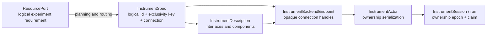

# Instrument Control

This document describes the current instrument-control architecture. It is not
a product requirement or roadmap. Session, ownership, replay, and recovery
mechanisms may be simplified when they make ordinary direct control and scan
workflows harder than the alternatives identified in the
[project charter](project-charter.md).

Scopecat treats direct instrument interaction as a first-class lab activity,
not as an experiment with one point. The GUI and notebook API open explicit
sessions owned by the lab daemon, while experiments and interactive sessions
compete for the same exclusive resource claims.

The design borrows Labber's useful separation between a background Instrument
Server, manual instrument controls, and measurement tooling. It does not adopt
a flat, vendor-shaped quantity tree as Scopecat's experiment model. Logical
resource ports and versioned interface requirements remain the
experiment-facing contract.

## Contract and lifecycle layers



`InstrumentSpec` answers what device is configured and how a provider can reach
it. Its `id` is the logical name used by commands, UI, and evidence;
`exclusivity_key` is the stable lab-defined physical access domain used only for
scheduling and daemon actors. It also contains `driver_id` and a typed
connection. The exclusivity key is neither inferred from an address nor exposed
to drivers. A config cannot assign one key to multiple instruments; a device
with several roles exposes multiple interfaces or components instead.
Ordinary activations may add physical domains but cannot remove or rekey one;
renaming a logical instrument keeps the same key. Retirement and rekeying
use a separate explicit inventory migration and only succeed after every
affected old and new physical domain is drained.
The complete spec is versioned with `ConfigProfileSnapshot`; editing it
publishes a new immutable entry instead of mutating a live run's inputs.

`InstrumentDescription` is the pure driver contract used without opening
hardware. It declares the versioned interfaces the device implements. An
interface or nested component may contain persistent properties, atomic
operations, and acquisitions with typed results. GUI controls and experiment
validation are derived from this description.

`InstrumentBackendEndpoint` owns providers and raw drivers, returning only
opaque connection handles. Before crossing that boundary, the daemon projects
the accepted config to provider bindings containing only device identity,
driver id, and connection settings. Topology, parameters, routing, and run-start
policy never enter the worker. Production uses one spawned, project-long worker;
the in-process implementation is a test seam behind the same API.
`InstrumentActor` remains in the daemon, is indexed by `exclusivity_key`, and
may retain a matching worker handle while the physical access domain is idle.
The owned view separately retains the logical instrument id. The actor accepts
only the driver backend ABI and never treats idle state as observed.
A handle is reusable only when its provider endpoint, canonical per-device
binding, and complete advertised description still match. Changing defaults,
run-start policy, routing, or unrelated configuration does not reconnect the
device; changing its driver, connection, options, or contract does. An idle
handle that is no longer selected remains process-local until a mismatched
owner replaces it or the daemon shuts down.

The normal instrument list is a separate safe projection: identity, driver id,
connection kind, and TCP/IP host/port. It excludes driver options, timeouts,
default state, run-start policy, exclusivity keys, and config hashes. The GUI
loads the complete active config only after a user explicitly opens
configuration editing.

`InstrumentSession` and an admitted run are ownership epochs, not connections.
The daemon pins the config revision, claims all requested instruments, and
acquires their actors until release or abort. Owner-scoped state and replay
evidence are cleared at the end of every epoch. Direct sessions carry a
renewable ownership lease; GUI and Notebook clients renew it explicitly at one
third of its duration. Renewal changes no hardware state and emits no durable
event. An expired idle session releases its actor without aborting, resetting,
or disconnecting a healthy cached connection. New run and session claims compare
the activation generation in the same SQLite writer transaction, so a concurrent
config activation cannot commit ownership derived from a stale physical
inventory.

A submitted run carries logical resource requirements only. Admission verifies
its complete instrument inventory against daemon-owned configuration, then
resolves separate canonical claims keyed by `exclusivity_key`; clients cannot
author physical claim ids. Registry and analysis-candidate sources are resolved
from their durable records, while a scratch submission must match the active
inventory. Domain plans retain the target kind and its complete instrument
footprint as one structured requirement. Ordinary run and instrument views
project claims back to logical ids. Scheduler keys remain confined to admission
storage, resource claims, and actor lookup.

A domain target may also own private connection endpoints that have no
standalone instrument contract. Such endpoints are configured as named target
members, remain invisible in the Instruments workspace, and are covered by the
target ownership claim. The target has its own stable `exclusivity_key`; its
logical id may change without changing the physical access domain, while
ordinary activation cannot silently replace that key. Admission compares the
complete submitted target binding, including member roles and private
connections, with daemon-owned active configuration before issuing the
canonical claim. Hardware that remains useful independently is instead
configured as an instrument member so direct sessions and other runs conflict
with the target through the same physical resource claim.

Executable Python remains in the client, so admission validates and authorizes
the declared plan rather than reconstructing it. Treating a hostile client as a
planner requires a future daemon-signed or daemon-built plan, not broader
implicit claims that serialize unrelated experiments.

Every new owner reads the device before its first write, including when it
reuses an idle connection. This accepts legitimate front-panel changes without
background polling or pretending the daemon observed idle hardware. A direct
session returns that synchronized snapshot in its open receipt; replaying the
same open operation returns the same evidence without touching hardware again.
If the initial refresh fails on a reused connection, the actor retires it and
retries once with a new connection. Normal release leaves a healthy connection
available; an unknown hardware outcome faults and disconnects it. Daemon
shutdown first fences new owners, then drains durable ownership, disconnects
actor handles, and shuts down the endpoint. If driver cleanup exceeds the
shutdown grace period, the daemon fences the whole worker generation; pending
consequential calls become unknown and the worker is terminated.

A state snapshot is complete public physical state for every advertised static
component. Logical entity and channel bindings remain command provenance; they
are resolved before a driver request and never become device-state identity.
Quantity readback uses the unit declared by its `PropertySpec`; canonical units
make daemon-side validation deterministic.

An explicit state refresh is read-only. If it fails, or the driver returns an
invalid snapshot, the daemon ends the whole multi-instrument ownership epoch
and faults every connection without issuing hardware aborts. The durable
session is quarantined only if closing that session fails. A readback failure
after a consequential apply, operation, or acquisition remains an unknown
outcome and uses the abort-and-quarantine path.

`ResourcePort` remains a logical experiment requirement such as RF output or
network sweep. It requests one or more namespaced interface ids such as
`scopecat.rf_output/v1`; planning routes the complete requirement to a physical
instrument. Experiment definitions therefore do not depend on addresses,
vendors, or GUI concepts.

## Python authoring model

One typed factory names one instrument capability in both live control and
experiment authoring. The first argument selects the time model:

- `network_sweep("readout-vna")` binds a typed physical reference that can be
  opened in a live instrument session;
- `network_sweep(experiment, "readout")` declares a typed logical resource on
  the root experiment.

The member names, client method names, and acquisition result fields come from
one concrete schema. Generated carrier names make the time model explicit:
`Patch` requests a hardware transition now with concrete values, while `Target`
adds an experiment state effect and may contain point-resolved `ValueRef`
objects.

Live control is imperative:

```python
import scopecat as sc
from scopecat_instruments import network_sweep

READOUT_VNA = network_sweep("readout-vna")

with sc.open_project(".").connect(operator="alice") as lab:
    with lab.instruments.open(READOUT_VNA) as devices:
        vna = devices[READOUT_VNA]
        vna.apply(points=401)
        trace = vna.sweep()  # NetworkSweepReadback, produced now
```

Read-only typed observations use the same split between the cached state from
session opening and an explicit hardware refresh. For example,
`TemperatureReadoutClient.observation()` decodes the cached snapshot into
`TemperatureReadoutObservation`, while `refresh_observation()` first reads the
instrument. The lower-level `observed_state()` and `refresh()` snapshot methods
remain available for diagnostics.

The declarative form uses the same factory, state, and `sweep()` verb directly
inside a root experiment. A one-off experiment does not need an intermediate
module, manual interface refs, product declarations, or acquisition-result
mapping:

```python
import scopecat as sc
from scopecat_instruments import (
    DCSourceTarget,
    DCSourceVoltageTarget,
    dc_source,
    network_sweep,
)

DC_BIAS = sc.coordinate(
    "dc_bias",
    sc.ScalarType(sc.QuantityType(unit="V")),
)


@sc.template(id="resonator.capture", kind="resonator")
def capture(experiment: sc.ExperimentContext) -> None:
    experiment.scan(
        sc.axis(
            DC_BIAS,
            center=sc.Quantity(0, "V"),
            span=sc.Quantity(0.5, "V"),
            points=11,
        )
    )
    flux = dc_source(experiment, "flux")
    vna = network_sweep(experiment, "readout")

    flux.ensure(
        DCSourceVoltageTarget(
            range=sc.Quantity(1, "V"),  # fixed for every point
            level=DC_BIAS,  # resolved from the scan point
            output_enabled=True,
        )
    )
    vna.ensure(
        start_frequency=sc.Quantity(4.9, "GHz"),
        stop_frequency=sc.Quantity(5.1, "GHz"),
        points=751,
        s_parameter="S21",
    )
    trace = vna.sweep()  # NetworkSweepProducts, declared for every point

    experiment.record_coordinate(trace.frequency)
    experiment.record(trace.s_parameter)
    experiment.finalize(
        flux,
        DCSourceTarget(output_enabled=False),
    )
```

The symbolic client derives `trace.frequency` and `trace.s_parameter` from the
interface acquisition contract, including dtype, unit, axes, and shared-axis
identity. The ordinary typed path therefore does not repeat that schema with
`experiment.product(...)` and `experiment.acquire(...)`. An acquisition id can
still be supplied when the same acquisition occurs more than once and needs a
distinct product namespace.

Reusable `@module` definitions remain available when work is genuinely shared
or composed. They are an extraction step, not a prerequisite for using typed
instrument clients. A reusable module passes symbolic dependencies through its
typed parameters; a root template or scratch definition may author the simple
workflow directly as above.

A target is a coherent state intention, not an instruction to write every
field unconditionally. Omitted fields remain unspecified. After point values
are resolved, one single-client `ensure(...)` remains one typed state effect.
Adjacent `ensure(...)` calls remain ordered effects rather than being merged
accidentally; the driver still receives the minimal validated patch required to
reach each target. Typed groups perform their per-entity expansion explicitly
while the experiment is authored.

A normal-completion state belongs to the root experiment because two
experiments may intentionally leave the same reusable work's hardware
differently. In the example, `finalize(...)` disables the flux source once after
all points complete normally; it is not repeated after every scan point.

All `finalize(...)` declarations form one desired state applied
only after every point and measurement block completes successfully. A
final_state may use fixed values, experiment inputs, or configuration
parameters, but not scan coordinates or point-local compute results: there is
no distinguished scan point after the scan. Failure, cancellation, and unknown
hardware outcomes skip this normal-completion state and remain governed by the
daemon's configured safety/finalization policy. Consequently modules do not
register global `finalize` callbacks, and an experiment final_state is not a
substitute for safety cleanup.

A live acquisition such as `sweep()` triggers hardware and returns named
readback plus its receipt. Its declarative counterpart adds an acquisition
effect and returns named `ProductRef` fields. Defining the experiment executes
neither `ensure(...)` nor the acquisition against hardware.

DC monitoring is an optional capability in both live and symbolic use.
`dc_source(...)` returns a source-only typed client and requires only the source
interface by default. `dc_source(..., monitor=True)` instead returns the
monitor-capable client type, requires both interfaces, and enables
the generated `DCMonitorPatch`/`DCMonitorTarget` surfaces and `monitor()`. This
keeps ordinary source-only control and
experiments routable to hardware without the monitor option. State fields that
determine output shape, such as network-sweep `points`, must resolve during
configuration binding, before point execution; scan coordinates and point-local
compute results cannot size an acquisition product.

### Typed interface declarations

An interface author writes the Python shape once, rather than separately
hand-authoring an `InterfaceSpec` builder, state-to-property mapping, and
acquisition-result schema. A generated, importable member catalog exposes refs
derived from that declaration to drivers. Decorated state and result dataclasses
own the field types; a decorated `Protocol` or abstract base class owns the
typed capability members.
`compile_interface(...)` explicitly lowers that Python declaration to the
existing `InterfaceSpec` wire contract:

```python
from typing import Protocol

import scopecat as sc
from scopecat.sdk.instruments.declarations import (
    acquisition,
    axis,
    instrument_bundle,
    instrument_interface,
    instrument_result,
    instrument_state,
    member_field,
    result_field,
)

@instrument_state
class NetworkSweepState:
    points: int = member_field(
        minimum=2,
        label="Sweep points",
    )


@instrument_result
class SweepResults:
    response: list[complex] = result_field(
        unit="ratio",
        axes=("frequency",),
    )


@instrument_interface(
    "example.network_sweep/v1",
    state=NetworkSweepState,
)
class NetworkSweep(Protocol):
    @acquisition(
        axes={"frequency": axis(size="points", unit="Hz")},
    )
    def sweep(self) -> SweepResults: ...
```

State declarations are concrete capability schemas, not user-authored patches:
their fields contain the hardware value type `T`, are required, and never gain
`ValueRef` or omission semantics. The state, observed-state, and result
decorators are standard dataclass transforms that create frozen, slotted,
keyword-only schema records. `member_field(...)` and `result_field(...)` use
namespaced dataclass field metadata; `Annotated` metadata remains available when
declarations need to compose additional typing metadata.
Interface and method decorators only attach metadata and preserve the authored
methods. `NetworkSweep` therefore remains usable as a structural `Protocol`; an
`ABC` works as well when nominal implementation inheritance is useful, and
decorated members inherited from base interfaces are preserved. The compiled
wrapper exposes `.spec` and `.ref` without changing the interface class.
Consumers that need that lower-level boundary can call
`compile_interface(NetworkSweep)` locally; normal client generation consumes
the decorated interface type directly, so declarations do not need a parallel
public compiled constant.

A discriminated declaration may use a private common base to reuse field
definitions, but that base is not a public device state. `DCSourceState`, for
example, is the closed union of complete `DCSourceVoltageState` and
`DCSourceCurrentState` records; both cases contain the common protection/output
fields and their required range and level. Generated `DCSourcePatch` represents
only a sparse update of common fields. The voltage/current patch and target
carriers are the case-selecting forms and carry their discriminator as a
generated constant, not as a user-visible optional field.

The same declaration surface also covers read-only observed-state dataclasses,
typed atomic methods whose `Annotated` parameters carry operation-argument
metadata, and nested typed capability attributes marked as components. Component
capabilities may contain operations and acquisitions and may nest further, while
the Python annotations remain visible to static type checkers.

Compiled declarations expose typed member descriptors in addition to the wire
contract. `declared_operation(...)` binds the concrete Python call signature and
maps its arguments to stable operation refs, `declared_acquisition(...)` binds
result layouts, and `declared_observed_state(...)` decodes complete snapshots
back into the declared dataclass. Operations are also authored with concrete
`T` parameters; generation projects them to `T | ValueRef` only on symbolic
clients and lifts those values per entity on group clients.

For every writable schema the catalog generator emits three nominal sparse
carriers. `NetworkSweepPatch` contains only concrete `T` values for live
`apply(...)`; `NetworkSweepTarget` contains `T | ValueRef` values for scalar
`ensure(...)`; `NetworkSweepGroupTarget` additionally accepts
`PerEntity[T | ValueRef]` independently for each field. Field presence is
tracked by a private sentinel, not by `None`, so omission is orthogonal to the
domain value. A group also accepts `PerEntity[NetworkSweepTarget]` when complete
targets or discriminated cases differ by entity. The lower-level
`resource + DesiredState` path remains available as an escape hatch.

For an unambiguous flat schema, generated overloads also accept those same
fields directly: `vna.apply(points=401)`, `vna.ensure(points=TRACE_POINTS)`,
and `vnas.ensure(points=per_entity_points)`. The scalar overload remains narrow
and never accepts `PerEntity`; only its group counterpart performs that lift.
Carrier objects remain the positional form for reuse and composition.

The same Python declaration also generates the typed driver boundary. Each
writable interface has a flat, sparse, concrete `TypedDict` patch, while a
generated adapter owns the generic worker ABI and its ref dispatch. A bundle
adapter takes one validated batch, lowers it at that boundary, and calls the
driver once with one typed bundle patch containing its constituent interface
patches. Exact snapshot encoders perform the reverse projection from complete
canonical state records. Read-only observed-state declarations generate only
the snapshot and acquisition hooks: they do not invent a writable patch or
target.

This declaration layer generates the stable contract and refs, but it does not
invent session behavior. A typed factory still defines whether an action is
live or symbolic. The package's `PACKAGE_MANIFEST` is the authoritative list of
generated interface/bundle surfaces, public types, provider identity, and lazy
driver registrations; the generator and provider both derive their catalogs
from it. `@instrument_bundle` marks an ordered,
member-free Protocol intersection; it composes existing interfaces without
creating a third wire interface, and `compile_interface(...)` rejects it. The
factory also defines how `each(...)` fans one logical operation out to
independently routable resources. The compiler covers persistent flat and
discriminated scalar state, read-only observed state, typed atomic operations,
fixed and state-discriminated acquisitions, axes, results, preconditions, and nested
method capabilities. Explicit contract builders remain the escape hatch for
component-owned state or properties, combining observed and discriminated state,
and other unusual contract shapes.

The descriptor boundary does not dynamically inject public client methods.
Those methods remain real Python source so type checkers can preserve
positional-only and keyword-only parameters, narrow live argument carriers, add
symbolic effect ids, and lift each parameter independently for entity groups.
The repository's committed generator compiles the manifest's decorated
interfaces while generating and writes their runtime descriptors and specs as
deterministic static source. Importing generated clients, state projections,
member refs, or interface factories does not compile declarations. Interface
factories parse generated JSON into a fresh `InterfaceSpec`. The production
target generates complete `TemperatureReadout`, `RFOutput`, and `NetworkSweep`
families, plus source-only and source-with-monitor `DCSource` live, symbolic
single-entity, and group clients. The generated `dc_source(..., monitor=...)`
facade selects those two typed surfaces. Generated source also includes
applicable observation accessors and acquisition result carriers. Root-level
flat and discriminated schemas both produce typed `apply(...)`, `ensure(...)`,
and field-wise group target surfaces.
The same pass writes the six public runtime modules—`clients.py`, `members.py`,
`interfaces.py`, `states.py`, `driver_states.py`, and `driver_handlers.py`—plus
the package facade. Refs recurse through components and operations, interface
factories return fresh wire specs from generated JSON, and state projections
preserve canonical field types while adding only presence, binding-time, or
entity-cardinality semantics. These modules are generated output, not a second
authoring surface.

Regenerate the committed Python surfaces, or verify that they are current, with:

```console
uv run --locked python scripts/generate_instrument_clients.py
uv run --locked python scripts/generate_instrument_clients.py --check
```

For supported nested component operations, generation emits a typed component
proxy tree while retaining the recursively resolved component and operation
refs. The authored operation uses concrete `T` arguments. The live method keeps
`T` and returns `InvokeReceipt`; the scalar symbolic method projects each
argument to `T | ValueRef` and adds `effect_id`; its group counterpart also
accepts `PerEntity[T | ValueRef]` independently for each argument. The group
aligns every argument before recording any invocation, then
emits one ordinary scalar effect per child resource. Alignment is an exact join
by entity identity, not by input order.

The optional DC monitor is declared using ordinary Protocol inheritance:

```python
@instrument_bundle
class DCSourceMonitorInterface(
    DCSourceInterface,
    DCMonitorInterface,
    Protocol,
): ...
```

The generator treats the first constituent as the base surface and emits the
boolean `monitor` facade policy. Literal `False` and `True` calls retain exact
return types; a runtime `bool` returns the corresponding union. The flag chooses
one capability set for the whole group rather than becoming
`PerEntity[bool]`. Each child still has its own resource and discriminator state,
so one group can map complete voltage/current states per entity and produce the
mode-appropriate monitor result for each.

The client source generator intentionally supports concrete declaration shapes
rather than claiming every compiled interface shape. It currently rejects
payload-bearing operations because their live and symbolic carriers need a
schema-specific policy; the declaration compiler and generated driver handlers
already support decoded payload operations. Component-owned state and component
acquisitions also remain outside the generated client surface; explicit
contract builders and hand-written clients remain their escape hatch.

### Entity selection and parameter mapping

`one(...)` and `each(...)` make entity cardinality explicit at the typed-client
boundary:

- `factory(experiment, id, for_=sc.one(entity))` returns one symbolic client;
  the entity may be concrete or a symbolic entity `ValueRef`;
- `factory(experiment, id, for_=sc.each(...))` returns a typed group client that
  keeps the same `ensure`, `sweep`, `sample`, or `monitor` verbs and can also be
  indexed by `EntityRef`.

`each(...)` contains concrete entities so the group has stable identity keys at
authoring time. Use `one(...)` for a point-resolved symbolic entity.

A group `ensure(...)` accepts either one broadcast target or a
`PerEntity[target]` mapping. A group acquisition returns `PerEntity[Products]`.
Both mappings join by durable entity identity `(kind, id)`, never by list
position; descriptive
entity metadata does not participate in the join, and duplicate identities are
rejected. Because topology and routing still address entities by string id,
the concrete entities in one `each(...)` selection must also have globally
unique ids; different kinds do not disambiguate the same id there. Root
recording accepts a `PerEntity[ProductRef]` projection directly, preserves
declaration order, and gives each scoped product a stable qualified record id.

`EachEntity` expansion happens while authoring: every selected entity owns an
independently routable scalar resource. It is not a vector operation added to
the planner. Generated group operation methods apply the same identity rule
independently to every argument: a scalar value broadcasts, a
`PerEntity[value]` must be an exact join, and all arguments are aligned before
any child invocation is recorded. The result is one ordinary invocation per
child resource, so component paths and symbolic state-cache invalidation retain
their scalar semantics.

Parameter tables use the same cardinality shape. The schema is declared once
and supplies both named authoring accessors and the exact catalog `TableType`:

```python
class QubitParameters(sc.ParameterRow):
    flux_bias = sc.parameter_column(
        sc.ScalarType(sc.QuantityType(unit="V"))
    )


QUBITS = sc.ParameterTable(
    "qubit_parameters",
    key=sc.entity_key("qubit", kind="logical_device"),
    row=QubitParameters,
)

targets = sc.each("q0", "q1", kind="logical_device")
rows = QUBITS[targets]  # PerEntity[QubitParameters]
biases = rows.map(lambda row: row.flux_bias)  # PerEntity[ValueRef]

sources = dc_source(experiment, "flux", for_=targets)
sources.ensure(
    biases.map(
        lambda bias: DCSourceVoltageTarget(
            range=sc.Quantity(1, "V"),
            level=bias,
            output_enabled=True,
        )
    )
)

readouts = network_sweep(experiment, "readout", for_=targets)
readouts.ensure(points=751)  # one broadcast target
traces = readouts.sweep()  # PerEntity[NetworkSweepProducts]
experiment.record(traces.map(lambda trace: trace.s_parameter))
```

`QUBITS[sc.one("q0")]` instead returns one `QubitParameters` row, so its
`flux_bias` field is exactly one `ValueRef`. This row/client-container symmetry
keeps single- and multi-entity code predictable. Only generated `GroupTarget`
fields gain the scalar-or-mapping lift; canonical schemas and scalar targets
remain narrow.

`for_=sc.each(...)` is explicit authoring-time fan-out: it creates independently
routable per-entity resources and effects rather than asking a driver to
broadcast one command. The low-level
`context.resource(..., for_entities=(left, right))` API retains a different,
intentional meaning: all listed symbolic entities form one co-located aggregate
resource requirement that must route together. Typed factories use `for_` and
do not treat that aggregate API as a compatibility spelling for fan-out.

## Interface boundaries

An interface id names stable behavior, not a driver implementation or current
device mode. Its major version is part of the id. The members have distinct
roles:

- `PropertySpec` describes readable or writable persistent state;
- `OperationSpec` describes one atomic action that is not state;
- `AcquisitionSpec` describes one trigger and its typed result set;
- `ComponentSpec` gives repeated or nested endpoints, such as channels and
  traces, a stable path beneath the interface.

A fixed acquisition always exposes the same results. A state-discriminated
acquisition references one physical state discriminator and declares a result
set for every mode. Acquisition- and case-level preconditions declare the
observable public state required before a trigger. The daemon resolves an
interactive collect intent from a fresh hardware snapshot, while batch
preflight uses projected state to reject an incoherent plan before its first
side effect.

Every array axis has either a fixed size or an observable integer state
property as its size source. Executable collect commands always freeze concrete
dimensions; state references remain in the interface contract and never enter
the driver request. Truly ragged or event-shaped results require a distinct
result contract rather than an omitted axis size.

Interactive replay is checked before touching hardware. On the first attempt,
the daemon synchronizes state, selects the active results, resolves every axis,
and freezes the resulting concrete command. A rejection is also replayed
without another state read. The driver still rechecks live mode and
preconditions before the trigger because the front panel can change after the
snapshot; implementation-specific constraints remain driver guards.

A driver implementation may expose several interfaces. Multi-device
calibration, feedback, and analysis remain experiment workflows rather than
device operations.

Persistent hardware settings may not remain undeclared if they can change an
interface's promised behavior. A setting is either public state represented by
a `PropertySpec`, a fixed driver-configuration invariant, or state local to one
operation or acquisition. A continuous invariant is verified by `read_state`
and re-established before related writes; an action-local invariant is
established at that action boundary and temporary trigger or transport state is
restored afterward. Diagnostic metadata is not a substitute for observed public
state. Calibration and correction choices are explicit configuration with
provenance and are never silently reset by a generic interface.

The daemon validates the complete public command, keeps its retry and
provenance fields, then lowers it to the worker's process-safe generic
`DriverState`, `DriverStatePatch`, `DriverOperation`, `DriverAcquisition`, and
`DriverReadback` ABI. Generated adapters own that ABI, map refs, unwrap already
decoded payloads, and expose concrete driver hooks in Python field names: typed
patches or bundle patches, decoded operation arguments, and typed acquisition
result-name sets.

Drivers do not receive run, resource, entity, channel, point, product, codec,
byte transport, axis, or provenance fields. The adapter re-encodes typed
snapshots and readbacks, while the daemon checks result shape and units against
the original request.

Adapters remove handwritten ref dispatch, not device policy. Command ordering,
temporary disable/restore steps, connection-profile checks, and device-specific
validation remain explicit driver responsibilities. All four real and four
virtual first-party drivers inherit their generated adapter and implement only
these typed hooks plus normal description and lifecycle methods.

Operating-mode-dependent property sets use discriminated state. The private
common declaration base exists only for field reuse; public snapshots are a
closed union of complete cases. A patch within the observed case may remain
sparse. At the low-level wire boundary, changing case requires the discriminator
and the target case's entry properties so hidden state cannot become active.
Typed users instead choose the generated voltage or current carrier, which
inserts that discriminator and requires range and level. Common-field
`DCSourcePatch` remains a sparse update and does not select a case. Configured
startup defaults resolve to property assignments; omitted experiment properties
preserve freshly observed device state unless the run applies those defaults.

## Connection configuration

The core configuration schema distinguishes:

- `virtual`: a deterministic simulated device selected by `driver_id`;
- `tcpip_socket`: host, port, and timeout for line-oriented SCPI.

Connections may carry driver-specific `options`. The first-party provider
supports virtual devices and configured TCP/IP endpoints.

A raw TCP transport owns one socket generation and never reconnects itself.
Connect, write, read, response-size, or text-decoding failure permanently
breaks that transport and clears buffered bytes. Reconnection happens only by
constructing and identifying a new driver through the provider.

Example:

```json
{
  "id": "readout-vna",
  "exclusivity_key": "rack-a/readout-vna",
  "driver_id": "scopecat.keysight.e5080b",
  "connection": {
    "kind": "tcpip_socket",
    "host": "192.0.2.20",
    "port": 5025,
    "timeout_seconds": 10,
    "options": {}
  },
  "default_state": [],
  "run_start": "preserve",
  "safe_state": [],
  "failure_action": "abort_and_release"
}
```

`default_state` is a reusable partial public physical-state profile. It may be
saved independently of how runs start, so interactive tools can apply it
explicitly.

`run_start` is required for every instrument:

- `preserve` reads the device after the run acquires exclusive ownership and
  keeps those settings.
- `apply_default_state` reads first, then reconciles only `default_state`.
  Unspecified properties are preserved.

Applying default state is not a factory reset. Settings outside the public
interface remain driver-owned connection or profile configuration; experiments
neither guess nor overwrite them. A discriminated state case explicitly lists
the properties required when entering it. Defaults that select a new case must
provide those values, so startup does not activate safety-relevant settings left
by an earlier use of that mode.

`failure_action` is also required and has deliberately few choices:

- `abort_and_release` stops owner-scoped work, reads terminal state, and
  releases ownership.
- `abort_then_safe_state` stops work, freshly observes the device, reconciles
  the sparse `safe_state`, reads terminal state, and releases ownership.

This recovery belongs to the pinned system configuration rather than an
experiment. It runs only for failure, cancellation, or the terminal fallback;
a successful run instead uses its experiment final_state. A conclusive driver
rejection is returned as a finalization problem. An unknown abort, observation,
or apply outcome faults the connection, quarantines the run, and sends no
further commands.

A hardware reset or preset is an explicit `OperationSpec`, not a connection
hook or session-open flag. It therefore participates in normal argument
validation, operation replay, auditing, state readback, and unknown-outcome
handling. Neither connection reuse nor opening an interactive session may reset
hardware implicitly.

Run evidence records both the fresh `observed_state` and the resulting
`prepared_state`. Direct GUI and Notebook sessions always use fresh observation
with preserve semantics; saved defaults never change a device merely because a
user opened an interactive session. An explicit configured-default action reads
again and uses the immutable config entry pinned when that session opened, even
if another revision has since become active.

The GUI reads the provider's driver catalog when adding or configuring an
instrument. It edits the registered driver, supported connection kind, endpoint,
strict driver options, sparse default state, and run-start policy, then
publishes and activates a new immutable configuration entry. Changing the driver
clears defaults whose property identities may no longer be valid. **Test
connection** opens the candidate binding in the worker, identifies it, returns
its interface description, and closes it without changing the active config.
Configuration is disabled while the instrument is owned or quarantined.

Activation never hot-switches a live owner: a run or session keeps its accepted
configuration through release. A later owner may reuse the idle connection only
when the provider endpoint, binding, and advertised contract still match, and
always reads fresh physical state before use.

### Inventory changes

Removing a device, changing its `exclusivity_key`, or renaming and rekeying it
is an administrative migration rather than a normal config edit. The command
supplies a complete target snapshot plus explicit `remove`, `rekey`, or
`rename_rekey` intent. The daemon derives the destructive diff itself and
requires an exact match; ordinary additions, same-key logical renames, and
other valid config edits may be included in the same target snapshot.

The daemon gates acquisition on every affected old and new key, rejects queued
or active runs, active sessions, and quarantined claims, then disconnects any
idle retained actor before saving and activating the revision in one
transaction. It does not cancel runs, abort sessions, retain key aliases, or
rewrite historical run records. A failed migration leaves the active config
and event stream unchanged. Reverting one therefore uses another explicit
migration rather than ordinary undo.

## Instruments workspace

Instruments are a top-level workspace beside Runs and Configuration. The list
shows:

- friendly label, stable id, and non-secret connection summary;
- availability: `available`, `active`, `quarantined`, or `unavailable`;
- whether a run or interactive session currently owns the device;
- provider or configuration problems.

Opening the workspace does not acquire an instrument automatically. The
operator explicitly selects **Connect**, after which the detail view:

1. renders the fresh state snapshot returned by session open;
2. renders interface components and property controls from
   `InstrumentDescription`;
3. offers an explicit **Apply configured defaults** action when the session's
   pinned config contains a sparse default state;
4. disables `read_only` properties and never tries to read `write_only` values;
5. stages edits locally, showing current and proposed values separately;
6. submits all staged properties in one **Apply** operation;
7. offers one-shot controls for declared operations whose arguments the GUI can
   encode;
8. offers **Collect** for declared acquisitions; the daemon resolves the active
   result case and validates its preconditions;
9. releases session ownership on explicit disconnect or workspace teardown.

**Refresh state** performs a new read when the operator wants to synchronize
again; connecting does not issue a redundant second read.

If a browser teardown request does not reach the daemon, the next client can
disconnect the still-visible interactive session. This is ordinary ownership
recovery, not quarantine: only an unfinished consequential operation or
unconfirmed abort creates hardware uncertainty.

This is intentionally not a raw SCPI terminal. Driver interfaces preserve
units and validation, make changes auditable, and keep the same semantics in
GUI, notebooks, and experiments.

Output enable, source level, heater control, and similar consequential
properties must never be “apply on change”. Staging makes a multi-property
transition intentional and lets a driver order dependent device commands
safely. The initial Lake Shore driver is read-only because generic heater
controls need additional lab-specific safety policy.

## Notebook API

The normal project connection exposes the same daemon-owned path:

```python
import scopecat as sc
from scopecat_instruments import network_sweep

READOUT_VNA = network_sweep("readout-vna")

with sc.open_project(".").connect(operator="alice") as lab:
    for item in lab.instruments.list().items:
        print(item.instrument_id, item.availability)

    with lab.instruments.open(READOUT_VNA) as devices:
        vna = devices[READOUT_VNA]
        print(vna.describe())
        print(vna.observed_state())

        receipt = vna.apply(
            start_frequency=sc.Quantity(4.8, "GHz"),
            stop_frequency=sc.Quantity(5.2, "GHz"),
            points=401,
        )
        trace = vna.sweep()
```

Typed physical refs bind a project-owned instrument id to a statically known
client inside the daemon-owned session. Generated keyword signatures and
reusable patches correlate property names, concrete Python value types, and
explicit presence, while typed acquisitions expose named result fields.
Experiment lowering and the low-level dynamic API continue to use
nominal member refs, so an acquisition result cannot be accidentally paired
with another interface or component. Specs, compiler IR, and daemon requests
lower them to physical ids.

Values with physical units may be passed as Scopecat `Quantity` values. Plain
numbers remain valid only where the declared property type accepts them. A
`scopecat.dc_source/v2` state belongs to either its voltage or current case.
Choose `DCSourceVoltagePatch`/`Target` or `DCSourceCurrentPatch`/`Target` when
switching cases; the carrier supplies `source_mode`, while range and level remain
required. Protection and output properties are common sparse updates.

A multi-instrument session is available when an operation must reserve a
coherent set:

```python
from scopecat_instruments import (
    DCSourceVoltagePatch,
    dc_source,
    network_sweep,
)

FLUX_SOURCE = dc_source("flux-source")
READOUT_VNA = network_sweep("readout-vna")

with lab.instruments.open(FLUX_SOURCE, READOUT_VNA) as devices:
    source = devices[FLUX_SOURCE]
    vna = devices[READOUT_VNA]

    source.apply(
        DCSourceVoltagePatch(
            range=sc.Quantity(1.0, "V"),
            level=sc.Quantity(0.05, "V"),
            output_enabled=True,
        )
    )
    trace = vna.sweep()
```

The handle is synchronous to match the existing notebook API and releases
ownership when its context exits. Calls are replay-safe across a transient
transport failure without requiring users to manage daemon command identities.
Omitting result refs asks the daemon to select every active result from the
fresh synchronized state.

The Notebook API does not read state or resolve acquisition schema locally.
The daemon performs one fresh synchronization after a replay miss, chooses
default results, rejects an inactive explicit result or unmet precondition, and
freezes concrete dimensions before calling the driver.

Opaque values such as compiled pulse programs are operation arguments, never
persistent properties. A registered codec converts the in-memory value to an
exact byte payload; the command carries only a typed reference plus a
content-addressed envelope. The daemon resolves and verifies every payload
before a hardware batch begins. The worker wire format keeps its JSON
descriptor separate from hash-checked raw attachments and never serializes
arbitrary Python objects. Inside the worker, the registered codec decodes each
payload once before the adapter is called. The generic request retains the
decoded value and schema identity; the generated adapter passes only the
declaration's typed value to the concrete driver hook. A decode failure proves
the operation was not invoked. Public inline/blob bodies, codec details, and
transport bytes never enter the concrete driver API; a codec may intentionally
decode to `bytes` when bytes are the domain value. Control messages are capped
at 1 MiB and must round-trip through JSON without changing value types.

Collection uses the reverse framed path. The worker keeps receipt status,
problems, metadata, and scalar values in a bounded JSON descriptor, while every
array is a separately sized and hash-checked attachment. Numeric and boolean
arrays use canonical little-endian row-major bytes; string arrays use
little-endian offsets over UTF-8 content. The daemon reconstructs the public
`CollectReceipt` before validating it, so binary transport details do not enter
the driver or experiment APIs.

Collection outcome and data quality are independent. A `collected` receipt may
contain an unavailable result with reason `missing`, `invalid`, or `overload`;
the value retains its declared dtype, unit, and complete point-local shape.
`not_collected` instead means the acquisition did not happen, while `unknown`
still means its consequence cannot be determined. NaN and infinity are never
missing-value encodings. An unavailable array marks the whole result;
element-level validity requires a chunked data representation and is outside
the current whole-result contract.

Recorded variables identify their logical source product in the dataset schema.
Each directly collected point value also retains the instrument, interface,
component, acquisition, result, and daemon-observed driver-call interval.
Single-input measurement postprocessors retain that physical source evidence;
scan coordinates and values produced without an instrument do not invent it.

An abandoned idle interactive owner expires automatically. If its lease expires
during a recorded hardware operation, the daemon faults the connection and
keeps the claim quarantined for operator resolution.

## Concurrency and failure semantics

Runs and direct sessions claim the same resource key, so an instrument cannot
be manually adjusted while an experiment owns it. Multi-instrument acquisition
is all-or-nothing. The daemon acquires the durable claim before contacting
hardware. Both external executors and direct clients renew ownership explicitly;
ordinary hardware calls do not extend either lease. Executor calls additionally
carry a fencing token because execution effects cross the process boundary.
Direct calls use their unique session id and reach the same daemon-owned
instrument worker as experiment calls.

Reads are observational: a failed read reports an error but does not by itself
claim the physical state changed. Apply, invoke, and collect are consequential:

- `applied`, `invoked`, or `collected` means the driver confirmed the outcome;
- `not_applied`, `not_invoked`, or `not_collected` proves it did not happen;
- `unknown` means the command may have reached the instrument.

The last case aborts the owner, faults its actor connection, retains quarantined
resource claims, and requires operator resolution. Automatic retry would be
unsafe. Command ids provide owner-local de-duplication, and durable
started/finished events provide an audit trail around consequential calls. A
daemon restart releases an idle session, but the durable active-operation
marker lets it quarantine a session interrupted between those two events.

The daemon-owned instrument worker is the sole live driver host for both
interactive sessions and experiment runs. A notebook plans and interprets the
experiment program, but after the daemon grants its fenced executor lease, the
daemon acquires actors bound to the run's accepted configuration snapshot. The
notebook submits ordered hardware batches; the daemon owns current-state
reconciliation, batch replay, abort-on-failure, terminal readback, and
connection retirement, while raw calls stay in the worker. Experiments
therefore do not expose per-device lifecycle RPCs.
Planning receives a serializable contract catalog resolved by the daemon for
the exact configuration snapshot; it neither imports nor calls a provider.
Fine-grained read, apply, and collect remain available only through an explicit
interactive session.

Admission records the expected provider and an ordered instrument-contract
fingerprint. The daemon verifies both before connecting drivers, so a provider
or interface change cannot be accepted by client convention alone. Each
hardware batch has one content-derived retry identity and durable
started/finished evidence. Individual effects retain semantic ids for
diagnostics, not independent retry identities.

The daemon's reconciliation cache is an assumed state: it starts from observed
readback and advances only after confirmed writes, using driver-returned state
when available. After an atomic operation it adopts the receipt state or reads
the device again before executing later state effects. The cache is not
presented as fresh physical observation. Projected acquisition readiness proves
only that an ordered batch is internally coherent; live driver guards protect
the trigger boundary. Drivers for devices whose properties drift independently
can later require explicit readback without changing the batch boundary.

The GS200 `/MON` interface treats `measurement_enabled`,
`integration_cycles` (NPLC), and `measurement_delay` as public persistent
state. Its monitor acquisition declares output and measurement enablement as
public preconditions. `remote_sense` and `guard_enabled` instead describe the
expected physical wiring profile: the driver verifies them but never changes them.
Four-wire remote sense with a voltage range below 1 V is rejected before any
state mutation because those ranges require two-terminal wiring.
Collection is refused while NULL is enabled because disabling it discards the
reference and cannot restore the prior state. Each collection temporarily
establishes a one-shot trigger setup and restores the previous trigger
settings. The condition register maps an incomplete or failed sample to
`invalid` and an over-range sample to `overload`. Internal GS200 program state
is outside this direct source-monitor interface.

## Initial superconducting-lab driver set

The first package deliberately implements narrow, documented subsets:

| Device | Interface | Initial boundary |
|---|---|---|
| Yokogawa GS200/GS210 | `scopecat.dc_source/v2`; optional `scopecat.dc_monitor/v4` | discriminated voltage/current state, protection, output, and independent current/voltage `/MON` acquisitions |
| R&S SGS100A | `scopecat.rf_output/v1` | CW frequency, power, RF output, internal/external reference |
| Lake Shore 372 | `scopecat.temperature_readout/v1` | read-only scanner state and settled, status-checked temperature or resistance samples |
| Keysight E5080B | `scopecat.network_sweep/v1` | one linear two-port S-parameter sweep and complex trace |

These subsets follow the vendors' public programming documentation:

- [Yokogawa GS200/GS210 User's Manual](https://cdn.tmi.yokogawa.com/1/6218/files/IMGS210-01EN.pdf)
- [Rohde & Schwarz SGS100A User Manual](https://scdn.rohde-schwarz.com/ur/pws/dl_downloads/pdm/cl_manuals/user_manual/1173_9105_01/SGS100A_UserManual_en_13.pdf)
- [Lake Shore Model 372 User's Manual](https://www.lakeshore.com/docs/default-source/product-downloads/manuals/372_manual.pdf)
- [Keysight E5080B Programming Guide](https://helpfiles.keysight.com/csg/e5080b/Programming/Programming_Guide.htm)

## Virtual lab

Virtual instruments implement the same interfaces and receipts as real
drivers. They share one deterministic `VirtualLabWorld`: changing an enabled DC
source shifts the virtual resonance and adds heating; enabled RF power also
adds heating; the temperature monitor observes the resulting temperature; VNA
linewidth, depth, and trace noise respond to that world.

This coupling matters. Independent mocks can demonstrate buttons, but a shared
world lets a user learn the real workflow—connect, bias, observe temperature,
collect a trace, and see cause and effect—without hardware. A fixed seed keeps
tests reproducible while still producing realistic complex traces.
