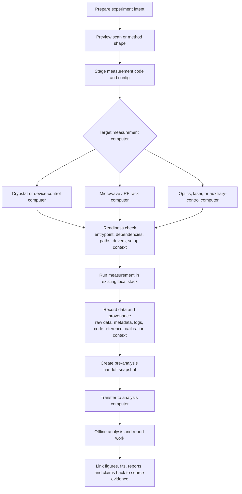
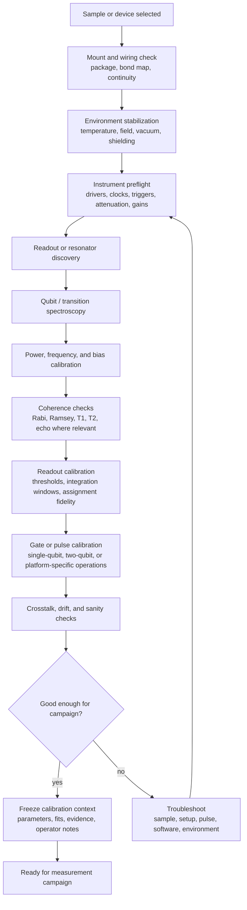
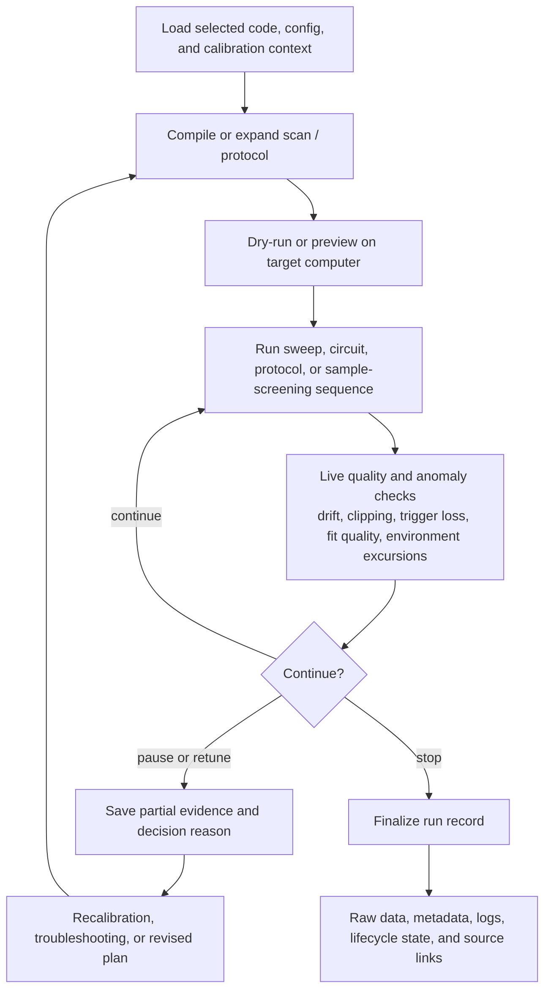
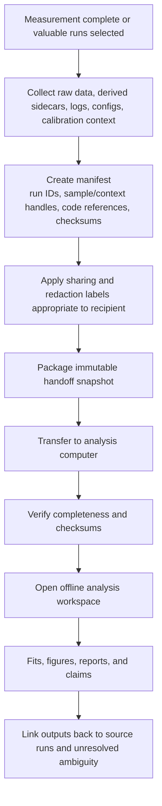

# Product Experience Map

## Status

Drafting experience map.

This document describes cross-journey experience shape. It is not a product
plan, roadmap, capability map, subsystem spec, API contract, UI spec, storage
design, or prototype scope.

## Purpose

Give future journey work one durable place to describe the fuller product
experience without making any one `JC-###` too broad to validate.

Earlier documents intentionally kept `JC-001` and `JC-002` narrow enough for
fixture-scale validation. That left some complete-experience pressure scattered
across tracker rows, top-level pain narratives, future-pressure notes, and
journey non-goals.

```text
complete experience pressure
  -> journey-sized validation slice
  -> fixture/prototype boundary
  -> later contract or decision only when earned
```

## Experience Shape

Project-level product direction and boundaries are owned by
[`vision.md`](vision.md). This map only shows how validated and candidate
journeys may compose into a fuller user experience.

One representative long-form experience is:

```text
experiment user prepares work
  -> previews intended scan or method shape
  -> stages measurement code, config, and environment context for a target
     measurement computer
  -> validates local readiness without taking over hardware control
  -> runs measurement in an existing local stack
  -> records data, metadata, code provenance, calibration context, and run
     lifecycle evidence
  -> later opens an existing run or work bundle
  -> sees source identity, selected context, code references, companion
     artifacts, missing facts, conflicts, and sharing boundaries
  -> selects valuable runs or a run group
  -> creates an immutable pre-analysis handoff snapshot
  -> transfers the snapshot from the measurement computer to an analysis
     computer
  -> opens the snapshot offline on the analysis computer
  -> compares current evidence with a known-good reference when trust is weak
  -> links later figures, reports, fits, or claims back to source evidence
```

The silhouette is useful because it shows why small slices need to compose. It
does not mean every step is accepted product direction today.

## Reference Lab Flows

These flows are included to keep future journey slicing grounded in real
experiment work. They are reference context, not accepted product scope, hardware
control scope, scheduling scope, storage contracts, or UI contracts.

### Cross-Computer Movement

Measurement code and measurement data move at different points in the
experience. Code, config, and environment context move before a run so a target
measurement computer can be checked. Data and source evidence move after a run
so a separate analysis computer can work offline without losing provenance.



### Device Bring-Up And Calibration

Calibration is not one step. It is a sequence of setup checks, exploratory
measurements, fitted updates, operator judgment, and go/no-go decisions. Future
journeys should preserve the evidence chain without implying automatic
write-back or device apply.



### Measurement Campaign

Run execution can produce partial, interrupted, repeated, or corrected evidence.
Measurement-time support should start as passive, explicitly recorded, and
replayable before any later decision accepts mutation or automation.



### Analysis Handoff

The handoff from measurement computer to analysis computer is a distinct
workflow from acquisition. It needs portability, integrity, and source identity;
it is not the same as a publication export or full work-bundle import.



## Experience Step Labels

Use these labels for experience steps. They are not accepted capability
contracts or project-level boundaries by themselves.

| Mode | Meaning | Current examples |
| --- | --- | --- |
| Evidence-only | Read existing artifacts, preserve roles, relations, ambiguity, conflicts, missing facts, and sharing labels. | `JC-001` passive evidence view. |
| Packaging-only | Copy or manifest already-known artifacts and context without producing new analysis outputs. | `JC-002` handoff snapshot export concept. |
| Preview-only | Render intended work shape without hardware apply, scheduling, runner control, or authoritative parameter ownership. | Candidate `JC-007` scan plan preview/diff. |
| Readiness-only | Explain whether code, config, environment, and setup context look usable on a target computer without installing, mutating, scheduling, or controlling hardware. | Candidate `JC-008` dry-run execution package; copied-code provenance work. |
| Diagnostic-only | Compare evidence, gaps, and confidence signals without selecting truth, restoring state, or mutating systems. | Candidate `JC-009` known-good comparison. |
| Gap-review-only | Explain which scientific or context differences may matter without automatic equivalence scoring. | Candidate `JC-010` comparability review. |
| Proposal-only | Show a proposed change and its evidence before mutation. | Candidate `JC-003` calibration review before write-back. |
| Apply or execution boundary | Mutation, authoritative state changes, and managed execution need explicit future decisions. | Device apply, rollback, managed execution, remote execution, autonomous scheduling. |

## Journey Coverage

- `JC-001` covers post-run explanation of an existing run or work bundle.
- `JC-002` covers selected-run analysis handoff.
- Candidate `JC-003` may cover calibration review before write-back.
- Candidate `JC-007` may cover pre-run scan or method intent.
- Candidate `JC-008` may cover dry-run package readiness before execution.
- Candidate `JC-009` may cover known-good diagnostic comparison.
- Candidate `JC-010` may cover scientific comparability review.
- Candidate `JC-011` may cover passive measurement-time decision support.
- Later analysis-lineage work may cover figures, reports, fits, and claims.

Adjacent steps are context, not prototype scope. The tracker owns current
phase, priority, and coordination status; owning `JC` documents own validation
boundaries.

## Uncovered Experience Gaps

These gaps help place future `JC` work in the larger experience. They are not
priorities, requirements, or prototype scope.

- Live inspection or live preview before and during a run.
- Pre-run code, config, dependency, and setup-context staging onto a target
  measurement computer without becoming a deployment or remote-execution system.
- Sample/device bring-up and calibration evidence chains, including fitted
  values, operator judgment, stale context, and proposal-versus-apply boundaries.
- Measurement-time decision support for long-running measurements, where completed
  sweep slices can trigger fit, quality, anomaly, and intent-specific feedback
  from explicitly recorded measurement data without taking over hardware
  control.
- Partial, paused, retuned, repeated, corrected, and invalidated run evidence,
  including why the operator continued, stopped, or returned to calibration.
- Declared setup, sample, topology, or schema context when it powers lookup,
  calculation, visualization, comparison, handoff, or diagnostics.
- Analysis-impact lineage from figures, reports, fits, and claims back to
  source runs, code, context, corrections, exclusions, and unresolved ambiguity.
- Failure, interruption, manual intervention, and recovery evidence that helps
  users understand partial or rescued work.
