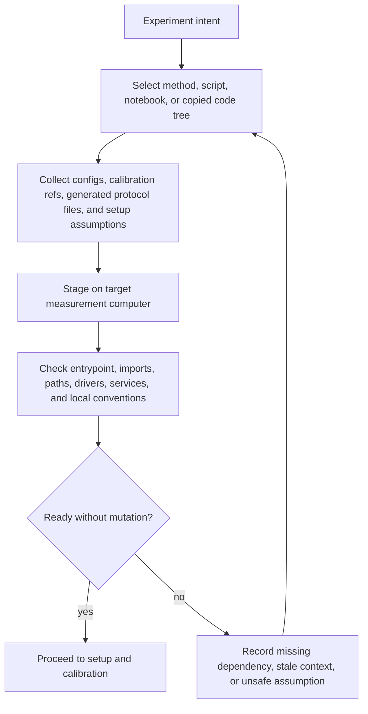
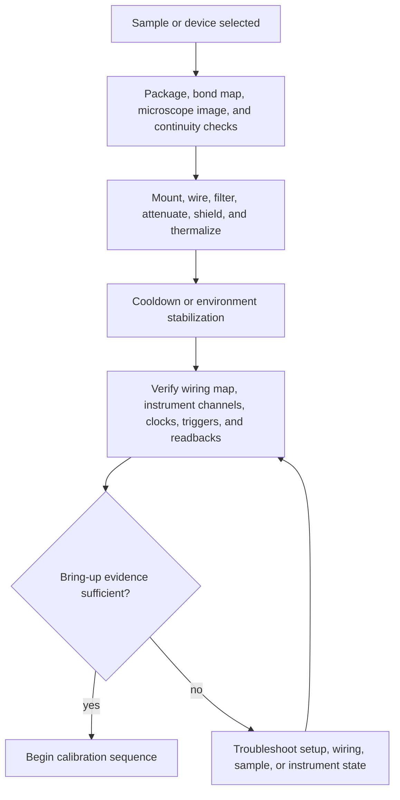
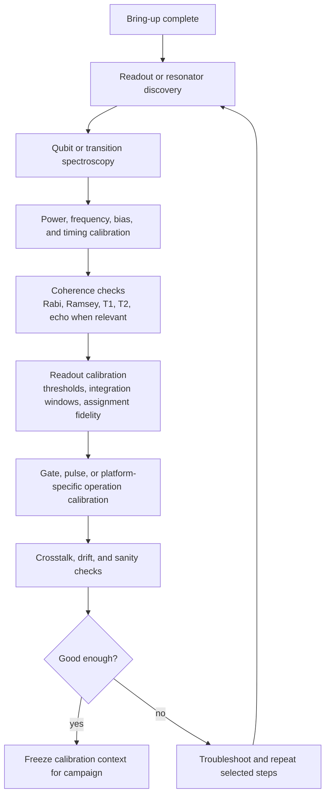
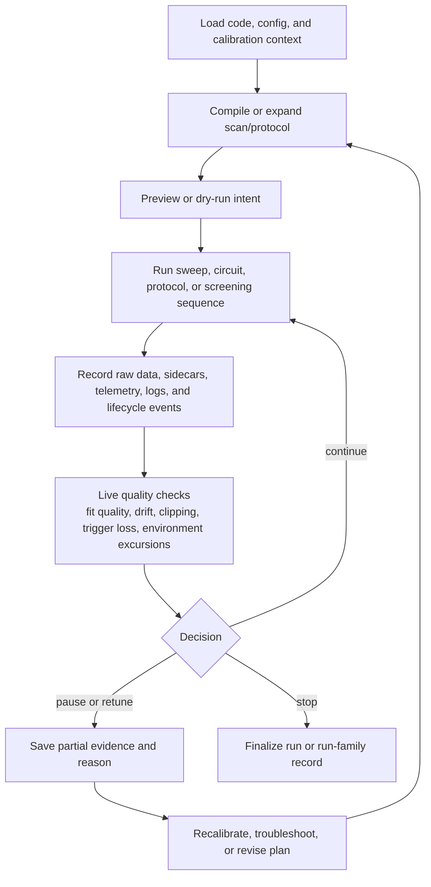
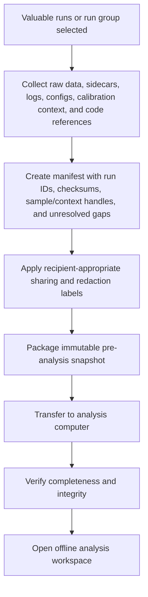
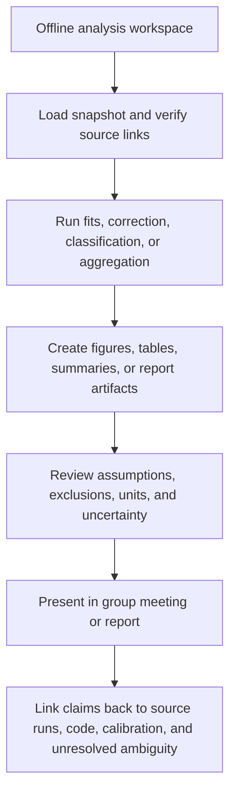

# Experimental Lab Workflow Reference

## Status

Quarantined

## Source

- User refinement on 2026-05-15: preserve realistic experimental-lab workflow
  detail so future product work can compare candidate journeys against the
  whole lab context.
- Role-synthesis discussion from experimental-physicist, lab-manager, and
  data/control-engineer perspectives. Treat these as domain hypotheses unless
  supported by existing evidence.
- Existing extracted research:
  - [`legacy-experiment-code-sample-validation.md`](legacy-experiment-code-sample-validation.md)
  - [`research-acceptance-readiness-triage.md`](research-acceptance-readiness-triage.md)
- Promoted context in
  [`../../product-experience-map.md`](../../product-experience-map.md).

This note is public-safe and intentionally generic. It omits local paths,
hostnames, machine names, user names, sample identifiers, instrument addresses,
and lab-specific project labels.

## Summary

This note records realistic experimental-lab workflow detail that is too broad
for a product experience map but useful for future gap discovery. It is not a
product plan, accepted journey, architecture contract, subsystem spec, hardware
control model, scheduler model, ELN/LIMS scope, or public user documentation.

The reference workflow is:

```text
prepare intent
  -> stage code/config/context on a target measurement computer
  -> bring up and calibrate the sample/device
  -> run a measurement campaign in the existing local stack
  -> capture raw data, sidecars, logs, lifecycle events, and provenance
  -> package selected runs for analysis handoff
  -> transfer the snapshot to an analysis computer
  -> analyze, report, and link claims back to source evidence
  -> feed lessons into calibration, method, setup, or next-sample work
```

The important product-learning point is that code transfer and data transfer
sit on opposite sides of the measurement. Pre-run code/config staging is a
readiness and portability problem. Post-run data movement is an evidence,
integrity, and handoff problem.

## Current Use

Use this note as a gap-discovery reference when drafting or reviewing future
journeys, especially:

- dry-run package readiness;
- copied-code provenance;
- calibration review before write-back;
- hardware bring-up validation;
- passive measurement-time decision support;
- selected-run analysis handoff;
- scientific comparability review;
- analysis and report lineage.

Do not infer product acceptance directly from this note. Promote only narrow
claims into owner documents after fixture, interview, spike, or existing
evidence review.

## Remaining Value

This note remains useful while future product work is deciding whether candidate
journeys miss high-value lab gaps. Delete or archive it after the useful
workflow detail has moved into journey source maps, fixture plans,
capability-adoption hypotheses, or accepted decisions.

## Claim Classes

Use these classes when extracting from the workflows below:

| Class | Meaning | Handling |
| --- | --- | --- |
| Observed evidence | Directly supported by existing extracted research or current fixtures. | Can support evidence inventory or journey source maps. |
| Evidence-backed inference | Reasonable conclusion from observed artifacts, current docs, or multiple source families. | Candidate for promotion after owner review. |
| Domain hypothesis | Plausible lab workflow detail from role synthesis or domain reasoning. | Validate before promotion. |
| Boundary guardrail | Detail that protects scope, safety, or public redaction boundaries. | Keep visible when slicing journeys. |
| Rejected as current scope | Useful background that would over-broaden current product scope. | Keep out of journey acceptance unless new evidence and a decision reverse it. |

## Workflow Reference

### 1. Pre-Run Code And Context Staging

Before a measurement, experiment users often need to move or adapt runnable
measurement code, configuration files, calibration references, generated
protocol artifacts, and environment assumptions onto a target measurement
computer.



| Detail | Likely class | Product gap it may expose |
| --- | --- | --- |
| Code identity is folder-copy based and ambiguous. | Observed evidence | Copied-code provenance and known-good reference comparison. |
| Runtime readiness is distinct from instrument-control semantics. | Observed evidence | Readiness-only checks before managed execution or hardware control. |
| Same protocol may need adaptation across non-identical measurement computers. | Evidence-backed inference | Bounded protocol-transfer diagnostics without assuming routine same-sample migration. |
| A product that installs, mutates, or owns the environment too early may be rejected on fragile control PCs. | Boundary guardrail | Read-only companion validation before deployment or remote execution. |

### 2. Sample Or Device Bring-Up

The sample/device is not simply "ready." It passes through physical, setup, and
instrument readiness checks before scientific calibration begins.



| Detail | Likely class | Product gap it may expose |
| --- | --- | --- |
| Wiring, registry, setup files, and instrument-driver context affect interpretation. | Observed evidence | Passive setup evidence and hardware bring-up validation. |
| Setup state can be necessary context without becoming Scopecat-owned truth. | Boundary guardrail | Evidence-only setup context before apply/reconciliation semantics. |
| Bring-up failures may explain later run quality or comparability. | Evidence-backed inference | Lifecycle and failure evidence linked to runs. |
| Full device communication or desired-state apply is safety and ADR-gated. | Rejected as current scope | Avoid broad device framework or mutation scope. |

### 3. Calibration Sequence

Calibration is a chain of measurements, fits, operator decisions, and sometimes
direct setting changes. Future products should preserve evidence and proposal
boundaries before accepting write-back.



| Detail | Likely class | Product gap it may expose |
| --- | --- | --- |
| Calibration mixes measurements, fits, generated files, operator judgment, and parameter edits. | Observed evidence | Reviewable calibration proposals before mutation. |
| Frozen calibration context is needed to explain later runs. | Evidence-backed inference | Run-bound parameter snapshots and selected-context evidence. |
| Readout/SPAM and classifier choices are first-class lineage for some results. | Observed evidence | Derived-artifact and correction lineage. |
| Automatic calibration write-back is mutation-capable automation. | Boundary guardrail | Proposal-only first slice; write-back needs explicit decision. |

### 4. Measurement Campaign

A campaign may include repeated scans, sample-screening sequences, generated
protocols, partial runs, retunes, pauses, and stop/continue decisions.



| Detail | Likely class | Product gap it may expose |
| --- | --- | --- |
| Run families, generated protocols, correction records, and sidecars affect interpretation. | Observed evidence | Run-family navigation and generated-protocol lineage. |
| Partial, paused, retuned, corrected, or invalidated runs can be scientifically important. | Evidence-backed inference | Lifecycle evidence beyond complete/incomplete status. |
| Long-running measurements may need passive fit, quality, anomaly, and intent feedback. | Domain hypothesis with supporting pressure | Measurement-time advisory support without control ownership. |
| A workflow DAG, scheduler, queue, or autonomous controller is too broad for current scope. | Rejected as current scope | Keep advisory support replayable and safe to disable. |

### 5. Analysis Handoff

After acquisition, a user may select valuable runs and move data plus context
from a measurement computer to a personal or shared analysis computer.



| Detail | Likely class | Product gap it may expose |
| --- | --- | --- |
| Analysis handoff is distinct from acquisition. | Observed evidence | `JC-002` selected-run handoff and offline reader needs. |
| Handoff needs source identity, portability, integrity, and unresolved ambiguity. | Evidence-backed inference | Manifest, checksum, source-link, and gap-review design. |
| Public export and internal analysis handoff have different redaction needs. | Boundary guardrail | Recipient-aware sharing boundaries. |
| Full work-bundle import, report generation, or publication workflow is too broad for the first handoff slice. | Rejected as current scope | Keep handoff pre-analysis and immutable. |

### 6. Analysis, Reports, And Claims

Analysis work often continues outside the measurement environment and produces
fits, figures, notebooks, spreadsheets, reports, group-meeting slides, or paper
draft material.



| Detail | Likely class | Product gap it may expose |
| --- | --- | --- |
| Reports and figures need lineage back to source runs and processing choices. | Observed evidence | Analysis-impact lineage. |
| Notebook state is useful evidence but poor automatic truth. | Observed evidence | Link code/notebook evidence without full notebook-state capture. |
| Group-meeting outputs can reveal decision points and missing context. | Domain hypothesis | Lightweight decision records, not full ELN scope. |
| Full publication or report-generation product is outside current scope. | Rejected as current scope | Preserve lineage first. |

### 7. Lab-Management Context

Operational work surrounds the experiment but should not dominate product
journey scope unless a narrow workflow earns validation.

| Activity | Why it matters | Product handling |
| --- | --- | --- |
| Equipment booking and cooldown planning | Scarce tools, cooldown windows, setup time, and backup users constrain experiments. | Context for readiness and scheduling pressure; not accepted scheduler scope. |
| Shift handoff | Operators need current state, active scripts, anomalies, next actions, stop conditions, and contacts. | Potential evidence for lifecycle and decision records. |
| Sample inventory | Chips, packages, mounted devices, fabrication batches, and status affect interpretation. | Minimal sample/context handles before full inventory scope. |
| Lab notebooks | Objectives, setup diagrams, parameter ranges, scripts, observations, and data links are operational evidence. | Link and summarize as evidence; avoid automatic notebook truth. |
| Group meetings and weekly reports | Figures, blockers, decisions, owners, and next actions shape what work continues. | Useful for analysis lineage and decision context; not full project-management scope. |
| Safety, training, and incidents | Cryogens, magnets, high voltage, lasers/RF, and faults constrain mutation and automation. | Guardrails for ADR-gated control/apply decisions. |

## Gap-Discovery Prompts

Use these prompts when comparing a candidate journey to the reference workflow:

- Which computer owns the current step: authoring, target measurement, shared
  instrument-control, or analysis?
- Is the user moving code/config before the run, or moving data/evidence after
  the run?
- What source identity would be lost if the user copied only a folder, dataset
  ID, notebook, or figure?
- Which calibration, setup, generated-protocol, or correction context affects
  trust in the result?
- What does the user need to know without letting Scopecat mutate files,
  environments, parameters, or hardware?
- What partial, interrupted, retuned, repeated, or invalidated evidence would
  be important later?
- Which redaction boundary applies: internal handoff, restricted support,
  external support, public docs, or publication?
- Is the workflow naturally one journey, or is it a composition of smaller
  validation slices?

## Promotion Guidance

Promote from this note only when a narrower owner can state:

- the user-visible outcome;
- the concrete fixture or interview source;
- the boundary between evidence, proposal, diagnostic, and mutation;
- the minimum artifacts required;
- the redaction and sharing boundary;
- what remains explicitly out of scope.

Do not promote these broad directions directly:

- full ELN, LIMS, or lab-management platform;
- scheduler, queue, lease manager, or generic workflow DAG;
- automatic environment sync, package deployment, or code registry;
- hardware control, setup apply, rollback, or autonomous calibration;
- full publication, report generation, or collaboration workflow;
- universal sample, device, setup, or topology database.
